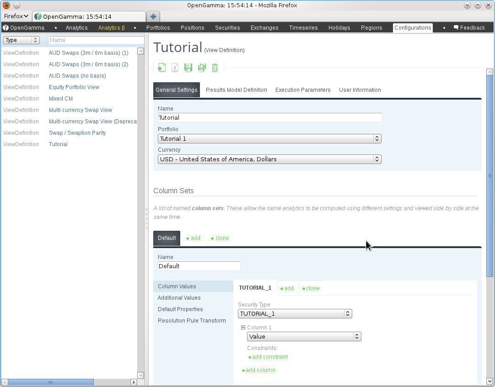
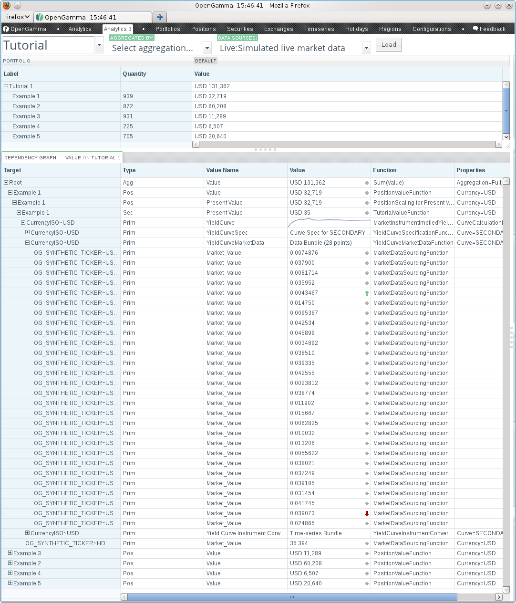

title: Adding a New Asset Class Using RawSecurity
shortcut: DOC:Adding a New Asset Class Using RawSecurity
---
Adding a new asset class to the full OpenGamma stack is quite involved as it would involve writing either a custom database backed security master to handle instances of that type, or modifying the OpenGamma provided security master. A simpler starting point involves creating a Java class that implements the Security interface, can be used to build portfolios and write analytic functions for, but maps onto the existing `RawSecurity` class for integration with the default platform security master. This tutorial explains this process.

All of the code files referenced in this tutorial are in the `com.opengamma.examples.tutorial` package of the OG-Examples project. To run any of the code you will need to create and populate the example database (for example by running `ant init-database` in the `projects/OG-Examples` folder of the source distribution.

................................
Creating the Java Representation
................................

We will use the Joda bean utilities to part automate writing the Java definition, and provide consistency with the OpenGamma supplied asset classes. Following this pattern will allow an easy transition from a `RawSecurity` backed security to one that is supported directly by the security master database.

The first part of the definition declares that we extend `ManageableSecurity`. An implementation need only implement `Security` to work with the OpenGamma engine for pricing. `ManageableSecurity` is a reasonable implementation of `Security` and is the base class that will be required for the security to be used directly with a `SecurityMaster` in the future.

.. code::

    @BeanDefinition
    public class Tutorial1Security extends ManageableSecurity {
    
      public static final String TYPE = "TUTORIAL_1";

All securities have a sting describing their type. This might be displayed to the user, depending on the client interfaces being used, but can also be used to programatically detect different security types. Using suitable type strings is especially important when working with `RawSecurity` as all instances will have the same Java type (so we can't use `instanceof`) and the `getSecurityType` method call on `Security` is the only way to distinguish them and determine how to handle the binary payload. Here we define a constant `TUTORIAL_1` to refer to our new asset type.

Next we declare the properties that are specific to our asset class. We will use the `@PropertyDefinition` annotation to automate code generation. We also need to declare a no-arg constructor to make this a valid bean. We will store a currency and reference to another, underlying, security.

.. code::

    @PropertyDefinition(validate = "notNull")
      private Currency _currency;
    
      @PropertyDefinition(validate = "notNull")
      private ExternalId _underlying;
    
      public Tutorial1Security() {
        super(TYPE);
      }

From the command line, running `ant joda-bean` in `projects/OG-Examples` will now generate a block of automatic code containing getters, setters and reflection meta data. This will be sandwiched between lines containing `AUTOGENERATED START` and `AUTOGENERATED END`. Do not modify any of the code in this block or add anything here. If the properties are changed, save the file and re-run the `ant joda-bean` task to rebuild the block.

Next we declare a more useful constructor than the default for creating instances which are correctly populated.

.. code::

    public Tutorial1Security(final String name, final ExternalIdBundle identifiers, final Currency currency, final ExternalId underlying) {
        super(null, name, TYPE, identifiers);
        ArgumentChecker.notNull(currency, "currency");
        ArgumentChecker.notNull(underlying, "underlying");
        setCurrency(currency);
        setUnderlying(underlying);
      }

When a security is first constructed there is no unique identifier, so we pass null to the superclass constructor. When its `RawSecurity` form is persisted to a security master a unique identifier will be allocated. When an instance is being created from a `RawSecurity` instance we need a different constructor form that accepts the security that was returned by the security master (which contains the unique identifier) and the Fudge message that was encoded in the `RawSecurity`.

.. code::

    protected Tutorial1Security(final Security copyFrom, final FudgeDeserializer deserializer, final FudgeMsg msg) {
        this(copyFrom.getName(), copyFrom.getExternalIdBundle(),
            deserializer.fieldValueToObject(Currency.class, msg.getByName(Meta.INSTANCE.currency().name())),
            deserializer.fieldValueToObject(ExternalId.class, msg.getByName(Meta.INSTANCE.underlying().name())));
        setAttributes(copyFrom.getAttributes());
      }

Note that the field names in the Fudge message are taken from the Joda bean meta data. This constructor is called from a static method that will be used to convert `RawSecurity` instances returned from a security master into instances of our asset class.

.. code::

    public static Tutorial1Security fromRawSecurity(final RawSecurity raw) {
        ArgumentChecker.isTrue(isInstance(raw), "raw");
        final FudgeContext context = OpenGammaFudgeContext.getInstance();
        final FudgeMsg fudgeMsg = context.deserialize(raw.getRawData()).getMessage();
        final FudgeDeserializer deserializer = new FudgeDeserializer(context);
        return new Tutorial1Security(raw, deserializer, fudgeMsg);
      }

This method in turn calls an `isInstance` method to validate the parameter. As mentioned above, all `RawSecurity` instances are of the same class and so `instanceof` tests can't be used. A static `isInstance` method can be used in its place to quickly test if a `RawSecurity` is of our custom type based on its security type field.

.. code::

    public static boolean isInstance(final RawSecurity raw) {
        ArgumentChecker.notNull(raw, "raw");
        return TYPE.equals(raw.getSecurityType());
      }

Finally a `toRawSecurity` method is needed to convert our custom asset class instances to a `RawSecurity` that can be persisted into a security master.

.. code::

    protected void populateFudgeMsg(final FudgeSerializer serializer, final MutableFudgeMsg msg) {
        serializer.addToMessage(msg, currency().name(), null, getCurrency());
        serializer.addToMessage(msg, underlying().name(), null, getUnderlying());
      }
    
      public RawSecurity toRawSecurity() {
        final FudgeContext context = OpenGammaFudgeContext.getInstance();
        final MutableFudgeMsg fudgeMsg = context.newMessage();
        final FudgeSerializer serializer = new FudgeSerializer(context);
        populateFudgeMsg(serializer, fudgeMsg);
        final RawSecurity security = new RawSecurity(getUniqueId(), getName(), getSecurityType(), getExternalIdBundle(), context.toByteArray(fudgeMsg));
        security.setAttributes(getAttributes());
        return security;
      }

This completes the Java representation of our custom asset class. The class only contains attributes and no behavior specific to the asset class. We will implement pricing functions for our asset class separately. Such functions will recognise instances of this custom asset type and take them as their targets.

The next section will use this class to create a portfolio containing some positions in our new asset class.

~~~~~~~~~~~~~~~~~~~~~~~~~~~~~~~~~~~~~
Importing/Creating Security Instances
~~~~~~~~~~~~~~~~~~~~~~~~~~~~~~~~~~~~~

Most tools for OpenGamma are written using the `AbstractTool` class. To create instances of our new asset class and an example portfolio containing positions in them there is the `Tutorial1SecurityLoader` class. This can be run with the `-c classpath:toolcontext/toolcontext-example.properties` parameter and will create five instances of our new type and a portfolio called `Tutorial 1` containing a position in each.

In practice, security definitions are normally available in a CSV file, XML file or other interchange format exported from another system. A loader will typically read this file and create instances of the new asset class. These can be converted to `RawSecurity` by calling their `toRawSecurity` method and persisted to the OpenGamma supplied security master. To avoid cluttering the example with file format handling, we create five security instances directly from code.

Positions in these securities can be created by making calls to a `PositionMaster`. Note that the positions are created with references to the external identifiers stored against each security. This "weak" linking allows more flexibility than "hard" linking to the object identifiers created by the `SecurityMaster`, for example allowing a different security master implementation to be adopted at a later date.

Once positions in the securities are created, a portfolio referencing them can be created (using the position object identifiers) and stored in the `PortfolioMaster`.

Writing custom data loaders is the main time when security, position and portfolio masters will be used directly. Analytic functions which operate on our security instances are written using meta data which the OpenGamma engine will recognise and use to deliver the required object instances.

The next section will describe writing an OpenGamma engine function that will recognise our new asset class to produce analytic values on our position.

..........................
Writing an Engine Function
..........................

We will be writing a function to operate at the security level to produce a generic valuation tagged with the symbolic name `ValueRequirementNames.PRESENT_VALUE`. This is a standard symbol is used for other asset types, so there will already be a `PositionScalingFunction` instance which will operate at the `Position` level to scale the per-security price and `SummingFunction` instance which will operate at the `PortfolioNode` level to perform aggregation. We only need to introduce to the system the details specific to handling our new asset class.

An engine function is an implementation of the `FunctionDefinition` interface. We will use the `AbstractFunction.NonCompiledInvoker` class as a base to avoid implementing all of the interface methods. The first method to implement declares the type of the function. Ours operates on the `SECURITY` type meaning the target will be a sub-class of the `Security` interface.

.. code::

    public class TutorialValueFunction extends AbstractFunction.NonCompiledInvoker {
    
      @Override
      public ComputationTargetType getTargetType() {
        return ComputationTargetType.SECURITY;
      }

After establishing that the function is applicable to a security, the engine will call the `canApplyTo` method to determine whether the function can be used for a specific security instance. When loading and manipulating our new security type the other parts of OpenGamma will be working with `RawSecurity` instances, so the `canApplyTo` check is based on an `instanceof` check and the helper `isInstance` method described above.

.. code::

    @Override
      public boolean canApplyTo(final FunctionCompilationContext context, final ComputationTarget target) {
        final Security security = target.getSecurity();
        return (security instanceof RawSecurity) && Tutorial1Security.isInstance((RawSecurity) security);
      }

The `getResults` method must report to the engine the type of output (or multiple outputs) that the function is capable of producing. Our example will produce a single value called `ValueRequirementNames.PRESENT_VALUE` that will be annotated with a currency marker based on the currency information held within the security class.

.. code::

    protected Tutorial1Security getSecurity(final ComputationTarget target) {
        return Tutorial1Security.fromRawSecurity((RawSecurity) target.getSecurity());
      }
    
      protected ValueProperties.Builder createValueProperties(final Tutorial1Security security) {
        final ValueProperties.Builder builder = createValueProperties();
        builder.with(ValuePropertyNames.CURRENCY, security.getCurrency().getCode());
        return builder;
      }
    
      @Override
      public Set<ValueSpecification> getResults(final FunctionCompilationContext context, final ComputationTarget target) {
        final Tutorial1Security security = getSecurity(target);
        return Collections.singleton(new ValueSpecification(ValueRequirementNames.PRESENT_VALUE, target.toSpecification(), createValueProperties(security).get()));
      }

The `getSecurity` method is a helper that allows us to convert the `ComputationTarget` supplied to the function methods by the OpenGamma engine into an instance of our asset class. The `createValueProperties` method is a helper to annotate the declared result with the currency from our security definition.

The `getRequirements` method must report to the engine the values that this function will require in order to calculate its output value for the target. Here we will request a yield curve and valuation of the underlying security. Where possible we use the standard symbols from `ValueRequirementNames` allowing these values to be sourced from any analytics library that is compatible with OpenGamma. The function definition here is not complicated by specific details on how to construct or value these objects and only contains information specific to the asset class we are working with.

.. code::

    @Override
      public Set<ValueRequirement> getRequirements(final FunctionCompilationContext context, final ComputationTarget target, final ValueRequirement desiredValue) {
        final Tutorial1Security security = getSecurity(target);
        final ValueRequirement yieldCurve = new ValueRequirement(ValueRequirementNames.YIELD_CURVE, new ComputationTargetSpecification(security.getCurrency()), ValueProperties.with(ValuePropertyNames.CURVE, "SECONDARY").get());
        final ValueRequirement underlyingPrice = new ValueRequirement(MarketDataRequirementNames.MARKET_VALUE, security.getUnderlying(), ValueProperties.with(ValuePropertyNames.CURRENCY, security.getCurrency().getCode()).get());
        return ImmutableSet.of(yieldCurve, underlyingPrice);
      }

Note the currency of the security is used as a target for the yield curve to select the correct objects as the system will typically contain definitions for a range of currencies. A system may also contain multiple definitions - each has a name which can be specified as a constraint on the `YIELD_CURVE` value - for simplicity we will hard code the name of the curve (`SECONDARY`) to be used here. A more complete and robust implementation would allow these names to be specified using the constraint mechanism - this will be covered in a different tutorial.

The currency is used as a constraint to request the valuation of the underlying in the currency we expect. Doing this means we don't have to include any FX logic - another function from the repository will perform a suitable conversion - this keeps the code for this function simpler and ensures any conversions are always performed consistently (for example how/where spot rates are sourced from).

All of the preceding methods are called by the OpenGamma engine in order to use the function to build one or more executable dependency graphs for views defined on portfolios containing positions in our new asset class. With each valuation cycle the `execute` method will be called in order to apply the function to the values that other nodes in the graph have calculated for this function's requirements.

We will write the execute method in two parts - an internal helper method will call out to the analytics library that we are presenting to the OpenGamma engine. This method will contain any logic necessary to convert from the Java objects produced by other nodes in the graph to any forms that are specific to the external analytics library.

.. code::

    protected double execute(final Tutorial1Security security, final Instant valuationTime, final YieldCurve yieldCurve, final double underlyingPrice) {
        // ... call out to an analytics library to calculate the price
      }

The `execute` method that is part of the `FunctionInvoker` interface is then written in terms of the other method and contains the logic to unpack the inputs passed to the function from the engine and package the function outputs into the form expected by the engine.

.. code::

    @Override
      public Set<ComputedValue> execute(final FunctionExecutionContext executionContext, final FunctionInputs inputs, final ComputationTarget target, final Set<ValueRequirement> desiredValues) {
        final Tutorial1Security security = getSecurity(target);
        final Instant valuationTime = executionContext.getValuationTime();
        final YieldCurve yieldCurve = (YieldCurve) inputs.getValue(ValueRequirementNames.YIELD_CURVE);
        final double underlyingPrice = (Double) inputs.getValue(MarketDataRequirementNames.MARKET_VALUE);
        final double myResult = execute(security, valuationTime, yieldCurve, underlyingPrice);
        return Collections.singleton(new ComputedValue(new ValueSpecification(ValueRequirementNames.PRESENT_VALUE, target.toSpecification(), createValueProperties(security).get()), myResult));
      }

~~~~~~~~~~~~~~~~~~~~~~~~~~~~~~
Registering an Engine Function
~~~~~~~~~~~~~~~~~~~~~~~~~~~~~~

Engine functions are held in a function repository. A `RepositoryConfiguration` object describes how to construct a repository (or a subset of a repository). These configuration objects are introduced to the system by a `RepositoryConfigurationSource`. Typically a set of functions definitons to integrate with a specific analytics library will have an associated `RepositoryConfigurationSource` that publishes how to construct them. When an OpenGamma installation starts these configurations from all of the installed analytics will be combined to create a single repository.

The `TutorialRepositoryConfiguration` class is a Spring factory bean that can create a configuration source object. We can add this to the standard function definitions by editing the component factory used to create the function repository (for example `ExampleRepositoryConfigurationSourceComponentFactory`).

.. code::

    protected List<RepositoryConfigurationSource> initSources() {
        List<RepositoryConfigurationSource> sources = new ArrayList<RepositoryConfigurationSource>();
        // ... standard/existing function configurations
        sources.add(new TutorialRepositoryConfiguration().getObjectCreating());
        return sources;
      }

When the OpenGamma example server is restarted it will now include the function supporting our new asset class.

...............
Creating a View
...............

Finally, to see the new asset class and supporting function in action we must create a view that will request `ValueRequirementNames.VALUE` on the example portfolio previously created.

After starting the OpenGamma example server point a browser to `localhost:8080` to access the main interface and go to the `Configurations` tab.

Click the `Add Configuration` icon, select `ViewDefinition` as the configuration type and click `OK`.

Enter a suitable name, select the `Tutorial 1` portfolio, and add the `Value` requirement to a calculation configuration:

After saving the view, the `Analytics` tab can used to see the function in action. Clicking on one of the values will show the dependency graph which indicates which functions have been used at each node and the full flow of information from market data at the bottom of the graph to the aggregate value at the top can be seen:

