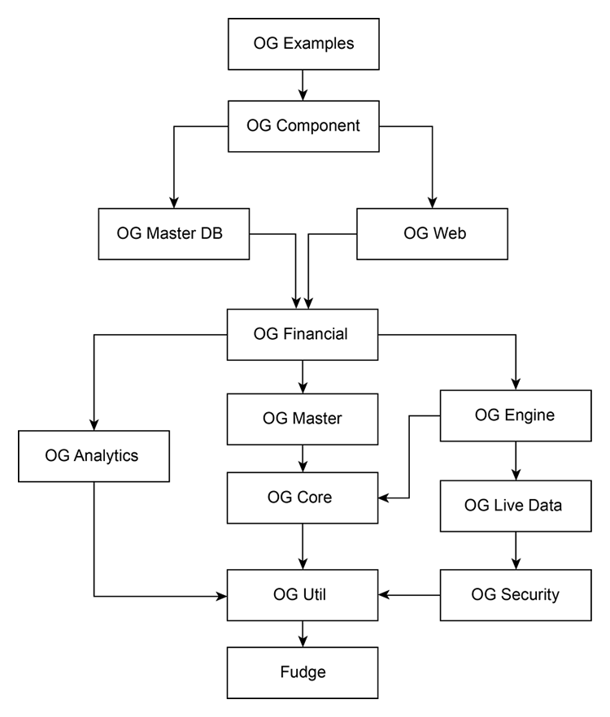

title: Project Descriptions
shortcut: DOC:Project Descriptions
---

+---------------------+------------+-----------------------+--------------------------------------------------------------------------------------------------------------------------------------------------------------------+
| Project Directory   | License    | Git Project           | Description                                                                                                                                                        |
+=====================+============+=======================+====================================================================================================================================================================+
| OG-Platform         | APLv2      | OpenGamma/OG-Platform | Top level project containing common and top level build files, ivy settings, Eclipse properties and preference files                                               |
+---------------------+------------+-----------------------+--------------------------------------------------------------------------------------------------------------------------------------------------------------------+
| OG-Analytics        | APLv2      | OpenGamma/OG-Platform | Analytics library                                                                                                                                                  |
+---------------------+------------+-----------------------+--------------------------------------------------------------------------------------------------------------------------------------------------------------------+
| OG-Engine           | APLv2      | OpenGamma/OG-Platform | Core dependency analysis and execution engine                                                                                                                      |
+---------------------+------------+-----------------------+--------------------------------------------------------------------------------------------------------------------------------------------------------------------+
| OG-Financial        | APLv2      | OpenGamma/OG-Platform | Real-world financial processing and analytic functions that provide glue between messy real world and analytics library                                            |
+---------------------+------------+-----------------------+--------------------------------------------------------------------------------------------------------------------------------------------------------------------+
|                     |            |                       |                                                                                                                                                                    |
+---------------------+------------+-----------------------+--------------------------------------------------------------------------------------------------------------------------------------------------------------------+
| OG-Maths            | APLv2      | OpenGamma/OG-Platform | Library of mathematics                                                                                                                                             |
+---------------------+------------+-----------------------+--------------------------------------------------------------------------------------------------------------------------------------------------------------------+
| OG-TimeSeries       | APLv2      | OpenGamma/OG-Platform | Library providing API and implementations of time-series                                                                                                           |
+---------------------+------------+-----------------------+--------------------------------------------------------------------------------------------------------------------------------------------------------------------+
| OG-Util             | APLv2      | OpenGamma/OG-Platform | Library of common platform-wide utility classes and abstractions                                                                                                   |
+---------------------+------------+-----------------------+--------------------------------------------------------------------------------------------------------------------------------------------------------------------+
| OG-UtilDB           | APLv2      | OpenGamma/OG-Platform | Library of basic abstractions for database code in OpenGamma, including JDBC, Mongo and Redis                                                                      |
+---------------------+------------+-----------------------+--------------------------------------------------------------------------------------------------------------------------------------------------------------------+
|                     |            |                       |                                                                                                                                                                    |
+---------------------+------------+-----------------------+--------------------------------------------------------------------------------------------------------------------------------------------------------------------+
| OG-Core             | APLv2      | OpenGamma/OG-Platform | Data abstraction API, supporting read-only access to data, such as the database                                                                                    |
+---------------------+------------+-----------------------+--------------------------------------------------------------------------------------------------------------------------------------------------------------------+
| OG-Provider         | APLv2      | OpenGamma/OG-Platform | Data abstraction SPI, wrapping incoming data, typically from a market data source                                                                                  |
+---------------------+------------+-----------------------+--------------------------------------------------------------------------------------------------------------------------------------------------------------------+
| OG-Master           | APLv2      | OpenGamma/OG-Platform | Data abstraction API, supporting read-write management of data, such as the database                                                                               |
+---------------------+------------+-----------------------+--------------------------------------------------------------------------------------------------------------------------------------------------------------------+
| OG-MasterDB         | APLv2      | OpenGamma/OG-Platform | Implementations of masters using the database                                                                                                                      |
+---------------------+------------+-----------------------+--------------------------------------------------------------------------------------------------------------------------------------------------------------------+
| OG-LiveData         | APLv2      | OpenGamma/OG-Platform | Data abstraction API, supporting access to live market data and normalisation system                                                                               |
+---------------------+------------+-----------------------+--------------------------------------------------------------------------------------------------------------------------------------------------------------------+
| OG-Security         | APLv2      | OpenGamma/OG-Platform | Original/Legacy Authorisation/Authentication framework                                                                                                             |
+---------------------+------------+-----------------------+--------------------------------------------------------------------------------------------------------------------------------------------------------------------+
|                     |            |                       |                                                                                                                                                                    |
+---------------------+------------+-----------------------+--------------------------------------------------------------------------------------------------------------------------------------------------------------------+
| OG-Bloomberg        | APLv2      | OpenGamma/OG-Platform | Bloomberg implementation of OG-LiveData Server & Authn/Authz system                                                                                                |
+---------------------+------------+-----------------------+--------------------------------------------------------------------------------------------------------------------------------------------------------------------+
| OG-Reuters          | Commercial | OpenGamma/OG-Reuters  | Thompson-Reuters RMDS/OpenDACS implementation of OG-LiveData Server & Authn/Authz system                                                                           |
+---------------------+------------+-----------------------+--------------------------------------------------------------------------------------------------------------------------------------------------------------------+
| OG-Activ            | Commercial | OpenGamma/OG-Activ    | ACTIVFinancial implementation of OG-LiveData Server                                                                                                                |
+---------------------+------------+-----------------------+--------------------------------------------------------------------------------------------------------------------------------------------------------------------+
|                     |            |                       |                                                                                                                                                                    |
+---------------------+------------+-----------------------+--------------------------------------------------------------------------------------------------------------------------------------------------------------------+
| OG-Web              | APLv2      | OpenGamma/OG-Platform | Web User Interface                                                                                                                                                 |
+---------------------+------------+-----------------------+--------------------------------------------------------------------------------------------------------------------------------------------------------------------+
| OG-Component        | APLv2      | OpenGamma/OG-Platform |  `Component-based Configuration </confluence/DOC/OpenGamma-Platform-Documentation/Getting-Started/Configuration-Guide/Component-based-Configuration/index.rst>`_   |
+---------------------+------------+-----------------------+--------------------------------------------------------------------------------------------------------------------------------------------------------------------+
| OG-Integration      | APLv2      | OpenGamma/OG-Platform | Integration area with various useful tools                                                                                                                         |
+---------------------+------------+-----------------------+--------------------------------------------------------------------------------------------------------------------------------------------------------------------+
| OG-Examples         | APLv2      | OpenGamma/OG-Platform | Example template for tying together an integrated working system                                                                                                   |
+---------------------+------------+-----------------------+--------------------------------------------------------------------------------------------------------------------------------------------------------------------+
| OG-BloombergExample | APLv2      | OpenGamma/OG-Platform | Example template for tying together an integrated working system using Bloomberg as a data source                                                                  |
+---------------------+------------+-----------------------+--------------------------------------------------------------------------------------------------------------------------------------------------------------------+
|                     |            |                       |                                                                                                                                                                    |
+---------------------+------------+-----------------------+--------------------------------------------------------------------------------------------------------------------------------------------------------------------+
| OG-Language         | APLv2      | OpenGamma/OG-Platform | Common services for integration with external language integration (R, Excel, etc)                                                                                 |
+---------------------+------------+-----------------------+--------------------------------------------------------------------------------------------------------------------------------------------------------------------+
| OG-RStats           | APLv2      | OpenGamma/OG-RStats   | R integration module, will be moved to OG-Platform git repository shortly                                                                                          |
+---------------------+------------+-----------------------+--------------------------------------------------------------------------------------------------------------------------------------------------------------------+
| OG-DOTNET           | APLv2      | OpenGamma/OG-DOTNET   | Microsoft .NET Client libraries                                                                                                                                    |
+---------------------+------------+-----------------------+--------------------------------------------------------------------------------------------------------------------------------------------------------------------+
| OG-Excel            | Commercial | OpenGamma/OG-Excel    | Excel plugin                                                                                                                                                       |
+---------------------+------------+-----------------------+--------------------------------------------------------------------------------------------------------------------------------------------------------------------+
|                     |            |                       |                                                                                                                                                                    |
+---------------------+------------+-----------------------+--------------------------------------------------------------------------------------------------------------------------------------------------------------------+
| OG-Parent           | APLv2      | OpenGamma/OG-Platform | Parent maven project (primary build system is still Ant+Ivy)                                                                                                       |
+---------------------+------------+-----------------------+--------------------------------------------------------------------------------------------------------------------------------------------------------------------+
| OG-MavenPlugin      | APLv2      | OpenGamma/OG-Platform | Project provding maven plugins (primary build system is still Ant+Ivy)                                                                                             |
+---------------------+------------+-----------------------+--------------------------------------------------------------------------------------------------------------------------------------------------------------------+
| OG-Excel            | APLv2      | OpenGamma/OG-Platform | Build system installer files                                                                                                                                       |
+---------------------+------------+-----------------------+--------------------------------------------------------------------------------------------------------------------------------------------------------------------+

.....................
Graph of dependencies
.....................

