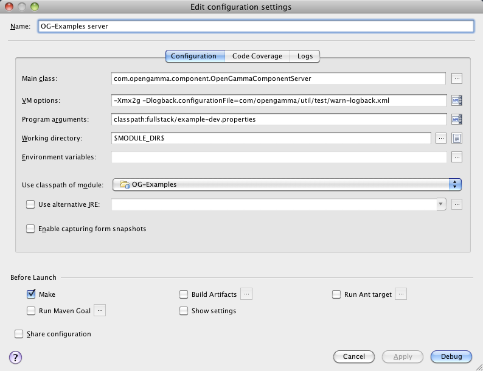

title: Setting up IntelliJ IDEA
shortcut: DOC:Setting up IntelliJ IDEA
---
.............
Prerequisites
.............

The following software must be installed:

*  IntelliJ IDEA 10.5 or later, Community or Ultimate edition

*  IvyIDEA plugin for IntelliJ

*  Ant

*  Git

The following is optional but recommended if you're planning to contribute code:

*  Checkstyle-IDEA plugin for IntelliJ

.........
Procedure
.........

#  Follow the instructions `Obtaining and building the source code </confluence/DOC/OpenGamma-Platform-Documentation/Developing-with-the-OpenGamma-Source-Code/Obtaining-and-building-the-source-code/index.rst>`_  to get the code.

#  Run a `Using Ant from the Command Line </confluence/DOC/OpenGamma-Platform-Documentation/Developing-with-the-OpenGamma-Source-Code/Working-with-Ant/Using-Ant-from-the-Command-Line/index.rst>`_ .

#  Open the IntelliJ project file `OG-Platform/OG-Platform.ipr`

#  Tools menu \-> IvyIDEA \-> Resolve for all modules

You should now be able to compile the project and run the tests.

..........................
Running the example server
..........................

Follow the instructions on the `Running the Example Engine using Ant </confluence/DOC/OpenGamma-Platform-Documentation/Developing-with-the-OpenGamma-Source-Code/Working-with-Ant/Running-the-Example-Engine-using-Ant/index.rst>`_  page to create a local database and populate it with example data.  To run the example server from within IntelliJ you need to create a run / debug configuration with the following properties

+-------------------------+----------------------------------------------------------------------------------+
| Main class \\           | com.opengamma.component.OpenGammaComponentServer \\                              |
+-------------------------+----------------------------------------------------------------------------------+
| VM options              | \-Xmx2g \-Dlogback.configurationFile=com/opengamma/util/test/warn-logback.xml \\ |
+-------------------------+----------------------------------------------------------------------------------+
| Program arguments \\    | classpath:fullstack/fullstack-example-dev.properties \\                          |
+-------------------------+----------------------------------------------------------------------------------+
| Working directory       | $MODULE_DIR$                                                                     |
+-------------------------+----------------------------------------------------------------------------------+
| Use classpath of module | OG-Examples                                                                      |
+-------------------------+----------------------------------------------------------------------------------+

............
Known Issues
............

*  IntelliJ sometimes shows an error message about invalid Git roots when opening the project. &nbsp;This is an issue with IntelliJ's Git support and should be ignored, the Git roots are valid.

*  When opening the project in the Community Edition of IntelliJ there will be an error message about unknown facet types. &nbsp;These are for the Web, Hibernate and Spring facets that are only supported in the Ultimate version of IntelliJ. &nbsp;Click "Keep All" on the error dialog to keep the facet definitions in the project.

*  The project files work with IntelliJ 10.0 but there are issues with the Ant and TestNG plugins that cause a few problems for the OG-Platform project. &nbsp;No testing has been done with earlier versions of IntelliJ.

