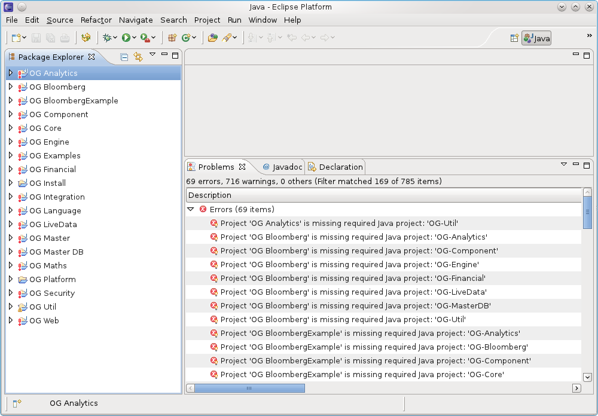

title: Eclipse Project Renames (v1.1)
shortcut: DOC:Eclipse Project Renames (v1.1)
---
With the version 1.1 release of OpenGamma the Eclipse projects have been renamed to match the folders. For example, the "OG Analytics" project is now "OG-Analytics". This is to avoid problems some users were having when importing the projects into their workspaces.

If you had previously configured an Eclipse workspace and have downloaded updated code you may see error markers against all projects and reported messages such as:

Project 'OG Core' is missing required project 'OG-Util'

To avoid clearing your workspace and re-importing all of the projects, the following steps can be followed:

#  Re-import the preferences file:

   #  Go to **File->Import**

   #  Under "General" choose **Preferences**

   #  Click **Next**

   #  Click the **Browse...** button

   #  Navigate the file chooser to the **OG-Platform/eclipse** folder and choose **OpenGamma-Eclipse-Preferences.epf**

   #  Click **Finish**

#  Select all projects, right click and choose **Refresh**. You may see messages about Checkstyle and other build errors - press **Ok** to ignore these

#  Rename the projects by applying the supplied refactoring script:

   #  Go to **Refactor->Apply Script...**

   #  Click the **Browse...** button

   #  Navigate the file chooser to the **OG-Platform/eclipse** folder and choose **refactor.xml**

   #  Click **Ok**

   #  Click **Finish**

   #  You may be warned about performing all refactorings without showing previews - click **Ok** if this message box appears

   #  You may see messages about Ivy resolve jobs and other build errors - press **Ok** to ignore these

   #  If you are using the open source release there may be also be problems relating to modules such as OG-Excel that are not included in this release. These can be ignored

   #  Click **Finish**

#  

   .. image:: clean_ivy.png

   

    Clear the Ivy resolution cache

   #  Expand the OG-Util project

   #  Right click on `ivy.xml [*]`

   #  Go to **Clean Ivy cache->Cache '__ivdyde-workspace-resolver-cache'**

#  Select all projects, right click and choose **Ivy->Resolve**. You may need to collapse the OG-Util project (and any others that are currently expanded) for the Ivy commands to appear in the context menu.

All projects should now appear error free. If there are still errors, then quitting and restarting Eclipse may help.
