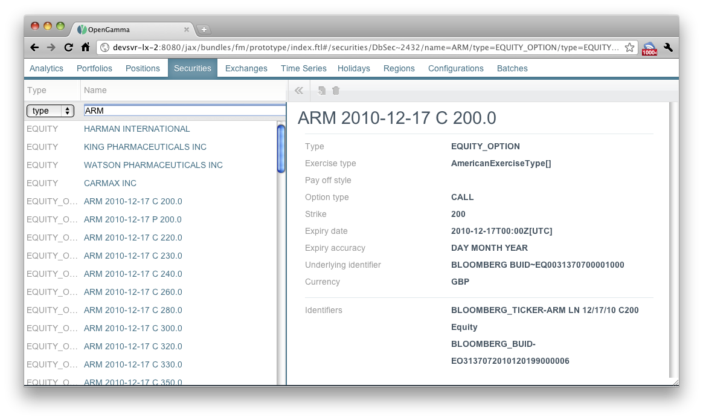
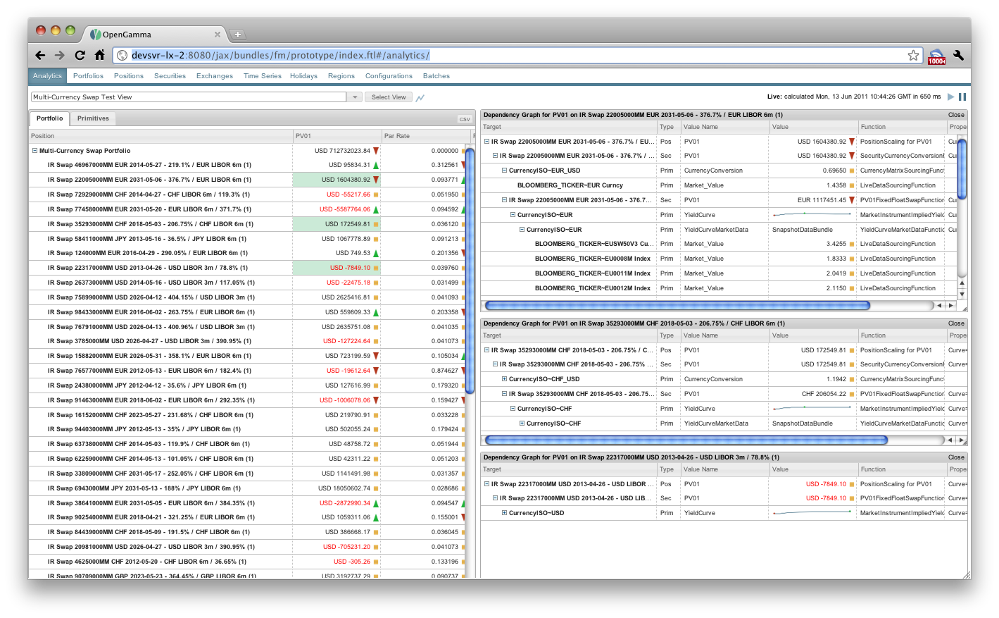

title: 0.8.0 Release Notes
shortcut: DOC:0.8.0 Release Notes
---
............
Key Features
............

There are two key highlights in this release:

*  The first publicly supported version of our new Web GUI.

*  Explain Value, allowing you to drill down into the full set of interim calculations leading to a particular result.

~~~~~~~~~~~
New Web GUI
~~~~~~~~~~~

We've made our new Web user interface the default now.  It should provide a more intuitive and powerful interface.  Some of the features included in this version are:

*  Incremental loading of large data sets

*  Per-column filtering/searching

*  Adjustable and collapsible panels

*  Top level menu always available

*  Recently viewed lists

*  Graphical representations of holiday calendars

*  Analytics view more tightly integrated

*  Explain Value in analytics (see below)

*  CSV export from analytics viewer

We've got plenty more in the pipeline, so watch out for the next release!  The only major feature the UI doesn't currently support is accessing older versions of objects.  This will be addressed in the next release.  For now, versions can be accessed via the old user interface by directing your browser at `/jax`

~~~~~~~~~~~~~~~~~~~~~~~~~~~
Explain Value Functionality
~~~~~~~~~~~~~~~~~~~~~~~~~~~

A key reason why the OpenGamma Engine was built using a Dependency Graph approach was so that end users could drill down into individual results, and see what all the interim calculations that led to that result were. 0.8.0 is the first version, however, where this is *actually* possible in our user interface and remote APIs.

~~~~~~~~~~~~~~~~~~~~~~~~
Additional Asset Classes
~~~~~~~~~~~~~~~~~~~~~~~~

More asset classes are now supported in our Analytics library and the security master database:

*  Swaptions

*  Reworked equity/equity index options

*  Improved IR future options

*  FX options

*  FX barrier options

some of these don't work end-to-end yet, but full support is coming soon.

Trades can now have arbitrary string key/value pair attributes, intended to be used for ulta-flexible aggregation in the future.

There's plenty more in the full list, see below.

~~~~~~~~~~~
Sample Data
~~~~~~~~~~~

We've had several requests for some sample data to allow the engine to be run without a full data connection.  Licenses with data providers prevent us from redistributing real data, but we're working on a fake data set that will allow our analytic pricing models to work realistically (random data would not) and give those evaluating the system the ability to see it operating.  We hope to release that as a point release (0.8.1) in the next few weeks.

.........
Upgrading
.........

For our 0.x lines, unless you're a commercial customer (for whom we're doing upgrades ourselves as part of our support policies), you'll need to either upgrade your databases, or recreate them from scratch from your original source data.

+---------+----------------------+
| Version | MasterDB Patch Level |
+=========+======================+
| 0.7.x   | 6                    |
+---------+----------------------+
| 0.8.0   | 13                   |
+---------+----------------------+

To upgrade, find the patch level for your current release, and then roll forward from each patch, applying the appropriate `upgrade-db.sql` file for each patch level and database version until you get to the target patch.

..........................................
Full List of Jira Issues Resolved in 0.8.0
..........................................

In addition to the usability issues highlighted above, there are as usual a list of issues resolved throughout the system.

.. raw:: html

    <iframe class="jira" src="http://jira.opengamma.com/sr/jira.issueviews:searchrequest-printable/temp/SearchRequest.xml?jqlQuery=project+%3D+PLAT+AND+fixVersion+%3D+%220.8.0%22&tempMax=1000"></iframe>

