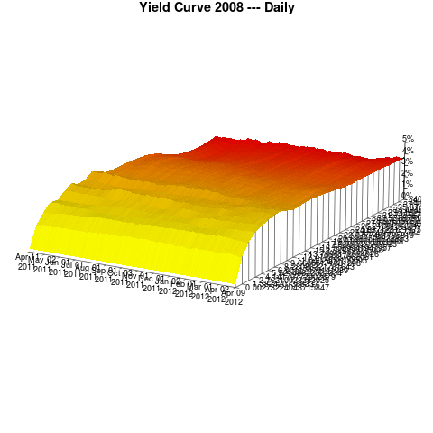

title: Demo Scripts
shortcut: DOC:Demo Scripts
---

.........
Analytics
.........

.. code::

    > library ("OpenGamma")
    [1] "Info: Loading OpenGamma namespace"
    [1] "Info: OpenGamma namespace loaded"
    > demo(Analytics, package = "OpenGamma")
    
    
    	demo(Analytics)
    	---- ~~~~~~~~~
    
    > ##
    >  # Copyright (C) 2011 - present by OpenGamma Inc. and the OpenGamma group of companies
    >  #
    >  # Please see distribution for license.
    >  ##
    > 
    > # Demonstrates the full use of the system for performing calculations by creating a security, a suitable view,
    > # a market data snapshot from the view, and then executing the view with peturbations on the market data snapshot.
    > 
    > Init ()
    Loading required package: OG
    
    > # Helper function to get a value from a view result (assumes the only node is the root node)
    > get.result <- function (view.result, value.requirement.name, calc.config = "Default") {
    +   data <- results.ViewComputationResultModel (view.result)[[calc.config]]
    +   root.node <- data[which (data$type == "PORTFOLIO_NODE"),]
    +   columns <- columns.ViewComputationResultModel (data, value.requirement.name)
    +   firstValue.ViewComputationResultModel (root.node, columns)
    + }
    
    > # Helper function to alter the values for a yield curve
    > modify.curve <- function (curve, shift) {
    +   data <- values.YieldCurveSnapshot (curve)
    +   apply (data, 1, function (x) {
    +     v <- x["MarketValue"]
    +     if (!is.na (v)) {
    +       curve <<- SetYieldCurvePoint (curve, x["ValueName"], x["Identifier"], as.real (v) + shift)
    +     }
    +     invisible (0)
    +   })
    +   curve
    + }
    
    > # Create the security
    > print ("Creating security")
    [1] "Creating security"
    
    > security <- SwapSecurity (
    +   name = "IR Swap USD 40,326,000 2021-08-08 - USD LIBOR 3m / 2.709%",
    +   tradeDate = "2011-08-08",
    +   effectiveDate = "2011-08-08",
    +   maturityDate = "2021-08-08",
    +   counterparty = "CParty",
    +   payLeg = FloatingInterestRateLeg (
    +     dayCount = "Actual/360",
    +     frequency = "Quarterly",
    +     regionId = "FINANCIAL_REGION~US+GB",
    +     businessDayConvention = "Modified Following",
    +     notional = InterestRateNotional ("USD", 40326000),
    +     eom = FALSE,
    +     floatingReferenceRateId = "Reference Rate Simple Name~USD LIBOR 3m",
    +     floatingRateType = "IBOR"),
    +   receiveLeg = FixedInterestRateLeg (
    +     dayCount = "30U/360",
    +     frequency = "Semi-annual",
    +     regionId = "FINANCIAL_REGION~US+GB",
    +     businessDayConvention = "Modified Following",
    +     notional = InterestRateNotional ("USD", 40326000),
    +     eom = FALSE,
    +     rate = 0.027))
    
    > security.id <- StoreSecurity (security)
    
    > # Create a portfolio containing a position in this security
    > print ("Creating portfolio")
    [1] "Creating portfolio"
    
    > position <- PortfolioPosition (security.id, 1)
    
    > node <- PortfolioNode (name = "Example", positions = position)
    
    > portfolio <- Portfolio ("Example Portfolio", node)
    
    > portfolio.id <- StorePortfolio (portfolio)
    
    > # Create a view on this portfolio
    > print ("Creating view")
    [1] "Creating view"
    
    > requirements <- c (ValueRequirementNames.Present.Value)
    
    > view <- ViewDefinition ("Example View", portfolio.id, requirements)
    
    > view.id <- StoreViewDefinition (view)
    
    > # Create a view client to get an initial calculation from current market data
    > print ("Creating market data view client")
    [1] "Creating market data view client"
    
    > view.client.descriptor <- StaticMarketDataViewClient (view.id)
    
    > view.client <- ViewClient (view.client.descriptor, FALSE)
    
    > ConfigureViewClient (view.client, list (EnableCycleAccess ()))
    
    > TriggerViewCycle (view.client)
    
    > view.result.raw <- GetViewResult (view.client, -1)
    
    > # Print out the values calculated on the view
    > print (paste ("PV from current market data", get.result (view.result.raw, ValueRequirementNames.Present.Value)))
    [1] "PV from current market data -3541726.23577129"
    
    > # Take a snapshot
    > print ("Taking snapshot")
    [1] "Taking snapshot"
    
    > snapshot <- SnapshotViewResult (view.client)
    
    > snapshot <- SetSnapshotName (snapshot, "Example")
    
    > snapshot.id <- StoreSnapshot (snapshot)
    
    > # Create a view client referencing the snapshot that will recalculate when the snapshot changes
    > print ("Creating snapshot view client")
    [1] "Creating snapshot view client"
    
    > view.client.descriptor <- TickingSnapshotViewClient (view.id, unversioned.Identifier (snapshot.id))
    
    > view.client <- ViewClient (view.client.descriptor, FALSE)
    
    > view.result.snapshot <- GetViewResult (view.client, -1)
    
    > # Sanity check; the value from the snapshot MUST match the live data version
    > print (paste ("PV from base snapshot", get.result (view.result.snapshot, ValueRequirementNames.Present.Value)))
    [1] "PV from base snapshot -3541726.23577129"
    
    > # Generate some peturbation amounts (THIS IS FOR DEMONSTRATION ONLY; IT IS NOT A GOOD WAY TO PRODUCE RANDOM NUMBERS)
    > shifts <- sapply (head (randu$x, 10), function (x) { x / 100 })
    
    > # Iterate through them
    > for (shift in shifts) {
    + 
    +   # Modify the snapshot by tweaking the USD curve
    +   print (paste ("Modifying snapshot", snapshot.id, "by", shift))
    +   snapshot <- SetSnapshotYieldCurve (snapshot, "USD_SECONDARY", modify.curve (GetSnapshotYieldCurve (snapshot, "USD_SECONDARY"), shift))
    + 
    +   # Write the snapshot back
    +   print (paste ("Updating snapshot"))
    +   snapshot.id <- StoreSnapshot (snapshot, snapshot.id)
    + 
    +   # Wait for the new result
    +   print (paste ("Waiting for next result on snapshot", snapshot.id))
    +   view.result.snapshot <- GetViewResult (view.client, -1, viewCycleId.ViewComputationResultModel (view.result.snapshot))
    + 
    +   # Print out the values calculated on the view
    +   print (paste ("PV from snapshot", get.result (view.result.snapshot, ValueRequirementNames.Present.Value)))
    + 
    + }
    [1] "Modifying snapshot DbSnpUser~1000~0 by 3.1e-07"
    [1] "Updating snapshot"
    [1] "Waiting for next result on snapshot DbSnpUser~1000~1"
    [1] "PV from snapshot -3541818.93391371"
    [1] "Modifying snapshot DbSnpUser~1000~1 by 0.00044495"
    [1] "Updating snapshot"
    [1] "Waiting for next result on snapshot DbSnpUser~1000~2"
    [1] "PV from snapshot -3674493.29367395"
    [1] "Modifying snapshot DbSnpUser~1000~2 by 0.0082244"
    [1] "Updating snapshot"
    [1] "Waiting for next result on snapshot DbSnpUser~1000~3"
    [1] "PV from snapshot -5912181.48890293"
    [1] "Modifying snapshot DbSnpUser~1000~3 by 0.00322291"
    [1] "Updating snapshot"
    [1] "Waiting for next result on snapshot DbSnpUser~1000~4"
    [1] "PV from snapshot -4491519.90727118"
    [1] "Modifying snapshot DbSnpUser~1000~4 by 0.00393595"
    [1] "Updating snapshot"
    [1] "Waiting for next result on snapshot DbSnpUser~1000~5"
    [1] "PV from snapshot -4697969.70860697"
    [1] "Modifying snapshot DbSnpUser~1000~5 by 0.00309097"
    [1] "Updating snapshot"
    [1] "Waiting for next result on snapshot DbSnpUser~1000~6"
    [1] "PV from snapshot -4453173.81611199"
    [1] "Modifying snapshot DbSnpUser~1000~6 by 0.00826368"
    [1] "Updating snapshot"
    [1] "Waiting for next result on snapshot DbSnpUser~1000~7"
    [1] "PV from snapshot -5923088.91518753"
    [1] "Modifying snapshot DbSnpUser~1000~7 by 0.00729424"
    [1] "Updating snapshot"
    [1] "Waiting for next result on snapshot DbSnpUser~1000~8"
    [1] "PV from snapshot -5652766.6472998"
    [1] "Modifying snapshot DbSnpUser~1000~8 by 0.00317649"
    [1] "Updating snapshot"
    [1] "Waiting for next result on snapshot DbSnpUser~1000~9"
    [1] "PV from snapshot -4478033.89085647"
    [1] "Modifying snapshot DbSnpUser~1000~9 by 0.00599793"
    [1] "Updating snapshot"
    [1] "Waiting for next result on snapshot DbSnpUser~1000~10"
    [1] "PV from snapshot -5287612.6464861"
    >

...........
Analytics 2
...........

.. code::

    > library ("OpenGamma")
    [1] "Info: Loading OpenGamma namespace"
    [1] "Info: OpenGamma namespace loaded"
    > demo(Analytics2, package = "OpenGamma")
    
    
    	demo(Analytics2)
    	---- ~~~~~~~~~~
    
    > ##
    >  # Copyright (C) 2011 - present by OpenGamma Inc. and the OpenGamma group of companies
    >  #
    >  # Please see distribution for license.
    >  ##
    > 
    > # Demonstrates the full use of the system for performing calculations by creating a security, a suitable view,
    > # a market data snapshot from the view, and then executing the view with peturbations on the security.
    > 
    > Init ()
    Loading required package: OG
    
    > # Helper function to get a value from a view result (assumes the only node is the root node)
    > get.result <- function (view.result, value.requirement.name, calc.config = "Default") {
    +   data <- results.ViewComputationResultModel (view.result)[[calc.config]]
    +   root.node <- data[which (data$type == "PORTFOLIO_NODE"),]
    +   columns <- columns.ViewComputationResultModel (data, value.requirement.name)
    +   firstValue.ViewComputationResultModel (root.node, columns)
    + }
    
    > # Creates a portfolio containing a single position in a security and a view on the portfolio
    > create.view <- function (security) {
    +   security.id <- StoreSecurity (security)
    +   position <- PortfolioPosition (security.id, 1)
    +   node <- PortfolioNode (name = "Example", positions = position)
    +   portfolio <- Portfolio ("Example Portfolio", node)
    +   portfolio.id <- StorePortfolio (portfolio)
    +   requirements <- c (ValueRequirementNames.Present.Value)
    +   ViewDefinition ("Example View", portfolio.id, requirements)
    + }
    
    > # Create the security
    > print ("Creating base security")
    [1] "Creating base security"
    
    > security <- SwapSecurity (
    +   name = "IR Swap USD 40,326,000 2021-08-08 - USD LIBOR 3m / 2.709%",
    +   tradeDate = "2011-08-08",
    +   effectiveDate = "2011-08-08",
    +   maturityDate = "2021-08-08",
    +   counterparty = "CParty",
    +   payLeg = FloatingInterestRateLeg (
    +     dayCount = "Actual/360",
    +     frequency = "Quarterly",
    +     regionId = "FINANCIAL_REGION~US+GB",
    +     businessDayConvention = "Modified Following",
    +     notional = InterestRateNotional ("USD", 40326000),
    +     eom = FALSE,
    +     floatingReferenceRateId = "Reference Rate Simple Name~USD LIBOR 3m",
    +     floatingRateType = "IBOR"),
    +   receiveLeg = FixedInterestRateLeg (
    +     dayCount = "30U/360",
    +     frequency = "Semi-annual",
    +     regionId = "FINANCIAL_REGION~US+GB",
    +     businessDayConvention = "Modified Following",
    +     notional = InterestRateNotional ("USD", 40326000),
    +     eom = FALSE,
    +     rate = 0.027))
    
    > # Create the view
    > print ("Creating base view")
    [1] "Creating base view"
    
    > view.id <- StoreViewDefinition (create.view (security))
    
    > # Create a view client to get an initial calculation from current market data
    > print ("Creating market data view client")
    [1] "Creating market data view client"
    
    > view.client.descriptor <- StaticMarketDataViewClient (view.id)
    
    > view.client <- ViewClient (view.client.descriptor, FALSE)
    
    > ConfigureViewClient (view.client, list (EnableCycleAccess ()))
    
    > TriggerViewCycle (view.client)
    
    > view.result.raw <- GetViewResult (view.client, -1)
    
    > # Print out the values calculated on the view
    > print (paste ("PV from current market data", get.result (view.result.raw, ValueRequirementNames.Present.Value)))
    [1] "PV from current market data -3531321.30785347"
    
    > # Take a snapshot
    > print ("Taking snapshot")
    [1] "Taking snapshot"
    
    > snapshot <- SnapshotViewResult (view.client)
    
    > snapshot <- SetSnapshotName (snapshot, "Example")
    
    > snapshot.id <- StoreSnapshot (snapshot)
    
    > # Create a view client referencing the snapshot
    > print ("Creating snapshot view client")
    [1] "Creating snapshot view client"
    
    > view.client.descriptor <- StaticSnapshotViewClient (unversioned.Identifier (view.id), snapshot.id)
    
    > view.client <- ViewClient (view.client.descriptor, FALSE)
    
    > TriggerViewCycle (view.client)
    
    > view.result.snapshot <- GetViewResult (view.client, -1)
    
    > # Sanity check; the value from the snapshot MUST match the live data version
    > print (paste ("PV from base snapshot", get.result (view.result.snapshot, ValueRequirementNames.Present.Value)))
    [1] "PV from base snapshot -3531321.30785347"
    
    > # Generate some peturbation amounts (THIS IS FOR DEMONSTRATION ONLY; IT IS NOT A GOOD WAY TO PRODUCE RANDOM NUMBERS)
    > shifts <- sapply (head (randu$x, 10), function (x) { x + 0.5 })
    
    > # Iterate through them
    > for (shift in shifts) {
    + 
    +   # Modify the security and update the view
    +   print (paste ("Modifying security by", shift))
    +   leg <- GetSwapSecurityReceiveLeg (security)
    +   leg.modified <- SetFixedInterestRateLegRate (leg, GetFixedInterestRateLegRate (leg) * shift)
    +   security.modified <- SetSwapSecurityReceiveLeg (security, leg.modified)
    +   view.modified <- create.view (security.modified)
    +   view.id <- StoreViewDefinition (view.modified, view.id)
    + 
    +   # Trigger a cycle and wait for the new result
    +   TriggerViewCycle (view.client)
    +   view.result.cycleId <- viewCycleId.ViewComputationResultModel (view.result.snapshot)
    +   print (paste ("Waiting for next result after cycle", view.result.cycleId))
    +   view.result.snapshot <- GetViewResult (view.client, -1, view.result.cycleId)
    + 
    +   # Print out the values calculated on the view
    +   print (paste ("PV ", get.result (view.result.snapshot, ValueRequirementNames.Present.Value)))
    + 
    + }
    [1] "Modifying security by 0.500031"
    [1] "Waiting for next result after cycle ViewCycle~main-10~0"
    [1] "PV  -7913192.70668333"
    [1] "Modifying security by 0.544495"
    [1] "Waiting for next result after cycle ViewCycle~main-10~1"
    [1] "PV  -7523497.48582449"
    [1] "Modifying security by 1.32244"
    [1] "Waiting for next result after cycle ViewCycle~main-10~2"
    [1] "PV  -705364.870876983"
    [1] "Modifying security by 0.822291"
    [1] "Waiting for next result after cycle ViewCycle~main-10~3"
    [1] "PV  -5088813.84121985"
    [1] "Modifying security by 0.893595"
    [1] "Waiting for next result after cycle ViewCycle~main-10~4"
    [1] "PV  -4463885.17919848"
    [1] "Modifying security by 0.809097"
    [1] "Waiting for next result after cycle ViewCycle~main-10~5"
    [1] "PV  -5204449.83312367"
    [1] "Modifying security by 1.326368"
    [1] "Waiting for next result after cycle ViewCycle~main-10~6"
    [1] "PV  -670938.754748575"
    [1] "Modifying security by 1.229424"
    [1] "Waiting for next result after cycle ViewCycle~main-10~7"
    [1] "PV  -1520583.71451241"
    [1] "Modifying security by 0.817649"
    [1] "Waiting for next result after cycle ViewCycle~main-10~8"
    [1] "PV  -5129497.65768321"
    [1] "Modifying security by 1.099793"
    [1] "Waiting for next result after cycle ViewCycle~main-10~9"
    [1] "PV  -2656706.89675313"
    >

......
Curves
......

.. code::

    > library ("OpenGamma")
    [1] "Info: Loading OpenGamma namespace"
    [1] "Info: OpenGamma namespace loaded"
    > demo(Curves, package = "OpenGamma")
    
    
    	demo(Curves)
    	---- ~~~~~~
    
    > ##
    >  # Copyright (C) 2011 - present by OpenGamma Inc. and the OpenGamma group of companies
    >  #
    >  # Please see distribution for license.
    >  ##
    > 
    > # Demonstrates specifying curve names at the position level. Note that the "out-the-box" example server contains only
    > # a single set of curves called "SECONDARY" so the position attributes specified here will be ignored unless additional
    > # curves called "FORWARD_3M" and/or "FUNDING" are defined.
    > 
    > Init ()
    Loading required package: OG
    
    > # Create the security
    > print ("Creating security")
    [1] "Creating security"
    
    > security <- SwapSecurity (
    +   name = "IR Swap USD 40,326,000 2021-08-08 - USD LIBOR 3m / 2.709%",
    +   tradeDate = "2011-08-08",
    +   effectiveDate = "2011-08-08",
    +   maturityDate = "2021-08-08",
    +   counterparty = "CParty",
    +   payLeg = FloatingInterestRateLeg (
    +     dayCount = "Actual/360",
    +     frequency = "Quarterly",
    +     regionId = "FINANCIAL_REGION~US+GB",
    +     businessDayConvention = "Modified Following",
    +     notional = InterestRateNotional ("USD", 40326000),
    +     eom = FALSE,
    +     floatingReferenceRateId = "Reference Rate Simple Name~USD LIBOR 3m",
    +     floatingRateType = "IBOR"),
    +   receiveLeg = FixedInterestRateLeg (
    +     dayCount = "30U/360",
    +     frequency = "Semi-annual",
    +     regionId = "FINANCIAL_REGION~US+GB",
    +     businessDayConvention = "Modified Following",
    +     notional = InterestRateNotional ("USD", 40326000),
    +     eom = FALSE,
    +     rate = 0.027))
    
    > security.id <- StoreSecurity (security)
    
    > # Create a portfolio containing two positions in this security
    > print ("Creating portfolio")
    [1] "Creating portfolio"
    
    > position.forward <- SetPositionAttribute (PortfolioPosition (security.id, 1), "*.DEFAULT_ForwardCurve", "FORWARD_3M")
    
    > position.funding <- SetPositionAttribute (PortfolioPosition (security.id, 1), "*.DEFAULT_ForwardCurve", "FUNDING")
    
    > node <- PortfolioNode (name = "Example", positions = list (position.forward, position.funding))
    
    > portfolio <- Portfolio ("Example Portfolio", node)
    
    > portfolio.id <- StorePortfolio (portfolio)
    
    > # Create a view on this portfolio
    > print ("Creating view")
    [1] "Creating view"
    
    > requirements <- c (ValueRequirementNames.Present.Value)
    
    > view <- ViewDefinition ("Example View", portfolio.id, requirements)
    
    > view.id <- StoreViewDefinition (view)
    
    > # Create a view client to get an initial calculation from current market data
    > print ("Creating market data view client")
    [1] "Creating market data view client"
    
    > view.client.descriptor <- StaticMarketDataViewClient (view.id)
    
    > view.client <- ViewClient (view.client.descriptor, FALSE)
    
    > TriggerViewCycle (view.client)
    
    > view.result <- GetViewResult (view.client, -1)
    
    > # Format a data frame with the results
    > view.result.frame <- results.ViewComputationResultModel (view.result)$Default
    >

..........
Historical
..........

.. code::

    > library ("OpenGamma")
    [1] "Info: Loading OpenGamma namespace"
    [1] "Info: OpenGamma namespace loaded"
    > demo(Historical, package = "OpenGamma")
    
    
    	demo(Historical)
    	---- ~~~~~~~~~~
    
    > ##
    >  # Copyright (C) 2011 - present by OpenGamma Inc. and the OpenGamma group of companies
    >  #
    >  # Please see distribution for license.
    >  ##
    > 
    > # Iterates a view over historical market data to produce timeseries for the portfolio. This
    > # demonstrates the functions used to perform the historical iteration; the choice of view
    > # and handling the data is arbitrary.
    > 
    > Init ()
    Loading required package: OG
    
    > # Find a view identifier (omit the view name to graph the first view)
    > viewName <- "Swap Portfolio View"
    
    > matchedViews <- Views (viewName)
    
    > if (length (matchedViews) == 0) {
    +   matchedViews <- Views (paste ("Example", viewName))
    + }
    
    > if (length (matchedViews) == 0) {
    +   stop ("No view called '", viewName, "' defined")
    + } else {
    +   viewIdentifier <- matchedViews[1, 1]
    + }
    
    > # Create a client (private process) for sampling a historic period (past 365 days in this example)
    > endTime <- Sys.time () - (14 * 86400)
    
    > startTime <- endTime - (365 * 86400)
    
    > viewClientDescriptor <- HistoricalMarketDataViewClient (viewIdentifier, startTime, endTime)
    
    > viewClient <- ViewClient (viewClientDescriptor, FALSE)
    
    > # Start the first cycle (historical clients start "halted" so that additional parameters can be applied
    > # to further peturb the historical data)
    > TriggerViewCycle (viewClient)
    
    > # Build the result into these vectors
    > presentValue <- c ()
    
    > # Iterate through the results, blocking on the first but waiting no longer than 10s for each subsequent one.
    > # The timeout is arbitrary to demonstrate how the functions can be used to fail rather than block
    > # indefinately which may (or may not) be desirable in some systems.
    > timeout <- 10000
    
    > result <- GetViewResult (viewClient, -1)
    
    > while (!is.null (result)) {
    +   # Trigger the next iteration while we work with the previous
    +   TriggerViewCycle (viewClient)
    +   print (paste ("Got cycle", viewCycleId.ViewComputationResultModel (result)))
    +   # Get the data from the "Default" configuration in the view
    +   data <- results.ViewComputationResultModel (result)$Default
    +   print (paste(nrow (data), "row(s) of data"))
    +   # Identify the row with the portfolio values (it's the only portfolio node row in our example view)
    +   portfolio <- data[which (data$type == "PORTFOLIO_NODE"),]
    +   # Identify the PV column(s)
    +   columns.pv <- columns.ViewComputationResultModel (data, ValueRequirementNames.Present.Value)
    +   # Get the PV for the portfolio
    +   value.pv <- firstValue.ViewComputationResultModel (portfolio, columns.pv)
    +   print (paste ("PV for", valuationTime.ViewComputationResultModel (result), "=", value.pv))
    +   presentValue <- append (presentValue, value.pv)
    +   # Next iteration
    +   print (paste ("Waiting for next cycle"))
    +   result <- GetViewResult (viewClient, timeout, viewCycleId.ViewComputationResultModel (result))
    + }
    [1] "Got cycle ViewCycle~main-17~0"
    [1] " row(s) of data"
    [1] "PV for 2011-04-10 19:16:57.000000000 = NA"
    [1] "Waiting for next cycle"
    [1] "Got cycle ViewCycle~main-17~1"
    [1] "110 row(s) of data"
    [1] "PV for 2011-04-11 19:16:57.000000000 = 376.32983883363"
    [1] "Waiting for next cycle"
    [1] "Got cycle ViewCycle~main-17~2"
    [1] "110 row(s) of data"
    [1] "PV for 2011-04-12 19:16:57.000000000 = 377.054489165124"
    [1] "Waiting for next cycle"
    [1] "Got cycle ViewCycle~main-17~3"
    [1] "110 row(s) of data"
    [1] "PV for 2011-04-13 19:16:57.000000000 = 381.597190357045"
    [1] "Waiting for next cycle"
    [1] "Got cycle ViewCycle~main-17~4"
    [1] "110 row(s) of data"
    [1] "PV for 2011-04-14 19:16:57.000000000 = 381.672484965141"
    [1] "Waiting for next cycle"
    [1] "Got cycle ViewCycle~main-17~5"
    [1] "110 row(s) of data"
    [1] "PV for 2011-04-15 19:16:57.000000000 = 375.917908419574"
    [1] "Waiting for next cycle"
    [1] "Got cycle ViewCycle~main-17~6"
    [1] " row(s) of data"
    [1] "PV for 2011-04-16 19:16:57.000000000 = NA"
    [1] "Waiting for next cycle"
    [1] "Got cycle ViewCycle~main-17~7"
    [1] " row(s) of data"
    [1] "PV for 2011-04-17 19:16:57.000000000 = NA"
    [1] "Waiting for next cycle"
    [1] "Got cycle ViewCycle~main-17~8"
    [1] "110 row(s) of data"
    [1] "PV for 2011-04-18 19:16:57.000000000 = 379.445687234332"
    [1] "Waiting for next cycle"
    [1] "Got cycle ViewCycle~main-17~9"
    [1] "110 row(s) of data"
    [1] "PV for 2011-04-19 19:16:57.000000000 = 380.023869844353"
    [1] "Waiting for next cycle"
    [1] "Got cycle ViewCycle~main-17~10"
    [1] "110 row(s) of data"
    [1] "PV for 2011-04-20 19:16:57.000000000 = 380.044853869115"
    [1] "Waiting for next cycle"
    [1] "Got cycle ViewCycle~main-17~11"
    [1] "110 row(s) of data"
    [1] "PV for 2011-04-21 19:16:57.000000000 = 380.136367607726"
    [1] "Waiting for next cycle"
    [1] "Got cycle ViewCycle~main-17~12"
    [1] "110 row(s) of data"
    [1] "PV for 2011-04-22 19:16:57.000000000 = 383.607939847624"
    [1] "Waiting for next cycle"
    [1] "Got cycle ViewCycle~main-17~13"
    [1] " row(s) of data"
    [1] "PV for 2011-04-23 19:16:57.000000000 = NA"
    [1] "Waiting for next cycle"
    [1] "Got cycle ViewCycle~main-17~14"
    [1] " row(s) of data"
    [1] "PV for 2011-04-24 19:16:57.000000000 = NA"
    [1] "Waiting for next cycle"
    [1] "Got cycle ViewCycle~main-17~15"
    [1] "110 row(s) of data"
    [1] "PV for 2011-04-25 19:16:57.000000000 = 383.372971319949"
    [1] "Waiting for next cycle"
    [1] "Got cycle ViewCycle~main-17~16"
    [1] "110 row(s) of data"
    [1] "PV for 2011-04-26 19:16:57.000000000 = 382.193942191284"
    [1] "Waiting for next cycle"
    [1] "Got cycle ViewCycle~main-17~17"
    [1] "110 row(s) of data"
    [1] "PV for 2011-04-27 19:16:57.000000000 = 385.287836176448"
    [1] "Waiting for next cycle"
    [1] "Got cycle ViewCycle~main-17~18"
    [1] "110 row(s) of data"
    [1] "PV for 2011-04-28 19:16:57.000000000 = 380.752145883308"
    [1] "Waiting for next cycle"
    [1] "Got cycle ViewCycle~main-17~19"
    [1] "110 row(s) of data"
    [1] "PV for 2011-04-29 19:16:57.000000000 = 381.664115382647"
    [1] "Waiting for next cycle"
    [1] "Got cycle ViewCycle~main-17~20"
    [1] " row(s) of data"
    [1] "PV for 2011-04-30 19:16:57.000000000 = NA"
    [1] "Waiting for next cycle"
    [1] "Got cycle ViewCycle~main-17~21"
    [1] " row(s) of data"
    [1] "PV for 2011-05-01 19:16:57.000000000 = NA"
    [1] "Waiting for next cycle"
    [1] "Got cycle ViewCycle~main-17~22"
    [1] "110 row(s) of data"
    [1] "PV for 2011-05-02 19:16:57.000000000 = 386.0087821845"
    [1] "Waiting for next cycle"
    [1] "Got cycle ViewCycle~main-17~23"
    [1] "110 row(s) of data"
    [1] "PV for 2011-05-03 19:16:57.000000000 = 394.022055165919"
    [1] "Waiting for next cycle"
    [1] "Got cycle ViewCycle~main-17~24"
    [1] "110 row(s) of data"
    [1] "PV for 2011-05-04 19:16:57.000000000 = 390.623575183551"
    [1] "Waiting for next cycle"
    [1] "Got cycle ViewCycle~main-17~25"
    [1] "110 row(s) of data"
    [1] "PV for 2011-05-05 19:16:57.000000000 = 386.350079610721"
    [1] "Waiting for next cycle"
    [1] "Got cycle ViewCycle~main-17~26"
    [1] "110 row(s) of data"
    [1] "PV for 2011-05-06 19:16:57.000000000 = 390.535253866969"
    [1] "Waiting for next cycle"
    [1] "Got cycle ViewCycle~main-17~27"
    [1] " row(s) of data"
    [1] "PV for 2011-05-07 19:16:57.000000000 = NA"
    [1] "Waiting for next cycle"
    [1] "Got cycle ViewCycle~main-17~28"
    [1] " row(s) of data"
    [1] "PV for 2011-05-08 19:16:57.000000000 = NA"
    [1] "Waiting for next cycle"
    [1] "Got cycle ViewCycle~main-17~29"
    [1] "110 row(s) of data"
    [1] "PV for 2011-05-09 19:16:57.000000000 = 395.356367698397"
    [1] "Waiting for next cycle"
    [1] "Got cycle ViewCycle~main-17~30"
    [1] "110 row(s) of data"
    [1] "PV for 2011-05-10 19:16:57.000000000 = 397.20623535332"
    [1] "Waiting for next cycle"
    [1] "Got cycle ViewCycle~main-17~31"
    [1] "110 row(s) of data"
    [1] "PV for 2011-05-11 19:16:57.000000000 = 397.696700706033"
    [1] "Waiting for next cycle"
    [1] "Got cycle ViewCycle~main-17~32"
    [1] "110 row(s) of data"
    [1] "PV for 2011-05-12 19:16:57.000000000 = 394.056200638034"
    [1] "Waiting for next cycle"
    [1] "Got cycle ViewCycle~main-17~33"
    [1] "110 row(s) of data"
    [1] "PV for 2011-05-13 19:16:57.000000000 = 398.971158343816"
    [1] "Waiting for next cycle"
    [1] "Got cycle ViewCycle~main-17~34"
    [1] " row(s) of data"
    [1] "PV for 2011-05-14 19:16:57.000000000 = NA"
    [1] "Waiting for next cycle"
    [1] "Got cycle ViewCycle~main-17~35"
    [1] " row(s) of data"
    [1] "PV for 2011-05-15 19:16:57.000000000 = NA"
    [1] "Waiting for next cycle"
    [1] "Got cycle ViewCycle~main-17~36"
    [1] "110 row(s) of data"
    [1] "PV for 2011-05-16 19:16:57.000000000 = 400.356837967134"
    [1] "Waiting for next cycle"
    [1] "Got cycle ViewCycle~main-17~37"
    [1] "110 row(s) of data"
    [1] "PV for 2011-05-17 19:16:57.000000000 = 397.733446752637"
    [1] "Waiting for next cycle"
    [1] "Got cycle ViewCycle~main-17~38"
    [1] "110 row(s) of data"
    [1] "PV for 2011-05-18 19:16:57.000000000 = 393.972964382741"
    [1] "Waiting for next cycle"
    [1] "Got cycle ViewCycle~main-17~39"
    [1] "110 row(s) of data"
    [1] "PV for 2011-05-19 19:16:57.000000000 = 391.764880312545"
    [1] "Waiting for next cycle"
    [1] "Got cycle ViewCycle~main-17~40"
    [1] "110 row(s) of data"
    [1] "PV for 2011-05-20 19:16:57.000000000 = 390.654792538281"
    [1] "Waiting for next cycle"
    [1] "Got cycle ViewCycle~main-17~41"
    [1] " row(s) of data"
    [1] "PV for 2011-05-21 19:16:57.000000000 = NA"
    [1] "Waiting for next cycle"
    [1] "Got cycle ViewCycle~main-17~42"
    [1] " row(s) of data"
    [1] "PV for 2011-05-22 19:16:57.000000000 = NA"
    [1] "Waiting for next cycle"
    [1] "Got cycle ViewCycle~main-17~43"
    [1] "110 row(s) of data"
    [1] "PV for 2011-05-23 19:16:57.000000000 = 388.283646815566"
    [1] "Waiting for next cycle"
    [1] "Got cycle ViewCycle~main-17~44"
    [1] "110 row(s) of data"
    [1] "PV for 2011-05-24 19:16:57.000000000 = 384.043167370028"
    [1] "Waiting for next cycle"
    [1] "Got cycle ViewCycle~main-17~45"
    [1] "110 row(s) of data"
    [1] "PV for 2011-05-25 19:16:57.000000000 = 376.910786255169"
    [1] "Waiting for next cycle"
    [1] "Got cycle ViewCycle~main-17~46"
    [1] "110 row(s) of data"
    [1] "PV for 2011-05-26 19:16:57.000000000 = 380.836770072796"
    [1] "Waiting for next cycle"
    [1] "Got cycle ViewCycle~main-17~47"
    [1] "110 row(s) of data"
    [1] "PV for 2011-05-27 19:16:57.000000000 = 376.967103423979"
    [1] "Waiting for next cycle"
    [1] "Got cycle ViewCycle~main-17~48"
    [1] " row(s) of data"
    [1] "PV for 2011-05-28 19:16:57.000000000 = NA"
    [1] "Waiting for next cycle"
    [1] "Got cycle ViewCycle~main-17~49"
    [1] " row(s) of data"
    [1] "PV for 2011-05-29 19:16:57.000000000 = NA"
    [1] "Waiting for next cycle"
    [1] "Got cycle ViewCycle~main-17~50"
    [1] "110 row(s) of data"
    [1] "PV for 2011-05-30 19:16:57.000000000 = 370.554448762973"
    [1] "Waiting for next cycle"
    [1] "Got cycle ViewCycle~main-17~51"
    [1] "110 row(s) of data"
    [1] "PV for 2011-05-31 19:16:57.000000000 = 364.862504494388"
    [1] "Waiting for next cycle"
    [1] "Got cycle ViewCycle~main-17~52"
    [1] "110 row(s) of data"
    [1] "PV for 2011-06-01 19:16:57.000000000 = 361.876574650646"
    [1] "Waiting for next cycle"
    [1] "Got cycle ViewCycle~main-17~53"
    [1] "110 row(s) of data"
    [1] "PV for 2011-06-02 19:16:57.000000000 = 364.962377897323"
    [1] "Waiting for next cycle"
    [1] "Got cycle ViewCycle~main-17~54"
    [1] "110 row(s) of data"
    [1] "PV for 2011-06-03 19:16:57.000000000 = 360.653401588399"
    [1] "Waiting for next cycle"
    [1] "Got cycle ViewCycle~main-17~55"
    [1] " row(s) of data"
    [1] "PV for 2011-06-04 19:16:57.000000000 = NA"
    [1] "Waiting for next cycle"
    [1] "Got cycle ViewCycle~main-17~56"
    [1] " row(s) of data"
    [1] "PV for 2011-06-05 19:16:57.000000000 = NA"
    [1] "Waiting for next cycle"
    [1] "Got cycle ViewCycle~main-17~57"
    [1] "110 row(s) of data"
    [1] "PV for 2011-06-06 19:16:57.000000000 = 362.414330368095"
    [1] "Waiting for next cycle"
    [1] "Got cycle ViewCycle~main-17~58"
    [1] "110 row(s) of data"
    [1] "PV for 2011-06-07 19:16:57.000000000 = 362.723028314948"
    [1] "Waiting for next cycle"
    [1] "Got cycle ViewCycle~main-17~59"
    [1] "110 row(s) of data"
    [1] "PV for 2011-06-08 19:16:57.000000000 = 365.64533846383"
    [1] "Waiting for next cycle"
    [1] "Got cycle ViewCycle~main-17~60"
    [1] "110 row(s) of data"
    [1] "PV for 2011-06-09 19:16:57.000000000 = 366.863887229359"
    [1] "Waiting for next cycle"
    [1] "Got cycle ViewCycle~main-17~61"
    [1] "110 row(s) of data"
    [1] "PV for 2011-06-10 19:16:57.000000000 = 367.348440787104"
    [1] "Waiting for next cycle"
    [1] "Got cycle ViewCycle~main-17~62"
    [1] " row(s) of data"
    [1] "PV for 2011-06-11 19:16:57.000000000 = NA"
    [1] "Waiting for next cycle"
    [1] "Got cycle ViewCycle~main-17~63"
    [1] " row(s) of data"
    [1] "PV for 2011-06-12 19:16:57.000000000 = NA"
    [1] "Waiting for next cycle"
    [1] "Got cycle ViewCycle~main-17~64"
    [1] "110 row(s) of data"
    [1] "PV for 2011-06-13 19:16:57.000000000 = 367.54001139207"
    [1] "Waiting for next cycle"
    [1] "Got cycle ViewCycle~main-17~65"
    [1] "110 row(s) of data"
    [1] "PV for 2011-06-14 19:16:57.000000000 = 367.014980813756"
    [1] "Waiting for next cycle"
    [1] "Got cycle ViewCycle~main-17~66"
    [1] "110 row(s) of data"
    [1] "PV for 2011-06-15 19:16:57.000000000 = 365.787526378825"
    [1] "Waiting for next cycle"
    [1] "Got cycle ViewCycle~main-17~67"
    [1] "110 row(s) of data"
    [1] "PV for 2011-06-16 19:16:57.000000000 = 368.297592486662"
    [1] "Waiting for next cycle"
    [1] "Got cycle ViewCycle~main-17~68"
    [1] "110 row(s) of data"
    [1] "PV for 2011-06-17 19:16:57.000000000 = 368.074548004998"
    [1] "Waiting for next cycle"
    [1] "Got cycle ViewCycle~main-17~69"
    [1] " row(s) of data"
    [1] "PV for 2011-06-18 19:16:57.000000000 = NA"
    [1] "Waiting for next cycle"
    [1] "Got cycle ViewCycle~main-17~70"
    [1] " row(s) of data"
    [1] "PV for 2011-06-19 19:16:57.000000000 = NA"
    [1] "Waiting for next cycle"
    [1] "Got cycle ViewCycle~main-17~71"
    [1] "110 row(s) of data"
    [1] "PV for 2011-06-20 19:16:57.000000000 = 366.761472957701"
    [1] "Waiting for next cycle"
    [1] "Got cycle ViewCycle~main-17~72"
    [1] "110 row(s) of data"
    [1] "PV for 2011-06-21 19:16:57.000000000 = 361.008489468544"
    [1] "Waiting for next cycle"
    [1] "Got cycle ViewCycle~main-17~73"
    [1] "110 row(s) of data"
    [1] "PV for 2011-06-22 19:16:57.000000000 = 364.662318362172"
    [1] "Waiting for next cycle"
    [1] "Got cycle ViewCycle~main-17~74"
    [1] "110 row(s) of data"
    [1] "PV for 2011-06-23 19:16:57.000000000 = 367.038767569556"
    [1] "Waiting for next cycle"
    [1] "Got cycle ViewCycle~main-17~75"
    [1] "110 row(s) of data"
    [1] "PV for 2011-06-24 19:16:57.000000000 = 368.001576475155"
    [1] "Waiting for next cycle"
    [1] "Got cycle ViewCycle~main-17~76"
    [1] " row(s) of data"
    [1] "PV for 2011-06-25 19:16:57.000000000 = NA"
    [1] "Waiting for next cycle"
    [1] "Got cycle ViewCycle~main-17~77"
    [1] " row(s) of data"
    [1] "PV for 2011-06-26 19:16:57.000000000 = NA"
    [1] "Waiting for next cycle"
    [1] "Got cycle ViewCycle~main-17~78"
    [1] "110 row(s) of data"
    [1] "PV for 2011-06-27 19:16:57.000000000 = 375.100223836587"
    [1] "Waiting for next cycle"
    [1] "Got cycle ViewCycle~main-17~79"
    [1] "110 row(s) of data"
    [1] "PV for 2011-06-28 19:16:57.000000000 = 378.719496841675"
    [1] "Waiting for next cycle"
    [1] "Got cycle ViewCycle~main-17~80"
    [1] "110 row(s) of data"
    [1] "PV for 2011-06-29 19:16:57.000000000 = 373.921576885908"
    [1] "Waiting for next cycle"
    [1] "Got cycle ViewCycle~main-17~81"
    [1] "110 row(s) of data"
    [1] "PV for 2011-06-30 19:16:57.000000000 = 371.434517292445"
    [1] "Waiting for next cycle"
    [1] "Got cycle ViewCycle~main-17~82"
    [1] "110 row(s) of data"
    [1] "PV for 2011-07-01 19:16:57.000000000 = 369.140536510429"
    [1] "Waiting for next cycle"
    [1] "Got cycle ViewCycle~main-17~83"
    [1] " row(s) of data"
    [1] "PV for 2011-07-02 19:16:57.000000000 = NA"
    [1] "Waiting for next cycle"
    [1] "Got cycle ViewCycle~main-17~84"
    [1] " row(s) of data"
    [1] "PV for 2011-07-03 19:16:57.000000000 = NA"
    [1] "Waiting for next cycle"
    [1] "Got cycle ViewCycle~main-17~85"
    [1] "110 row(s) of data"
    [1] "PV for 2011-07-04 19:16:57.000000000 = 372.748634888574"
    [1] "Waiting for next cycle"
    [1] "Got cycle ViewCycle~main-17~86"
    [1] "110 row(s) of data"
    [1] "PV for 2011-07-05 19:16:57.000000000 = 367.242099111621"
    [1] "Waiting for next cycle"
    [1] "Got cycle ViewCycle~main-17~87"
    [1] "110 row(s) of data"
    [1] "PV for 2011-07-06 19:16:57.000000000 = 368.777607570157"
    [1] "Waiting for next cycle"
    [1] "Got cycle ViewCycle~main-17~88"
    [1] "110 row(s) of data"
    [1] "PV for 2011-07-07 19:16:57.000000000 = 365.935758269396"
    [1] "Waiting for next cycle"
    [1] "Got cycle ViewCycle~main-17~89"
    [1] "110 row(s) of data"
    [1] "PV for 2011-07-08 19:16:57.000000000 = 362.868444861179"
    [1] "Waiting for next cycle"
    [1] "Got cycle ViewCycle~main-17~90"
    [1] " row(s) of data"
    [1] "PV for 2011-07-09 19:16:57.000000000 = NA"
    [1] "Waiting for next cycle"
    [1] "Got cycle ViewCycle~main-17~91"
    [1] " row(s) of data"
    [1] "PV for 2011-07-10 19:16:57.000000000 = NA"
    [1] "Waiting for next cycle"
    [1] "Got cycle ViewCycle~main-17~92"
    [1] "110 row(s) of data"
    [1] "PV for 2011-07-11 19:16:57.000000000 = 358.40198924117"
    [1] "Waiting for next cycle"
    [1] "Got cycle ViewCycle~main-17~93"
    [1] "110 row(s) of data"
    [1] "PV for 2011-07-12 19:16:57.000000000 = 363.249354515087"
    [1] "Waiting for next cycle"
    [1] "Got cycle ViewCycle~main-17~94"
    [1] "110 row(s) of data"
    [1] "PV for 2011-07-13 19:16:57.000000000 = 366.030001231473"
    [1] "Waiting for next cycle"
    [1] "Got cycle ViewCycle~main-17~95"
    [1] "110 row(s) of data"
    [1] "PV for 2011-07-14 19:16:57.000000000 = 354.520102665046"
    [1] "Waiting for next cycle"
    [1] "Got cycle ViewCycle~main-17~96"
    [1] "110 row(s) of data"
    [1] "PV for 2011-07-15 19:16:57.000000000 = 356.705076464989"
    [1] "Waiting for next cycle"
    [1] "Got cycle ViewCycle~main-17~97"
    [1] " row(s) of data"
    [1] "PV for 2011-07-16 19:16:57.000000000 = NA"
    [1] "Waiting for next cycle"
    [1] "Got cycle ViewCycle~main-17~98"
    [1] " row(s) of data"
    [1] "PV for 2011-07-17 19:16:57.000000000 = NA"
    [1] "Waiting for next cycle"
    [1] "Got cycle ViewCycle~main-17~99"
    [1] "110 row(s) of data"
    [1] "PV for 2011-07-18 19:16:57.000000000 = 351.788574752441"
    [1] "Waiting for next cycle"
    [1] "Got cycle ViewCycle~main-17~100"
    [1] "110 row(s) of data"
    [1] "PV for 2011-07-19 19:16:57.000000000 = 350.263711522954"
    [1] "Waiting for next cycle"
    [1] "Got cycle ViewCycle~main-17~101"
    [1] "110 row(s) of data"
    [1] "PV for 2011-07-20 19:16:57.000000000 = 349.393217652841"
    [1] "Waiting for next cycle"
    [1] "Got cycle ViewCycle~main-17~102"
    [1] "110 row(s) of data"
    [1] "PV for 2011-07-21 19:16:57.000000000 = 342.297466681497"
    [1] "Waiting for next cycle"
    [1] "Got cycle ViewCycle~main-17~103"
    [1] "110 row(s) of data"
    [1] "PV for 2011-07-22 19:16:57.000000000 = 353.177321994831"
    [1] "Waiting for next cycle"
    [1] "Got cycle ViewCycle~main-17~104"
    [1] " row(s) of data"
    [1] "PV for 2011-07-23 19:16:57.000000000 = NA"
    [1] "Waiting for next cycle"
    [1] "Got cycle ViewCycle~main-17~105"
    [1] " row(s) of data"
    [1] "PV for 2011-07-24 19:16:57.000000000 = NA"
    [1] "Waiting for next cycle"
    [1] "Got cycle ViewCycle~main-17~106"
    [1] "110 row(s) of data"
    [1] "PV for 2011-07-25 19:16:57.000000000 = 342.122753138163"
    [1] "Waiting for next cycle"
    [1] "Got cycle ViewCycle~main-17~107"
    [1] "110 row(s) of data"
    [1] "PV for 2011-07-26 19:16:57.000000000 = 343.266125136295"
    [1] "Waiting for next cycle"
    [1] "Got cycle ViewCycle~main-17~108"
    [1] "110 row(s) of data"
    [1] "PV for 2011-07-27 19:16:57.000000000 = 337.981854039227"
    [1] "Waiting for next cycle"
    [1] "Got cycle ViewCycle~main-17~109"
    [1] "110 row(s) of data"
    [1] "PV for 2011-07-28 19:16:57.000000000 = 339.109142924617"
    [1] "Waiting for next cycle"
    [1] "Got cycle ViewCycle~main-17~110"
    [1] "110 row(s) of data"
    [1] "PV for 2011-07-29 19:16:57.000000000 = 345.987600003553"
    [1] "Waiting for next cycle"
    [1] "Got cycle ViewCycle~main-17~111"
    [1] " row(s) of data"
    [1] "PV for 2011-07-30 19:16:57.000000000 = NA"
    [1] "Waiting for next cycle"
    [1] "Got cycle ViewCycle~main-17~112"
    [1] " row(s) of data"
    [1] "PV for 2011-07-31 19:16:57.000000000 = NA"
    [1] "Waiting for next cycle"
    [1] "Got cycle ViewCycle~main-17~113"
    [1] "110 row(s) of data"
    [1] "PV for 2011-08-01 19:16:57.000000000 = 345.626463166461"
    [1] "Waiting for next cycle"
    [1] "Got cycle ViewCycle~main-17~114"
    [1] "110 row(s) of data"
    [1] "PV for 2011-08-02 19:16:57.000000000 = 347.11537688709"
    [1] "Waiting for next cycle"
    [1] "Got cycle ViewCycle~main-17~115"
    [1] "110 row(s) of data"
    [1] "PV for 2011-08-03 19:16:57.000000000 = 344.184867835991"
    [1] "Waiting for next cycle"
    [1] "Got cycle ViewCycle~main-17~116"
    [1] "110 row(s) of data"
    [1] "PV for 2011-08-04 19:16:57.000000000 = 344.178322144272"
    [1] "Waiting for next cycle"
    [1] "Got cycle ViewCycle~main-17~117"
    [1] "110 row(s) of data"
    [1] "PV for 2011-08-05 19:16:57.000000000 = 345.333057163676"
    [1] "Waiting for next cycle"
    [1] "Got cycle ViewCycle~main-17~118"
    [1] " row(s) of data"
    [1] "PV for 2011-08-06 19:16:57.000000000 = NA"
    [1] "Waiting for next cycle"
    [1] "Got cycle ViewCycle~main-17~119"
    [1] " row(s) of data"
    [1] "PV for 2011-08-07 19:16:57.000000000 = NA"
    [1] "Waiting for next cycle"
    [1] "Got cycle ViewCycle~main-17~120"
    [1] "110 row(s) of data"
    [1] "PV for 2011-08-08 19:16:57.000000000 = 348.641437825597"
    [1] "Waiting for next cycle"
    [1] "Got cycle ViewCycle~main-17~121"
    [1] "110 row(s) of data"
    [1] "PV for 2011-08-09 19:16:57.000000000 = 350.760386604921"
    [1] "Waiting for next cycle"
    [1] "Got cycle ViewCycle~main-17~122"
    [1] "110 row(s) of data"
    [1] "PV for 2011-08-10 19:16:57.000000000 = 353.587574805336"
    [1] "Waiting for next cycle"
    [1] "Got cycle ViewCycle~main-17~123"
    [1] "110 row(s) of data"
    [1] "PV for 2011-08-11 19:16:57.000000000 = 353.645831298081"
    [1] "Waiting for next cycle"
    [1] "Got cycle ViewCycle~main-17~124"
    [1] "110 row(s) of data"
    [1] "PV for 2011-08-12 19:16:57.000000000 = 354.666499152399"
    [1] "Waiting for next cycle"
    [1] "Got cycle ViewCycle~main-17~125"
    [1] " row(s) of data"
    [1] "PV for 2011-08-13 19:16:57.000000000 = NA"
    [1] "Waiting for next cycle"
    [1] "Got cycle ViewCycle~main-17~126"
    [1] " row(s) of data"
    [1] "PV for 2011-08-14 19:16:57.000000000 = NA"
    [1] "Waiting for next cycle"
    [1] "Got cycle ViewCycle~main-17~127"
    [1] "110 row(s) of data"
    [1] "PV for 2011-08-15 19:16:57.000000000 = 351.226376674316"
    [1] "Waiting for next cycle"
    [1] "Got cycle ViewCycle~main-17~128"
    [1] "110 row(s) of data"
    [1] "PV for 2011-08-16 19:16:57.000000000 = 350.758223467298"
    [1] "Waiting for next cycle"
    [1] "Got cycle ViewCycle~main-17~129"
    [1] "110 row(s) of data"
    [1] "PV for 2011-08-17 19:16:57.000000000 = 354.992210987171"
    [1] "Waiting for next cycle"
    [1] "Got cycle ViewCycle~main-17~130"
    [1] "110 row(s) of data"
    [1] "PV for 2011-08-18 19:16:57.000000000 = 355.910453496915"
    [1] "Waiting for next cycle"
    [1] "Got cycle ViewCycle~main-17~131"
    [1] "110 row(s) of data"
    [1] "PV for 2011-08-19 19:16:57.000000000 = 355.34900551352"
    [1] "Waiting for next cycle"
    [1] "Got cycle ViewCycle~main-17~132"
    [1] " row(s) of data"
    [1] "PV for 2011-08-20 19:16:57.000000000 = NA"
    [1] "Waiting for next cycle"
    [1] "Got cycle ViewCycle~main-17~133"
    [1] " row(s) of data"
    [1] "PV for 2011-08-21 19:16:57.000000000 = NA"
    [1] "Waiting for next cycle"
    [1] "Got cycle ViewCycle~main-17~134"
    [1] "110 row(s) of data"
    [1] "PV for 2011-08-22 19:16:57.000000000 = 351.795829982433"
    [1] "Waiting for next cycle"
    [1] "Got cycle ViewCycle~main-17~135"
    [1] "110 row(s) of data"
    [1] "PV for 2011-08-23 19:16:57.000000000 = 347.983192555664"
    [1] "Waiting for next cycle"
    [1] "Got cycle ViewCycle~main-17~136"
    [1] "110 row(s) of data"
    [1] "PV for 2011-08-24 19:16:57.000000000 = 347.652734737442"
    [1] "Waiting for next cycle"
    [1] "Got cycle ViewCycle~main-17~137"
    [1] "110 row(s) of data"
    [1] "PV for 2011-08-25 19:16:57.000000000 = 347.947244692922"
    [1] "Waiting for next cycle"
    [1] "Got cycle ViewCycle~main-17~138"
    [1] "110 row(s) of data"
    [1] "PV for 2011-08-26 19:16:57.000000000 = 346.419376478079"
    [1] "Waiting for next cycle"
    [1] "Got cycle ViewCycle~main-17~139"
    [1] " row(s) of data"
    [1] "PV for 2011-08-27 19:16:57.000000000 = NA"
    [1] "Waiting for next cycle"
    [1] "Got cycle ViewCycle~main-17~140"
    [1] " row(s) of data"
    [1] "PV for 2011-08-28 19:16:57.000000000 = NA"
    [1] "Waiting for next cycle"
    [1] "Got cycle ViewCycle~main-17~141"
    [1] "110 row(s) of data"
    [1] "PV for 2011-08-29 19:16:57.000000000 = 353.348240374485"
    [1] "Waiting for next cycle"
    [1] "Got cycle ViewCycle~main-17~142"
    [1] "110 row(s) of data"
    [1] "PV for 2011-08-30 19:16:57.000000000 = 352.559189153748"
    [1] "Waiting for next cycle"
    [1] "Got cycle ViewCycle~main-17~143"
    [1] "110 row(s) of data"
    [1] "PV for 2011-08-31 19:16:57.000000000 = 354.317506253259"
    [1] "Waiting for next cycle"
    [1] "Got cycle ViewCycle~main-17~144"
    [1] "110 row(s) of data"
    [1] "PV for 2011-09-01 19:16:57.000000000 = 352.278931740774"
    [1] "Waiting for next cycle"
    [1] "Got cycle ViewCycle~main-17~145"
    [1] "110 row(s) of data"
    [1] "PV for 2011-09-02 19:16:57.000000000 = 354.722954509358"
    [1] "Waiting for next cycle"
    [1] "Got cycle ViewCycle~main-17~146"
    [1] " row(s) of data"
    [1] "PV for 2011-09-03 19:16:57.000000000 = NA"
    [1] "Waiting for next cycle"
    [1] "Got cycle ViewCycle~main-17~147"
    [1] " row(s) of data"
    [1] "PV for 2011-09-04 19:16:57.000000000 = NA"
    [1] "Waiting for next cycle"
    [1] "Got cycle ViewCycle~main-17~148"
    [1] "110 row(s) of data"
    [1] "PV for 2011-09-05 19:16:57.000000000 = 350.066182716373"
    [1] "Waiting for next cycle"
    [1] "Got cycle ViewCycle~main-17~149"
    [1] "110 row(s) of data"
    [1] "PV for 2011-09-06 19:16:57.000000000 = 349.979301318046"
    [1] "Waiting for next cycle"
    [1] "Got cycle ViewCycle~main-17~150"
    [1] "110 row(s) of data"
    [1] "PV for 2011-09-07 19:16:57.000000000 = 346.709981211521"
    [1] "Waiting for next cycle"
    [1] "Got cycle ViewCycle~main-17~151"
    [1] "110 row(s) of data"
    [1] "PV for 2011-09-08 19:16:57.000000000 = 347.147645496886"
    [1] "Waiting for next cycle"
    [1] "Got cycle ViewCycle~main-17~152"
    [1] "110 row(s) of data"
    [1] "PV for 2011-09-09 19:16:57.000000000 = 346.740724741022"
    [1] "Waiting for next cycle"
    [1] "Got cycle ViewCycle~main-17~153"
    [1] " row(s) of data"
    [1] "PV for 2011-09-10 19:16:57.000000000 = NA"
    [1] "Waiting for next cycle"
    [1] "Got cycle ViewCycle~main-17~154"
    [1] " row(s) of data"
    [1] "PV for 2011-09-11 19:16:57.000000000 = NA"
    [1] "Waiting for next cycle"
    [1] "Got cycle ViewCycle~main-17~155"
    [1] "110 row(s) of data"
    [1] "PV for 2011-09-12 19:16:57.000000000 = 345.445541377856"
    [1] "Waiting for next cycle"
    [1] "Got cycle ViewCycle~main-17~156"
    [1] "110 row(s) of data"
    [1] "PV for 2011-09-13 19:16:57.000000000 = 346.128123765978"
    [1] "Waiting for next cycle"
    [1] "Got cycle ViewCycle~main-17~157"
    [1] "110 row(s) of data"
    [1] "PV for 2011-09-14 19:16:57.000000000 = 346.911352671514"
    [1] "Waiting for next cycle"
    [1] "Got cycle ViewCycle~main-17~158"
    [1] "110 row(s) of data"
    [1] "PV for 2011-09-15 19:16:57.000000000 = 344.908963538084"
    [1] "Waiting for next cycle"
    [1] "Got cycle ViewCycle~main-17~159"
    [1] "110 row(s) of data"
    [1] "PV for 2011-09-16 19:16:57.000000000 = 345.866635736996"
    [1] "Waiting for next cycle"
    [1] "Got cycle ViewCycle~main-17~160"
    [1] " row(s) of data"
    [1] "PV for 2011-09-17 19:16:57.000000000 = NA"
    [1] "Waiting for next cycle"
    [1] "Got cycle ViewCycle~main-17~161"
    [1] " row(s) of data"
    [1] "PV for 2011-09-18 19:16:57.000000000 = NA"
    [1] "Waiting for next cycle"
    [1] "Got cycle ViewCycle~main-17~162"
    [1] "110 row(s) of data"
    [1] "PV for 2011-09-19 19:16:57.000000000 = 344.826478152676"
    [1] "Waiting for next cycle"
    [1] "Got cycle ViewCycle~main-17~163"
    [1] "110 row(s) of data"
    [1] "PV for 2011-09-20 19:16:57.000000000 = 344.70463418624"
    [1] "Waiting for next cycle"
    [1] "Got cycle ViewCycle~main-17~164"
    [1] "110 row(s) of data"
    [1] "PV for 2011-09-21 19:16:57.000000000 = 347.807728010663"
    [1] "Waiting for next cycle"
    [1] "Got cycle ViewCycle~main-17~165"
    [1] "110 row(s) of data"
    [1] "PV for 2011-09-22 19:16:57.000000000 = 350.149149940584"
    [1] "Waiting for next cycle"
    [1] "Got cycle ViewCycle~main-17~166"
    [1] "110 row(s) of data"
    [1] "PV for 2011-09-23 19:16:57.000000000 = 343.018398226394"
    [1] "Waiting for next cycle"
    [1] "Got cycle ViewCycle~main-17~167"
    [1] " row(s) of data"
    [1] "PV for 2011-09-24 19:16:57.000000000 = NA"
    [1] "Waiting for next cycle"
    [1] "Got cycle ViewCycle~main-17~168"
    [1] " row(s) of data"
    [1] "PV for 2011-09-25 19:16:57.000000000 = NA"
    [1] "Waiting for next cycle"
    [1] "Got cycle ViewCycle~main-17~169"
    [1] "110 row(s) of data"
    [1] "PV for 2011-09-26 19:16:57.000000000 = 347.372132268149"
    [1] "Waiting for next cycle"
    [1] "Got cycle ViewCycle~main-17~170"
    [1] "110 row(s) of data"
    [1] "PV for 2011-09-27 19:16:57.000000000 = 345.592659328372"
    [1] "Waiting for next cycle"
    [1] "Got cycle ViewCycle~main-17~171"
    [1] "110 row(s) of data"
    [1] "PV for 2011-09-28 19:16:57.000000000 = 343.279027044221"
    [1] "Waiting for next cycle"
    [1] "Got cycle ViewCycle~main-17~172"
    [1] "110 row(s) of data"
    [1] "PV for 2011-09-29 19:16:57.000000000 = 335.73047899248"
    [1] "Waiting for next cycle"
    [1] "Got cycle ViewCycle~main-17~173"
    [1] "110 row(s) of data"
    [1] "PV for 2011-09-30 19:16:57.000000000 = 336.768211745917"
    [1] "Waiting for next cycle"
    [1] "Got cycle ViewCycle~main-17~174"
    [1] " row(s) of data"
    [1] "PV for 2011-10-01 19:16:57.000000000 = NA"
    [1] "Waiting for next cycle"
    [1] "Got cycle ViewCycle~main-17~175"
    [1] " row(s) of data"
    [1] "PV for 2011-10-02 19:16:57.000000000 = NA"
    [1] "Waiting for next cycle"
    [1] "Got cycle ViewCycle~main-17~176"
    [1] "110 row(s) of data"
    [1] "PV for 2011-10-03 19:16:57.000000000 = 335.128194935681"
    [1] "Waiting for next cycle"
    [1] "Got cycle ViewCycle~main-17~177"
    [1] "110 row(s) of data"
    [1] "PV for 2011-10-04 19:16:57.000000000 = 336.822903358821"
    [1] "Waiting for next cycle"
    [1] "Got cycle ViewCycle~main-17~178"
    [1] "110 row(s) of data"
    [1] "PV for 2011-10-05 19:16:57.000000000 = 332.047153430492"
    [1] "Waiting for next cycle"
    [1] "Got cycle ViewCycle~main-17~179"
    [1] "110 row(s) of data"
    [1] "PV for 2011-10-06 19:16:57.000000000 = 330.453422976855"
    [1] "Waiting for next cycle"
    [1] "Got cycle ViewCycle~main-17~180"
    [1] "110 row(s) of data"
    [1] "PV for 2011-10-07 19:16:57.000000000 = 326.291361068464"
    [1] "Waiting for next cycle"
    [1] "Got cycle ViewCycle~main-17~181"
    [1] " row(s) of data"
    [1] "PV for 2011-10-08 19:16:57.000000000 = NA"
    [1] "Waiting for next cycle"
    [1] "Got cycle ViewCycle~main-17~182"
    [1] " row(s) of data"
    [1] "PV for 2011-10-09 19:16:57.000000000 = NA"
    [1] "Waiting for next cycle"
    [1] "Got cycle ViewCycle~main-17~183"
    [1] "110 row(s) of data"
    [1] "PV for 2011-10-10 19:16:57.000000000 = 326.337786029198"
    [1] "Waiting for next cycle"
    [1] "Got cycle ViewCycle~main-17~184"
    [1] "110 row(s) of data"
    [1] "PV for 2011-10-11 19:16:57.000000000 = 326.185060555752"
    [1] "Waiting for next cycle"
    [1] "Got cycle ViewCycle~main-17~185"
    [1] "110 row(s) of data"
    [1] "PV for 2011-10-12 19:16:57.000000000 = 324.695525625232"
    [1] "Waiting for next cycle"
    [1] "Got cycle ViewCycle~main-17~186"
    [1] "110 row(s) of data"
    [1] "PV for 2011-10-13 19:16:57.000000000 = 324.605855065819"
    [1] "Waiting for next cycle"
    [1] "Got cycle ViewCycle~main-17~187"
    [1] "110 row(s) of data"
    [1] "PV for 2011-10-14 19:16:57.000000000 = 322.614746343844"
    [1] "Waiting for next cycle"
    [1] "Got cycle ViewCycle~main-17~188"
    [1] " row(s) of data"
    [1] "PV for 2011-10-15 19:16:57.000000000 = NA"
    [1] "Waiting for next cycle"
    [1] "Got cycle ViewCycle~main-17~189"
    [1] " row(s) of data"
    [1] "PV for 2011-10-16 19:16:57.000000000 = NA"
    [1] "Waiting for next cycle"
    [1] "Got cycle ViewCycle~main-17~190"
    [1] "110 row(s) of data"
    [1] "PV for 2011-10-17 19:16:57.000000000 = 327.165715952381"
    [1] "Waiting for next cycle"
    [1] "Got cycle ViewCycle~main-17~191"
    [1] "110 row(s) of data"
    [1] "PV for 2011-10-18 19:16:57.000000000 = 323.341541720188"
    [1] "Waiting for next cycle"
    [1] "Got cycle ViewCycle~main-17~192"
    [1] "110 row(s) of data"
    [1] "PV for 2011-10-19 19:16:57.000000000 = 328.660159497576"
    [1] "Waiting for next cycle"
    [1] "Got cycle ViewCycle~main-17~193"
    [1] "110 row(s) of data"
    [1] "PV for 2011-10-20 19:16:57.000000000 = 333.972911776426"
    [1] "Waiting for next cycle"
    [1] "Got cycle ViewCycle~main-17~194"
    [1] "110 row(s) of data"
    [1] "PV for 2011-10-21 19:16:57.000000000 = 337.942416104118"
    [1] "Waiting for next cycle"
    [1] "Got cycle ViewCycle~main-17~195"
    [1] " row(s) of data"
    [1] "PV for 2011-10-22 19:16:57.000000000 = NA"
    [1] "Waiting for next cycle"
    [1] "Got cycle ViewCycle~main-17~196"
    [1] " row(s) of data"
    [1] "PV for 2011-10-23 19:16:57.000000000 = NA"
    [1] "Waiting for next cycle"
    [1] "Got cycle ViewCycle~main-17~197"
    [1] "110 row(s) of data"
    [1] "PV for 2011-10-24 19:16:57.000000000 = 335.018658207884"
    [1] "Waiting for next cycle"
    [1] "Got cycle ViewCycle~main-17~198"
    [1] "110 row(s) of data"
    [1] "PV for 2011-10-25 19:16:57.000000000 = 337.730139561093"
    [1] "Waiting for next cycle"
    [1] "Got cycle ViewCycle~main-17~199"
    [1] "110 row(s) of data"
    [1] "PV for 2011-10-26 19:16:57.000000000 = 339.603796577985"
    [1] "Waiting for next cycle"
    [1] "Got cycle ViewCycle~main-17~200"
    [1] "110 row(s) of data"
    [1] "PV for 2011-10-27 19:16:57.000000000 = 336.355495796818"
    [1] "Waiting for next cycle"
    [1] "Got cycle ViewCycle~main-17~201"
    [1] "110 row(s) of data"
    [1] "PV for 2011-10-28 19:16:57.000000000 = 337.041371865138"
    [1] "Waiting for next cycle"
    [1] "Got cycle ViewCycle~main-17~202"
    [1] " row(s) of data"
    [1] "PV for 2011-10-29 19:16:57.000000000 = NA"
    [1] "Waiting for next cycle"
    [1] "Got cycle ViewCycle~main-17~203"
    [1] " row(s) of data"
    [1] "PV for 2011-10-30 19:16:57.000000000 = NA"
    [1] "Waiting for next cycle"
    [1] "Got cycle ViewCycle~main-17~204"
    [1] "110 row(s) of data"
    [1] "PV for 2011-10-31 19:16:57.000000000 = 336.081061889316"
    [1] "Waiting for next cycle"
    [1] "Got cycle ViewCycle~main-17~205"
    [1] "110 row(s) of data"
    [1] "PV for 2011-11-01 19:16:57.000000000 = 335.28904920551"
    [1] "Waiting for next cycle"
    [1] "Got cycle ViewCycle~main-17~206"
    [1] "110 row(s) of data"
    [1] "PV for 2011-11-02 19:16:57.000000000 = 339.006263596021"
    [1] "Waiting for next cycle"
    [1] "Got cycle ViewCycle~main-17~207"
    [1] "110 row(s) of data"
    [1] "PV for 2011-11-03 19:16:57.000000000 = 338.934940465888"
    [1] "Waiting for next cycle"
    [1] "Got cycle ViewCycle~main-17~208"
    [1] "110 row(s) of data"
    [1] "PV for 2011-11-04 19:16:57.000000000 = 338.670598290866"
    [1] "Waiting for next cycle"
    [1] "Got cycle ViewCycle~main-17~209"
    [1] " row(s) of data"
    [1] "PV for 2011-11-05 19:16:57.000000000 = NA"
    [1] "Waiting for next cycle"
    [1] "Got cycle ViewCycle~main-17~210"
    [1] " row(s) of data"
    [1] "PV for 2011-11-06 19:16:57.000000000 = NA"
    [1] "Waiting for next cycle"
    [1] "Got cycle ViewCycle~main-17~211"
    [1] "110 row(s) of data"
    [1] "PV for 2011-11-07 19:16:57.000000000 = 339.032211660462"
    [1] "Waiting for next cycle"
    [1] "Got cycle ViewCycle~main-17~212"
    [1] "110 row(s) of data"
    [1] "PV for 2011-11-08 19:16:57.000000000 = 341.449281833299"
    [1] "Waiting for next cycle"
    [1] "Got cycle ViewCycle~main-17~213"
    [1] "110 row(s) of data"
    [1] "PV for 2011-11-09 19:16:57.000000000 = 340.43832942215"
    [1] "Waiting for next cycle"
    [1] "Got cycle ViewCycle~main-17~214"
    [1] "110 row(s) of data"
    [1] "PV for 2011-11-10 19:16:57.000000000 = 347.334681213843"
    [1] "Waiting for next cycle"
    [1] "Got cycle ViewCycle~main-17~215"
    [1] "110 row(s) of data"
    [1] "PV for 2011-11-11 19:16:57.000000000 = 351.471461777795"
    [1] "Waiting for next cycle"
    [1] "Got cycle ViewCycle~main-17~216"
    [1] " row(s) of data"
    [1] "PV for 2011-11-12 19:16:57.000000000 = NA"
    [1] "Waiting for next cycle"
    [1] "Got cycle ViewCycle~main-17~217"
    [1] " row(s) of data"
    [1] "PV for 2011-11-13 19:16:57.000000000 = NA"
    [1] "Waiting for next cycle"
    [1] "Got cycle ViewCycle~main-17~218"
    [1] "110 row(s) of data"
    [1] "PV for 2011-11-14 19:16:57.000000000 = 352.652293260161"
    [1] "Waiting for next cycle"
    [1] "Got cycle ViewCycle~main-17~219"
    [1] "110 row(s) of data"
    [1] "PV for 2011-11-15 19:16:57.000000000 = 353.519497845529"
    [1] "Waiting for next cycle"
    [1] "Got cycle ViewCycle~main-17~220"
    [1] "110 row(s) of data"
    [1] "PV for 2011-11-16 19:16:57.000000000 = 359.309575277211"
    [1] "Waiting for next cycle"
    [1] "Got cycle ViewCycle~main-17~221"
    [1] "110 row(s) of data"
    [1] "PV for 2011-11-17 19:16:57.000000000 = 359.400256135986"
    [1] "Waiting for next cycle"
    [1] "Got cycle ViewCycle~main-17~222"
    [1] "110 row(s) of data"
    [1] "PV for 2011-11-18 19:16:57.000000000 = 365.973271947148"
    [1] "Waiting for next cycle"
    [1] "Got cycle ViewCycle~main-17~223"
    [1] " row(s) of data"
    [1] "PV for 2011-11-19 19:16:57.000000000 = NA"
    [1] "Waiting for next cycle"
    [1] "Got cycle ViewCycle~main-17~224"
    [1] " row(s) of data"
    [1] "PV for 2011-11-20 19:16:57.000000000 = NA"
    [1] "Waiting for next cycle"
    [1] "Got cycle ViewCycle~main-17~225"
    [1] "110 row(s) of data"
    [1] "PV for 2011-11-21 19:16:57.000000000 = 360.437991348585"
    [1] "Waiting for next cycle"
    [1] "Got cycle ViewCycle~main-17~226"
    [1] "110 row(s) of data"
    [1] "PV for 2011-11-22 19:16:57.000000000 = 363.048119988023"
    [1] "Waiting for next cycle"
    [1] "Got cycle ViewCycle~main-17~227"
    [1] "110 row(s) of data"
    [1] "PV for 2011-11-23 19:16:57.000000000 = 362.545191561923"
    [1] "Waiting for next cycle"
    [1] "Got cycle ViewCycle~main-17~228"
    [1] "110 row(s) of data"
    [1] "PV for 2011-11-24 19:16:57.000000000 = 365.422663854167"
    [1] "Waiting for next cycle"
    [1] "Got cycle ViewCycle~main-17~229"
    [1] "110 row(s) of data"
    [1] "PV for 2011-11-25 19:16:57.000000000 = 365.755469099928"
    [1] "Waiting for next cycle"
    [1] "Got cycle ViewCycle~main-17~230"
    [1] " row(s) of data"
    [1] "PV for 2011-11-26 19:16:57.000000000 = NA"
    [1] "Waiting for next cycle"
    [1] "Got cycle ViewCycle~main-17~231"
    [1] " row(s) of data"
    [1] "PV for 2011-11-27 19:16:57.000000000 = NA"
    [1] "Waiting for next cycle"
    [1] "Got cycle ViewCycle~main-17~232"
    [1] "110 row(s) of data"
    [1] "PV for 2011-11-28 19:16:57.000000000 = 369.694443776739"
    [1] "Waiting for next cycle"
    [1] "Got cycle ViewCycle~main-17~233"
    [1] "110 row(s) of data"
    [1] "PV for 2011-11-29 19:16:57.000000000 = 369.629865134952"
    [1] "Waiting for next cycle"
    [1] "Got cycle ViewCycle~main-17~234"
    [1] "110 row(s) of data"
    [1] "PV for 2011-11-30 19:16:57.000000000 = 363.09146026539"
    [1] "Waiting for next cycle"
    [1] "Got cycle ViewCycle~main-17~235"
    [1] "110 row(s) of data"
    [1] "PV for 2011-12-01 19:16:57.000000000 = 361.821999615016"
    [1] "Waiting for next cycle"
    [1] "Got cycle ViewCycle~main-17~236"
    [1] "110 row(s) of data"
    [1] "PV for 2011-12-02 19:16:57.000000000 = 356.374016619018"
    [1] "Waiting for next cycle"
    [1] "Got cycle ViewCycle~main-17~237"
    [1] " row(s) of data"
    [1] "PV for 2011-12-03 19:16:57.000000000 = NA"
    [1] "Waiting for next cycle"
    [1] "Got cycle ViewCycle~main-17~238"
    [1] " row(s) of data"
    [1] "PV for 2011-12-04 19:16:57.000000000 = NA"
    [1] "Waiting for next cycle"
    [1] "Got cycle ViewCycle~main-17~239"
    [1] "110 row(s) of data"
    [1] "PV for 2011-12-05 19:16:57.000000000 = 350.973796586746"
    [1] "Waiting for next cycle"
    [1] "Got cycle ViewCycle~main-17~240"
    [1] "110 row(s) of data"
    [1] "PV for 2011-12-06 19:16:57.000000000 = 350.719831268049"
    [1] "Waiting for next cycle"
    [1] "Got cycle ViewCycle~main-17~241"
    [1] "110 row(s) of data"
    [1] "PV for 2011-12-07 19:16:57.000000000 = 350.218940036607"
    [1] "Waiting for next cycle"
    [1] "Got cycle ViewCycle~main-17~242"
    [1] "110 row(s) of data"
    [1] "PV for 2011-12-08 19:16:57.000000000 = 352.180622407028"
    [1] "Waiting for next cycle"
    [1] "Got cycle ViewCycle~main-17~243"
    [1] "110 row(s) of data"
    [1] "PV for 2011-12-09 19:16:57.000000000 = 357.333052101162"
    [1] "Waiting for next cycle"
    [1] "Got cycle ViewCycle~main-17~244"
    [1] " row(s) of data"
    [1] "PV for 2011-12-10 19:16:57.000000000 = NA"
    [1] "Waiting for next cycle"
    [1] "Got cycle ViewCycle~main-17~245"
    [1] " row(s) of data"
    [1] "PV for 2011-12-11 19:16:57.000000000 = NA"
    [1] "Waiting for next cycle"
    [1] "Got cycle ViewCycle~main-17~246"
    [1] "110 row(s) of data"
    [1] "PV for 2011-12-12 19:16:57.000000000 = 357.598409473415"
    [1] "Waiting for next cycle"
    [1] "Got cycle ViewCycle~main-17~247"
    [1] "110 row(s) of data"
    [1] "PV for 2011-12-13 19:16:57.000000000 = 361.859510411584"
    [1] "Waiting for next cycle"
    [1] "Got cycle ViewCycle~main-17~248"
    [1] "110 row(s) of data"
    [1] "PV for 2011-12-14 19:16:57.000000000 = 365.502426830863"
    [1] "Waiting for next cycle"
    [1] "Got cycle ViewCycle~main-17~249"
    [1] "110 row(s) of data"
    [1] "PV for 2011-12-15 19:16:57.000000000 = 360.438672993854"
    [1] "Waiting for next cycle"
    [1] "Got cycle ViewCycle~main-17~250"
    [1] "110 row(s) of data"
    [1] "PV for 2011-12-16 19:16:57.000000000 = 363.535734403993"
    [1] "Waiting for next cycle"
    [1] "Got cycle ViewCycle~main-17~251"
    [1] " row(s) of data"
    [1] "PV for 2011-12-17 19:16:57.000000000 = NA"
    [1] "Waiting for next cycle"
    [1] "Got cycle ViewCycle~main-17~252"
    [1] " row(s) of data"
    [1] "PV for 2011-12-18 19:16:57.000000000 = NA"
    [1] "Waiting for next cycle"
    [1] "Got cycle ViewCycle~main-17~253"
    [1] "110 row(s) of data"
    [1] "PV for 2011-12-19 19:16:57.000000000 = 362.325106331469"
    [1] "Waiting for next cycle"
    [1] "Got cycle ViewCycle~main-17~254"
    [1] "110 row(s) of data"
    [1] "PV for 2011-12-20 19:16:57.000000000 = 364.002142755576"
    [1] "Waiting for next cycle"
    [1] "Got cycle ViewCycle~main-17~255"
    [1] "110 row(s) of data"
    [1] "PV for 2011-12-21 19:16:57.000000000 = 368.504229319545"
    [1] "Waiting for next cycle"
    [1] "Got cycle ViewCycle~main-17~256"
    [1] "110 row(s) of data"
    [1] "PV for 2011-12-22 19:16:57.000000000 = 367.651823118892"
    [1] "Waiting for next cycle"
    [1] "Got cycle ViewCycle~main-17~257"
    [1] "110 row(s) of data"
    [1] "PV for 2011-12-23 19:16:57.000000000 = 366.091048294183"
    [1] "Waiting for next cycle"
    [1] "Got cycle ViewCycle~main-17~258"
    [1] " row(s) of data"
    [1] "PV for 2011-12-24 19:16:57.000000000 = NA"
    [1] "Waiting for next cycle"
    [1] "Got cycle ViewCycle~main-17~259"
    [1] " row(s) of data"
    [1] "PV for 2011-12-25 19:16:57.000000000 = NA"
    [1] "Waiting for next cycle"
    [1] "Got cycle ViewCycle~main-17~260"
    [1] "110 row(s) of data"
    [1] "PV for 2011-12-26 19:16:57.000000000 = 368.838243496284"
    [1] "Waiting for next cycle"
    [1] "Got cycle ViewCycle~main-17~261"
    [1] "110 row(s) of data"
    [1] "PV for 2011-12-27 19:16:57.000000000 = 368.271886597471"
    [1] "Waiting for next cycle"
    [1] "Got cycle ViewCycle~main-17~262"
    [1] "110 row(s) of data"
    [1] "PV for 2011-12-28 19:16:57.000000000 = 367.746383963229"
    [1] "Waiting for next cycle"
    [1] "Got cycle ViewCycle~main-17~263"
    [1] "110 row(s) of data"
    [1] "PV for 2011-12-29 19:16:57.000000000 = 373.750676115671"
    [1] "Waiting for next cycle"
    [1] "Got cycle ViewCycle~main-17~264"
    [1] "110 row(s) of data"
    [1] "PV for 2011-12-30 19:16:57.000000000 = 377.965003845975"
    [1] "Waiting for next cycle"
    [1] "Got cycle ViewCycle~main-17~265"
    [1] " row(s) of data"
    [1] "PV for 2011-12-31 19:16:57.000000000 = NA"
    [1] "Waiting for next cycle"
    [1] "Got cycle ViewCycle~main-17~266"
    [1] " row(s) of data"
    [1] "PV for 2012-01-01 19:16:57.000000000 = NA"
    [1] "Waiting for next cycle"
    [1] "Got cycle ViewCycle~main-17~267"
    [1] "110 row(s) of data"
    [1] "PV for 2012-01-02 19:16:57.000000000 = 375.304892356761"
    [1] "Waiting for next cycle"
    [1] "Got cycle ViewCycle~main-17~268"
    [1] "110 row(s) of data"
    [1] "PV for 2012-01-03 19:16:57.000000000 = 377.64556537919"
    [1] "Waiting for next cycle"
    [1] "Got cycle ViewCycle~main-17~269"
    [1] "110 row(s) of data"
    [1] "PV for 2012-01-04 19:16:57.000000000 = 376.272637002811"
    [1] "Waiting for next cycle"
    [1] "Got cycle ViewCycle~main-17~270"
    [1] "110 row(s) of data"
    [1] "PV for 2012-01-05 19:16:57.000000000 = 373.268409067857"
    [1] "Waiting for next cycle"
    [1] "Got cycle ViewCycle~main-17~271"
    [1] "110 row(s) of data"
    [1] "PV for 2012-01-06 19:16:57.000000000 = 373.132748378257"
    [1] "Waiting for next cycle"
    [1] "Got cycle ViewCycle~main-17~272"
    [1] " row(s) of data"
    [1] "PV for 2012-01-07 19:16:57.000000000 = NA"
    [1] "Waiting for next cycle"
    [1] "Got cycle ViewCycle~main-17~273"
    [1] " row(s) of data"
    [1] "PV for 2012-01-08 19:16:57.000000000 = NA"
    [1] "Waiting for next cycle"
    [1] "Got cycle ViewCycle~main-17~274"
    [1] "110 row(s) of data"
    [1] "PV for 2012-01-09 19:16:57.000000000 = 371.564403247463"
    [1] "Waiting for next cycle"
    [1] "Got cycle ViewCycle~main-17~275"
    [1] "110 row(s) of data"
    [1] "PV for 2012-01-10 19:16:57.000000000 = 368.813864583584"
    [1] "Waiting for next cycle"
    [1] "Got cycle ViewCycle~main-17~276"
    [1] "110 row(s) of data"
    [1] "PV for 2012-01-11 19:16:57.000000000 = 369.470688321088"
    [1] "Waiting for next cycle"
    [1] "Got cycle ViewCycle~main-17~277"
    [1] "110 row(s) of data"
    [1] "PV for 2012-01-12 19:16:57.000000000 = 368.357629798749"
    [1] "Waiting for next cycle"
    [1] "Got cycle ViewCycle~main-17~278"
    [1] "110 row(s) of data"
    [1] "PV for 2012-01-13 19:16:57.000000000 = 370.491653970085"
    [1] "Waiting for next cycle"
    [1] "Got cycle ViewCycle~main-17~279"
    [1] " row(s) of data"
    [1] "PV for 2012-01-14 19:16:57.000000000 = NA"
    [1] "Waiting for next cycle"
    [1] "Got cycle ViewCycle~main-17~280"
    [1] " row(s) of data"
    [1] "PV for 2012-01-15 19:16:57.000000000 = NA"
    [1] "Waiting for next cycle"
    [1] "Got cycle ViewCycle~main-17~281"
    [1] "110 row(s) of data"
    [1] "PV for 2012-01-16 19:16:57.000000000 = 371.448731661595"
    [1] "Waiting for next cycle"
    [1] "Got cycle ViewCycle~main-17~282"
    [1] "110 row(s) of data"
    [1] "PV for 2012-01-17 19:16:57.000000000 = 374.341666345479"
    [1] "Waiting for next cycle"
    [1] "Got cycle ViewCycle~main-17~283"
    [1] "110 row(s) of data"
    [1] "PV for 2012-01-18 19:16:57.000000000 = 375.959658212269"
    [1] "Waiting for next cycle"
    [1] "Got cycle ViewCycle~main-17~284"
    [1] "110 row(s) of data"
    [1] "PV for 2012-01-19 19:16:57.000000000 = 374.561252736013"
    [1] "Waiting for next cycle"
    [1] "Got cycle ViewCycle~main-17~285"
    [1] "110 row(s) of data"
    [1] "PV for 2012-01-20 19:16:57.000000000 = 374.108844018416"
    [1] "Waiting for next cycle"
    [1] "Got cycle ViewCycle~main-17~286"
    [1] " row(s) of data"
    [1] "PV for 2012-01-21 19:16:57.000000000 = NA"
    [1] "Waiting for next cycle"
    [1] "Got cycle ViewCycle~main-17~287"
    [1] " row(s) of data"
    [1] "PV for 2012-01-22 19:16:57.000000000 = NA"
    [1] "Waiting for next cycle"
    [1] "Got cycle ViewCycle~main-17~288"
    [1] "110 row(s) of data"
    [1] "PV for 2012-01-23 19:16:57.000000000 = 377.298059024689"
    [1] "Waiting for next cycle"
    [1] "Got cycle ViewCycle~main-17~289"
    [1] "110 row(s) of data"
    [1] "PV for 2012-01-24 19:16:57.000000000 = 376.278404723069"
    [1] "Waiting for next cycle"
    [1] "Got cycle ViewCycle~main-17~290"
    [1] "110 row(s) of data"
    [1] "PV for 2012-01-25 19:16:57.000000000 = 380.990587543636"
    [1] "Waiting for next cycle"
    [1] "Got cycle ViewCycle~main-17~291"
    [1] "110 row(s) of data"
    [1] "PV for 2012-01-26 19:16:57.000000000 = 382.869895645458"
    [1] "Waiting for next cycle"
    [1] "Got cycle ViewCycle~main-17~292"
    [1] "110 row(s) of data"
    [1] "PV for 2012-01-27 19:16:57.000000000 = 382.862692962863"
    [1] "Waiting for next cycle"
    [1] "Got cycle ViewCycle~main-17~293"
    [1] " row(s) of data"
    [1] "PV for 2012-01-28 19:16:57.000000000 = NA"
    [1] "Waiting for next cycle"
    [1] "Got cycle ViewCycle~main-17~294"
    [1] " row(s) of data"
    [1] "PV for 2012-01-29 19:16:57.000000000 = NA"
    [1] "Waiting for next cycle"
    [1] "Got cycle ViewCycle~main-17~295"
    [1] "110 row(s) of data"
    [1] "PV for 2012-01-30 19:16:57.000000000 = 385.82774897442"
    [1] "Waiting for next cycle"
    [1] "Got cycle ViewCycle~main-17~296"
    [1] "110 row(s) of data"
    [1] "PV for 2012-01-31 19:16:57.000000000 = 392.88430153455"
    [1] "Waiting for next cycle"
    [1] "Got cycle ViewCycle~main-17~297"
    [1] "110 row(s) of data"
    [1] "PV for 2012-02-01 19:16:57.000000000 = 389.880507723667"
    [1] "Waiting for next cycle"
    [1] "Got cycle ViewCycle~main-17~298"
    [1] "110 row(s) of data"
    [1] "PV for 2012-02-02 19:16:57.000000000 = 389.059470551743"
    [1] "Waiting for next cycle"
    [1] "Got cycle ViewCycle~main-17~299"
    [1] "110 row(s) of data"
    [1] "PV for 2012-02-03 19:16:57.000000000 = 388.12954925096"
    [1] "Waiting for next cycle"
    [1] "Got cycle ViewCycle~main-17~300"
    [1] " row(s) of data"
    [1] "PV for 2012-02-04 19:16:57.000000000 = NA"
    [1] "Waiting for next cycle"
    [1] "Got cycle ViewCycle~main-17~301"
    [1] " row(s) of data"
    [1] "PV for 2012-02-05 19:16:57.000000000 = NA"
    [1] "Waiting for next cycle"
    [1] "Got cycle ViewCycle~main-17~302"
    [1] "110 row(s) of data"
    [1] "PV for 2012-02-06 19:16:57.000000000 = 392.640464645304"
    [1] "Waiting for next cycle"
    [1] "Got cycle ViewCycle~main-17~303"
    [1] "110 row(s) of data"
    [1] "PV for 2012-02-07 19:16:57.000000000 = 394.24654927471"
    [1] "Waiting for next cycle"
    [1] "Got cycle ViewCycle~main-17~304"
    [1] "110 row(s) of data"
    [1] "PV for 2012-02-08 19:16:57.000000000 = 403.589624774135"
    [1] "Waiting for next cycle"
    [1] "Got cycle ViewCycle~main-17~305"
    [1] "110 row(s) of data"
    [1] "PV for 2012-02-09 19:16:57.000000000 = 406.097111522946"
    [1] "Waiting for next cycle"
    [1] "Got cycle ViewCycle~main-17~306"
    [1] "110 row(s) of data"
    [1] "PV for 2012-02-10 19:16:57.000000000 = 407.462756469745"
    [1] "Waiting for next cycle"
    [1] "Got cycle ViewCycle~main-17~307"
    [1] " row(s) of data"
    [1] "PV for 2012-02-11 19:16:57.000000000 = NA"
    [1] "Waiting for next cycle"
    [1] "Got cycle ViewCycle~main-17~308"
    [1] " row(s) of data"
    [1] "PV for 2012-02-12 19:16:57.000000000 = NA"
    [1] "Waiting for next cycle"
    [1] "Got cycle ViewCycle~main-17~309"
    [1] "110 row(s) of data"
    [1] "PV for 2012-02-13 19:16:57.000000000 = 400.352801727345"
    [1] "Waiting for next cycle"
    [1] "Got cycle ViewCycle~main-17~310"
    [1] "110 row(s) of data"
    [1] "PV for 2012-02-14 19:16:57.000000000 = 398.591802860016"
    [1] "Waiting for next cycle"
    [1] "Got cycle ViewCycle~main-17~311"
    [1] "110 row(s) of data"
    [1] "PV for 2012-02-15 19:16:57.000000000 = 401.158604803761"
    [1] "Waiting for next cycle"
    [1] "Got cycle ViewCycle~main-17~312"
    [1] "110 row(s) of data"
    [1] "PV for 2012-02-16 19:16:57.000000000 = 401.11299549367"
    [1] "Waiting for next cycle"
    [1] "Got cycle ViewCycle~main-17~313"
    [1] "110 row(s) of data"
    [1] "PV for 2012-02-17 19:16:57.000000000 = 400.29277608238"
    [1] "Waiting for next cycle"
    [1] "Got cycle ViewCycle~main-17~314"
    [1] " row(s) of data"
    [1] "PV for 2012-02-18 19:16:57.000000000 = NA"
    [1] "Waiting for next cycle"
    [1] "Got cycle ViewCycle~main-17~315"
    [1] " row(s) of data"
    [1] "PV for 2012-02-19 19:16:57.000000000 = NA"
    [1] "Waiting for next cycle"
    [1] "Got cycle ViewCycle~main-17~316"
    [1] "110 row(s) of data"
    [1] "PV for 2012-02-20 19:16:57.000000000 = 401.905707807828"
    [1] "Waiting for next cycle"
    [1] "Got cycle ViewCycle~main-17~317"
    [1] "110 row(s) of data"
    [1] "PV for 2012-02-21 19:16:57.000000000 = 402.417824117458"
    [1] "Waiting for next cycle"
    [1] "Got cycle ViewCycle~main-17~318"
    [1] "110 row(s) of data"
    [1] "PV for 2012-02-22 19:16:57.000000000 = 409.953801807422"
    [1] "Waiting for next cycle"
    [1] "Got cycle ViewCycle~main-17~319"
    [1] "110 row(s) of data"
    [1] "PV for 2012-02-23 19:16:57.000000000 = 413.098630974217"
    [1] "Waiting for next cycle"
    [1] "Got cycle ViewCycle~main-17~320"
    [1] "110 row(s) of data"
    [1] "PV for 2012-02-24 19:16:57.000000000 = 414.079077188941"
    [1] "Waiting for next cycle"
    [1] "Got cycle ViewCycle~main-17~321"
    [1] " row(s) of data"
    [1] "PV for 2012-02-25 19:16:57.000000000 = NA"
    [1] "Waiting for next cycle"
    [1] "Got cycle ViewCycle~main-17~322"
    [1] " row(s) of data"
    [1] "PV for 2012-02-26 19:16:57.000000000 = NA"
    [1] "Waiting for next cycle"
    [1] "Got cycle ViewCycle~main-17~323"
    [1] "110 row(s) of data"
    [1] "PV for 2012-02-27 19:16:57.000000000 = 407.998401445231"
    [1] "Waiting for next cycle"
    [1] "Got cycle ViewCycle~main-17~324"
    [1] "110 row(s) of data"
    [1] "PV for 2012-02-28 19:16:57.000000000 = 408.489753832801"
    [1] "Waiting for next cycle"
    [1] "Got cycle ViewCycle~main-17~325"
    [1] "110 row(s) of data"
    [1] "PV for 2012-02-29 19:16:57.000000000 = 411.186579197369"
    [1] "Waiting for next cycle"
    [1] "Got cycle ViewCycle~main-17~326"
    [1] "110 row(s) of data"
    [1] "PV for 2012-03-01 19:16:57.000000000 = 412.39899137938"
    [1] "Waiting for next cycle"
    [1] "Got cycle ViewCycle~main-17~327"
    [1] "110 row(s) of data"
    [1] "PV for 2012-03-02 19:16:57.000000000 = 412.796666923682"
    [1] "Waiting for next cycle"
    [1] "Got cycle ViewCycle~main-17~328"
    [1] " row(s) of data"
    [1] "PV for 2012-03-03 19:16:57.000000000 = NA"
    [1] "Waiting for next cycle"
    [1] "Got cycle ViewCycle~main-17~329"
    [1] " row(s) of data"
    [1] "PV for 2012-03-04 19:16:57.000000000 = NA"
    [1] "Waiting for next cycle"
    [1] "Got cycle ViewCycle~main-17~330"
    [1] "110 row(s) of data"
    [1] "PV for 2012-03-05 19:16:57.000000000 = 413.085990876145"
    [1] "Waiting for next cycle"
    [1] "Got cycle ViewCycle~main-17~331"
    [1] "110 row(s) of data"
    [1] "PV for 2012-03-06 19:16:57.000000000 = 410.77296506797"
    [1] "Waiting for next cycle"
    [1] "Got cycle ViewCycle~main-17~332"
    [1] "110 row(s) of data"
    [1] "PV for 2012-03-07 19:16:57.000000000 = 417.362772652542"
    [1] "Waiting for next cycle"
    [1] "Got cycle ViewCycle~main-17~333"
    [1] "110 row(s) of data"
    [1] "PV for 2012-03-08 19:16:57.000000000 = 415.188136984579"
    [1] "Waiting for next cycle"
    [1] "Got cycle ViewCycle~main-17~334"
    [1] "110 row(s) of data"
    [1] "PV for 2012-03-09 19:16:57.000000000 = 412.64262148717"
    [1] "Waiting for next cycle"
    [1] "Got cycle ViewCycle~main-17~335"
    [1] " row(s) of data"
    [1] "PV for 2012-03-10 19:16:57.000000000 = NA"
    [1] "Waiting for next cycle"
    [1] "Got cycle ViewCycle~main-17~336"
    [1] " row(s) of data"
    [1] "PV for 2012-03-11 19:16:57.000000000 = NA"
    [1] "Waiting for next cycle"
    [1] "Got cycle ViewCycle~main-17~337"
    [1] "110 row(s) of data"
    [1] "PV for 2012-03-12 19:16:57.000000000 = 409.708919591469"
    [1] "Waiting for next cycle"
    [1] "Got cycle ViewCycle~main-17~338"
    [1] "110 row(s) of data"
    [1] "PV for 2012-03-13 19:16:57.000000000 = 410.435345154883"
    [1] "Waiting for next cycle"
    [1] "Got cycle ViewCycle~main-17~339"
    [1] "110 row(s) of data"
    [1] "PV for 2012-03-14 19:16:57.000000000 = 413.668616676116"
    [1] "Waiting for next cycle"
    [1] "Got cycle ViewCycle~main-17~340"
    [1] "110 row(s) of data"
    [1] "PV for 2012-03-15 19:16:57.000000000 = 406.442886188981"
    [1] "Waiting for next cycle"
    [1] "Got cycle ViewCycle~main-17~341"
    [1] "110 row(s) of data"
    [1] "PV for 2012-03-16 19:16:57.000000000 = 407.454822860312"
    [1] "Waiting for next cycle"
    [1] "Got cycle ViewCycle~main-17~342"
    [1] " row(s) of data"
    [1] "PV for 2012-03-17 19:16:57.000000000 = NA"
    [1] "Waiting for next cycle"
    [1] "Got cycle ViewCycle~main-17~343"
    [1] " row(s) of data"
    [1] "PV for 2012-03-18 19:16:57.000000000 = NA"
    [1] "Waiting for next cycle"
    [1] "Got cycle ViewCycle~main-17~344"
    [1] "110 row(s) of data"
    [1] "PV for 2012-03-19 19:16:57.000000000 = 400.517836610598"
    [1] "Waiting for next cycle"
    [1] "Got cycle ViewCycle~main-17~345"
    [1] "110 row(s) of data"
    [1] "PV for 2012-03-20 19:16:57.000000000 = 400.566330714061"
    [1] "Waiting for next cycle"
    [1] "Got cycle ViewCycle~main-17~346"
    [1] "110 row(s) of data"
    [1] "PV for 2012-03-21 19:16:57.000000000 = 394.697068639544"
    [1] "Waiting for next cycle"
    [1] "Got cycle ViewCycle~main-17~347"
    [1] "110 row(s) of data"
    [1] "PV for 2012-03-22 19:16:57.000000000 = 391.983056167018"
    [1] "Waiting for next cycle"
    [1] "Got cycle ViewCycle~main-17~348"
    [1] "110 row(s) of data"
    [1] "PV for 2012-03-23 19:16:57.000000000 = 386.858075164805"
    [1] "Waiting for next cycle"
    [1] "Got cycle ViewCycle~main-17~349"
    [1] " row(s) of data"
    [1] "PV for 2012-03-24 19:16:57.000000000 = NA"
    [1] "Waiting for next cycle"
    [1] "Got cycle ViewCycle~main-17~350"
    [1] " row(s) of data"
    [1] "PV for 2012-03-25 19:16:57.000000000 = NA"
    [1] "Waiting for next cycle"
    [1] "Got cycle ViewCycle~main-17~351"
    [1] "110 row(s) of data"
    [1] "PV for 2012-03-26 19:16:57.000000000 = 385.538217440636"
    [1] "Waiting for next cycle"
    [1] "Got cycle ViewCycle~main-17~352"
    [1] "110 row(s) of data"
    [1] "PV for 2012-03-27 19:16:57.000000000 = 381.528730730282"
    [1] "Waiting for next cycle"
    [1] "Got cycle ViewCycle~main-17~353"
    [1] "110 row(s) of data"
    [1] "PV for 2012-03-28 19:16:57.000000000 = 376.868049915916"
    [1] "Waiting for next cycle"
    [1] "Got cycle ViewCycle~main-17~354"
    [1] "110 row(s) of data"
    [1] "PV for 2012-03-29 19:16:57.000000000 = 370.290254143878"
    [1] "Waiting for next cycle"
    [1] "Got cycle ViewCycle~main-17~355"
    [1] "110 row(s) of data"
    [1] "PV for 2012-03-30 19:16:57.000000000 = 370.045820763905"
    [1] "Waiting for next cycle"
    [1] "Got cycle ViewCycle~main-17~356"
    [1] " row(s) of data"
    [1] "PV for 2012-03-31 19:16:57.000000000 = NA"
    [1] "Waiting for next cycle"
    [1] "Got cycle ViewCycle~main-17~357"
    [1] " row(s) of data"
    [1] "PV for 2012-04-01 19:16:57.000000000 = NA"
    [1] "Waiting for next cycle"
    [1] "Got cycle ViewCycle~main-17~358"
    [1] "110 row(s) of data"
    [1] "PV for 2012-04-02 19:16:57.000000000 = 365.457850308258"
    [1] "Waiting for next cycle"
    [1] "Got cycle ViewCycle~main-17~359"
    [1] "110 row(s) of data"
    [1] "PV for 2012-04-03 19:16:57.000000000 = 369.069963777906"
    [1] "Waiting for next cycle"
    [1] "Got cycle ViewCycle~main-17~360"
    [1] "110 row(s) of data"
    [1] "PV for 2012-04-04 19:16:57.000000000 = 366.756533156163"
    [1] "Waiting for next cycle"
    [1] "Got cycle ViewCycle~main-17~361"
    [1] "110 row(s) of data"
    [1] "PV for 2012-04-05 19:16:57.000000000 = 369.683994764596"
    [1] "Waiting for next cycle"
    [1] "Got cycle ViewCycle~main-17~362"
    [1] "110 row(s) of data"
    [1] "PV for 2012-04-06 19:16:57.000000000 = 372.126494321702"
    [1] "Waiting for next cycle"
    [1] "Got cycle ViewCycle~main-17~363"
    [1] " row(s) of data"
    [1] "PV for 2012-04-07 19:16:57.000000000 = NA"
    [1] "Waiting for next cycle"
    [1] "Got cycle ViewCycle~main-17~364"
    [1] " row(s) of data"
    [1] "PV for 2012-04-08 19:16:57.000000000 = NA"
    [1] "Waiting for next cycle"
    [1] "Got cycle ViewCycle~main-17~365"
    [1] "110 row(s) of data"
    [1] "PV for 2012-04-09 19:16:57.000000000 = 368.361743835995"
    [1] "Waiting for next cycle"
    
    > presentValue.ts <- ts (data = presentValue, start = as.Date (startTime))
    
    > print (presentValue.ts)
    Time Series:
    Start = 15074 
    End = 15439 
    Frequency = 1 
      [1]       NA 376.3298 377.0545 381.5972 381.6725 375.9179       NA       NA
      [9] 379.4457 380.0239 380.0449 380.1364 383.6079       NA       NA 383.3730
     [17] 382.1939 385.2878 380.7521 381.6641       NA       NA 386.0088 394.0221
     [25] 390.6236 386.3501 390.5353       NA       NA 395.3564 397.2062 397.6967
     [33] 394.0562 398.9712       NA       NA 400.3568 397.7334 393.9730 391.7649
     [41] 390.6548       NA       NA 388.2836 384.0432 376.9108 380.8368 376.9671
     [49]       NA       NA 370.5544 364.8625 361.8766 364.9624 360.6534       NA
     [57]       NA 362.4143 362.7230 365.6453 366.8639 367.3484       NA       NA
     [65] 367.5400 367.0150 365.7875 368.2976 368.0745       NA       NA 366.7615
     [73] 361.0085 364.6623 367.0388 368.0016       NA       NA 375.1002 378.7195
     [81] 373.9216 371.4345 369.1405       NA       NA 372.7486 367.2421 368.7776
     [89] 365.9358 362.8684       NA       NA 358.4020 363.2494 366.0300 354.5201
     [97] 356.7051       NA       NA 351.7886 350.2637 349.3932 342.2975 353.1773
    [105]       NA       NA 342.1228 343.2661 337.9819 339.1091 345.9876       NA
    [113]       NA 345.6265 347.1154 344.1849 344.1783 345.3331       NA       NA
    [121] 348.6414 350.7604 353.5876 353.6458 354.6665       NA       NA 351.2264
    [129] 350.7582 354.9922 355.9105 355.3490       NA       NA 351.7958 347.9832
    [137] 347.6527 347.9472 346.4194       NA       NA 353.3482 352.5592 354.3175
    [145] 352.2789 354.7230       NA       NA 350.0662 349.9793 346.7100 347.1476
    [153] 346.7407       NA       NA 345.4455 346.1281 346.9114 344.9090 345.8666
    [161]       NA       NA 344.8265 344.7046 347.8077 350.1491 343.0184       NA
    [169]       NA 347.3721 345.5927 343.2790 335.7305 336.7682       NA       NA
    [177] 335.1282 336.8229 332.0472 330.4534 326.2914       NA       NA 326.3378
    [185] 326.1851 324.6955 324.6059 322.6147       NA       NA 327.1657 323.3415
    [193] 328.6602 333.9729 337.9424       NA       NA 335.0187 337.7301 339.6038
    [201] 336.3555 337.0414       NA       NA 336.0811 335.2890 339.0063 338.9349
    [209] 338.6706       NA       NA 339.0322 341.4493 340.4383 347.3347 351.4715
    [217]       NA       NA 352.6523 353.5195 359.3096 359.4003 365.9733       NA
    [225]       NA 360.4380 363.0481 362.5452 365.4227 365.7555       NA       NA
    [233] 369.6944 369.6299 363.0915 361.8220 356.3740       NA       NA 350.9738
    [241] 350.7198 350.2189 352.1806 357.3331       NA       NA 357.5984 361.8595
    [249] 365.5024 360.4387 363.5357       NA       NA 362.3251 364.0021 368.5042
    [257] 367.6518 366.0910       NA       NA 368.8382 368.2719 367.7464 373.7507
    [265] 377.9650       NA       NA 375.3049 377.6456 376.2726 373.2684 373.1327
    [273]       NA       NA 371.5644 368.8139 369.4707 368.3576 370.4917       NA
    [281]       NA 371.4487 374.3417 375.9597 374.5613 374.1088       NA       NA
    [289] 377.2981 376.2784 380.9906 382.8699 382.8627       NA       NA 385.8277
    [297] 392.8843 389.8805 389.0595 388.1295       NA       NA 392.6405 394.2465
    [305] 403.5896 406.0971 407.4628       NA       NA 400.3528 398.5918 401.1586
    [313] 401.1130 400.2928       NA       NA 401.9057 402.4178 409.9538 413.0986
    [321] 414.0791       NA       NA 407.9984 408.4898 411.1866 412.3990 412.7967
    [329]       NA       NA 413.0860 410.7730 417.3628 415.1881 412.6426       NA
    [337]       NA 409.7089 410.4353 413.6686 406.4429 407.4548       NA       NA
    [345] 400.5178 400.5663 394.6971 391.9831 386.8581       NA       NA 385.5382
    [353] 381.5287 376.8680 370.2903 370.0458       NA       NA 365.4579 369.0700
    [361] 366.7565 369.6840 372.1265       NA       NA 368.3617
    
    > # Store this time series into the database (the name of the portfolio and portfolio identifier should be resolved programatically)
    > # StoreTimeSeries (presentValue.ts, name = "Present Value on Swap Portfolio", identifier = "DbPrt~1303", dataField = ValueRequirementNames.Present.Value, dataSource = "OPENGAMMA", dataProvider = "OPENGAMMA", observationTime = "LONDON_CLOSE", master = "GLOBAL")
    >

...........
SwapExample
...........

.. code::

    > library ("OpenGamma")
    [1] "Info: Loading OpenGamma namespace"
    [1] "Info: OpenGamma namespace loaded"
    > demo(SwapExample, package = "OpenGamma")
    
    
    	demo(SwapExample)
    	---- ~~~~~~~~~~~
    
    > ##
    >  # Copyright (C) 2011 - present by OpenGamma Inc. and the OpenGamma group of companies
    >  #
    >  # Please see distribution for license.
    >  ##
    > 
    > # Demonstrates constructing a swap security, specifying all of the market data required and pricing it using the engine.
    > 
    > Init ()
    Loading required package: OG
    
    > # Create the security as an R object
    > OpenGamma:::LOGDEBUG ("Creating security")
    
    > security <- SwapSecurity (
    +   name = "IR Swap USD 40,326,000 2021-08-08 - USD LIBOR 3m / 2.709%",
    +   tradeDate = "2011-08-08",
    +   effectiveDate = "2011-08-08",
    +   maturityDate = "2021-08-08",
    +   counterparty = "CParty",
    +   payLeg = FloatingInterestRateLeg (
    +     dayCount = "Actual/360",
    +     frequency = "Quarterly",
    +     regionId = "FINANCIAL_REGION~US+GB",
    +     businessDayConvention = "Modified Following",
    +     notional = InterestRateNotional ("USD", 40326000),
    +     eom = FALSE,
    +     floatingReferenceRateId = "Reference Rate Simple Name~USD LIBOR 3m",
    +     floatingRateType = "IBOR"),
    +   receiveLeg = FixedInterestRateLeg (
    +     dayCount = "30U/360",
    +     frequency = "Semi-annual",
    +     regionId = "FINANCIAL_REGION~US+GB",
    +     businessDayConvention = "Modified Following",
    +     notional = InterestRateNotional ("USD", 40326000),
    +     eom = FALSE,
    +     rate = 0.027))
    
    > # Store the security in the session database
    > OpenGamma:::LOGDEBUG ("Storing security")
    
    > security.id <- StoreSecurity (security)
    
    > OpenGamma:::LOGINFO ("Created security", security.id)
    [1] "Info: Created security UID~DbSecUser~1002~0"
    
    > # Create a portfolio containing a position in this security so that we can price it
    > OpenGamma:::LOGDEBUG ("Creating portfolio")
    
    > position <- PortfolioPosition (security = security.id, quantity = 1)
    
    > node <- PortfolioNode (name = "SWAP", positions = position)
    
    > portfolio <- Portfolio (name = "SWAP", rootNode = node)
    
    > portfolio.id <- StorePortfolio (portfolio)
    
    > OpenGamma:::LOGINFO ("Created portfolio", portfolio.id)
    [1] "Info: Created portfolio DbPrtUser~1002~0"
    
    > # Create a view on this portfolio
    > OpenGamma:::LOGDEBUG ("Creating view")
    
    > requirements <- c (
    +   new.ValueRequirement (ValueRequirementNames.Present.Value, "FundingCurve=SECONDARY,ForwardCurve=SECONDARY"),
    +   new.ValueRequirement (ValueRequirementNames.PV01, "Curve=SECONDARY,FundingCurve=SECONDARY,ForwardCurve=SECONDARY"))
    
    >   # TODO: It shouldn't be necessary to specify the FundingCurve/ForwardCurve constraints, but the default injection
    >   # mechanism was not working when this was wrtten.
    > view <- ViewDefinition ("Swap example", portfolio.id, requirements)
    
    > view.id <- StoreViewDefinition (view)
    
    > OpenGamma:::LOGINFO ("Created view", view.id)
    [1] "Info: Created view MemViewDef~2~1"
    
    > # Create a snapshot containing the market data
    > OpenGamma:::LOGDEBUG ("Creating (empty) snapshot")
    
    > market.data <- Snapshot ()
    
    > market.data <- SetSnapshotName (market.data, "Swap example")
    
    > market.data.id <- StoreSnapshot (market.data)
    
    > OpenGamma:::LOGINFO ("Created snapshot", market.data.id)
    [1] "Info: Created snapshot DbSnpUser~1011~0"
    
    > # Create a view client attached to the snapshot
    > OpenGamma:::LOGDEBUG ("Creating view client")
    
    > view.client <- ViewClient (viewDescriptor = StaticSnapshotViewClient (view.id, unversioned.Identifier (market.data.id)), useSharedProcess = FALSE)
    
    > view.result <- NULL
    
    > # Set the snapshot with necessary market data
    > OpenGamma:::LOGDEBUG ("Updating snapshot")
    
    > tickers <- list (
    +   "OG_SYNTHETIC_TICKER~USDSWAPP40Y" = 0.032172118,
    +   "OG_SYNTHETIC_TICKER~USDCASHP2M" = 0.004125419,
    +   "OG_SYNTHETIC_TICKER~USDSWAPP3Y" = 0.028081827,
    +   "OG_SYNTHETIC_TICKER~USDCASHP12M" = 0.015572704,
    +   "OG_SYNTHETIC_TICKER~USDCASHP6M" = 0.008696717,
    +   "OG_SYNTHETIC_TICKER~USDCASHP5M" = 0.006364289,
    +   "OG_SYNTHETIC_TICKER~USDSWAPP9Y" = 0.039016326,
    +   "OG_SYNTHETIC_TICKER~USDSWAPP20Y" = 0.037136499,
    +   "OG_SYNTHETIC_TICKER~USDCASHP3M" = 0.004699534,
    +   "OG_SYNTHETIC_TICKER~USDSWAPP15Y" = 0.040911091,
    +   "OG_SYNTHETIC_TICKER~USDCASHP11M" = 0.015744525,
    +   "OG_SYNTHETIC_TICKER~USDSWAPP10Y" = 0.046078292,
    +   "OG_SYNTHETIC_TICKER~USDCASHP10M" = 0.014378368,
    +   "OG_SYNTHETIC_TICKER~USDCASHP4M" = 0.006755011,
    +   "OG_SYNTHETIC_TICKER~USDCASHP1M" = 0.002773332,
    +   "OG_SYNTHETIC_TICKER~USDCASHP7M" = 0.009537775,
    +   "OG_SYNTHETIC_TICKER~USDCASHP1D" = 0.002178863,
    +   "OG_SYNTHETIC_TICKER~USDSWAPP25Y" = 0.039112661,
    +   "OG_SYNTHETIC_TICKER~USDSWAPP2Y" = 0.027865134,
    +   "OG_SYNTHETIC_TICKER~USDCASHP9M" = 0.013241200,
    +   "OG_SYNTHETIC_TICKER~USDSWAPP6Y" = 0.039671293,
    +   "OG_SYNTHETIC_TICKER~USDSWAPP8Y" = 0.040113628,
    +   "OG_SYNTHETIC_TICKER~USDSWAPP12Y" = 0.037815631,
    +   "OG_SYNTHETIC_TICKER~USDSWAPP30Y" = 0.041970889,
    +   "OG_SYNTHETIC_TICKER~USDSWAPP7Y" = 0.034719706,
    +   "OG_SYNTHETIC_TICKER~USDSWAPP4Y" = 0.034639707,
    +   "OG_SYNTHETIC_TICKER~USDSWAPP5Y" = 0.032331473,
    +   "OG_SYNTHETIC_TICKER~USDCASHP8M" = 0.011902323)
    
    > curve <- SnapshotYieldCurve ()
    
    > for (ticker in names (tickers)) {
    +   curve <- SetYieldCurvePoint (
    +     snapshot = curve,
    +     valueName = MarketDataRequirementNames.Market.Value,
    +     identifier = ticker,
    +     marketValue = tickers[[ticker]])
    + }
    
    > market.data <- SetSnapshotYieldCurve (snapshot = market.data, name = "USD_SECONDARY", yieldCurve = curve)
    
    > market.data.id <- StoreSnapshot (snapshot = market.data, identifier = market.data.id)
    
    > OpenGamma:::LOGINFO ("Snapshot updated to", market.data.id)
    [1] "Info: Snapshot updated to DbSnpUser~1011~1"
    
    > # Get the results from the view
    > OpenGamma:::LOGDEBUG ("Fetching results")
    
    > TriggerViewCycle (view.client)
    
    > view.result <- GetViewResult (
    +   viewClient = view.client,
    +   waitForResult = -1,
    +   NULL)
    
    > OpenGamma:::LOGINFO ("Got result", viewCycleId.ViewComputationResultModel (view.result))
    [1] "Info: Got result ViewCycle~main-7~0"
    
    > # Pull out the results from the data.frame to a simple list
    > view.result.data <- results.ViewComputationResultModel (view.result)[["Default"]]
    
    > root.node <- view.result.data[which (view.result.data$type == "PORTFOLIO_NODE"),]
    
    > results <- sapply (requirements, function (requirement) {
    +   firstValue.ViewComputationResultModel (root.node, columns.ViewComputationResultModel (view.result.data, requirement))
    + })
    
    > print (results)
           Present Value{FundingCurve=SECONDARY,ForwardCurve=SECONDARY} 
                                                            -4161232.75 
    PV01{Curve=SECONDARY,FundingCurve=SECONDARY,ForwardCurve=SECONDARY} 
                                                              -29273.45 
    >

.........
Perturbed
.........

.. code::

    > library ("OpenGamma")
    [1] "Info: Loading OpenGamma namespace"
    [1] "Info: OpenGamma namespace loaded"
    > demo(Perturbed, package = "OpenGamma")
    
    
    	demo(Perturbed)
    	---- ~~~~~~~~~
    
    > ##
    >  # Copyright (C) 2011 - present by OpenGamma Inc. and the OpenGamma group of companies
    >  #
    >  # Please see distribution for license.
    >  ##
    > 
    > # Iterates a view over some historical market data that is perturbed slightly. This demonstrates
    > # injecting values into the engine.
    > 
    > Init ()
    Loading required package: OG
    
    > # Find a view identifier (omit view name for arbitrary view)
    > viewName <- "Swap Portfolio View"
    
    > matchedViews <- Views (viewName)
    
    > if (length (matchedViews) == 0) {
    +   matchedViews <- Views (paste ("Example", viewName))
    + }
    
    > if (length (matchedViews) == 0) {
    +   stop ("No view called '", viewName, "' defined")
    + } else {
    +   viewIdentifier <- matchedViews[1,1]
    + }
    
    > # Set up the view client descriptor to sample a historic period (a month ending last week). This
    > # will be used over each of our "shift" samples.
    > endTime <- Sys.time () - (14 * 86400)
    
    > startTime <- endTime - (90 * 86400)
    
    > viewClientDescriptor <- HistoricalMarketDataViewClient (viewIdentifier, startTime, endTime)
    
    > # Our shifts (-5%, -1%, 0, +1%, +5%) applied to some tickers
    > shiftAmounts <- c (0.95, 0.99, 1, 1.01, 1.05)
    
    > shiftTickers <- c ("OG_SYNTHETIC_TICKER~USDCASHP2M", "OG_SYNTHETIC_TICKER~USDCASHP3M", "OG_SYNTHETIC_TICKER~USDSWAPP5Y", "OG_SYNTHETIC_TICKER~USDSWAPP10Y")
    
    > # Iterate over the shifts
    > results <- lapply (shiftAmounts, function (shift) {
    +   
    +   # Create the view client and configure. Note that we need to give the client's a unique name
    +   # or we will get the same one back each time as the descriptor matches.
    +   viewClient <- ViewClient (viewClientDescriptor, useSharedProcess = FALSE, clientName = toString (shift))
    +   ConfigureViewClient (viewClient, lapply (shiftTickers, function (ticker) { MarketDataOverride (value = shift, valueName = MarketDataRequirementNames.Market.Value, identifier = ticker, operation = "MULTIPLY") }))
    + 
    +   # Build the PV into this vector
    +   presentValue <- c ()
    + 
    +   # Run the view cycles
    +   TriggerViewCycle (viewClient)
    +   result <- GetViewResult (viewClient, -1)
    +   while (!is.null (result)) {
    + 
    +     # Trigger the next iteration while we work with the previous
    +     TriggerViewCycle (viewClient)
    + 
    +     # Extract the PV from our results
    +     print (paste ("Got cycle", viewCycleId.ViewComputationResultModel (result)))
    +     data <- results.ViewComputationResultModel (result)$Default
    +     print (paste (nrow (data), "row(s) of data"))
    +     portfolio <- data[which (data$type == "PORTFOLIO_NODE"),]
    +     columns.pv <- columns.ViewComputationResultModel (data, ValueRequirementNames.Present.Value)
    +     value.pv <- firstValue.ViewComputationResultModel (portfolio, columns.pv)
    +     print (paste ("PV for", valuationTime.ViewComputationResultModel (result), "with", shift, "=", value.pv))
    +     presentValue <- append (presentValue, value.pv)
    + 
    +     # Get the next iteration
    +     print (paste ("Waiting for next cycle"))
    +     result <- GetViewResult (viewClient, -1, viewCycleId.ViewComputationResultModel (result))
    + 
    +   }
    + 
    +   # Release the view client and return the PV vector as the result of this iteration
    +   presentValue
    + 
    + })
    [1] "Got cycle ViewCycle~main-19~0"
    [1] "110 row(s) of data"
    [1] "PV for 2012-01-10 19:50:52.000000000 with 0.95 = 368.366081764167"
    [1] "Waiting for next cycle"
    [1] "Got cycle ViewCycle~main-19~1"
    [1] "110 row(s) of data"
    [1] "PV for 2012-01-11 19:50:52.000000000 with 0.95 = 369.014607385925"
    [1] "Waiting for next cycle"
    [1] "Got cycle ViewCycle~main-19~2"
    [1] "110 row(s) of data"
    [1] "PV for 2012-01-12 19:50:52.000000000 with 0.95 = 367.863699286572"
    [1] "Waiting for next cycle"
    [1] "Got cycle ViewCycle~main-19~3"
    [1] "110 row(s) of data"
    [1] "PV for 2012-01-13 19:50:52.000000000 with 0.95 = 369.992671206396"
    [1] "Waiting for next cycle"
    [1] "Got cycle ViewCycle~main-19~4"
    [1] " row(s) of data"
    [1] "PV for 2012-01-14 19:50:52.000000000 with 0.95 = NA"
    [1] "Waiting for next cycle"
    [1] "Got cycle ViewCycle~main-19~5"
    [1] " row(s) of data"
    [1] "PV for 2012-01-15 19:50:52.000000000 with 0.95 = NA"
    [1] "Waiting for next cycle"
    [1] "Got cycle ViewCycle~main-19~6"
    [1] "110 row(s) of data"
    [1] "PV for 2012-01-16 19:50:52.000000000 with 0.95 = 370.968740358067"
    [1] "Waiting for next cycle"
    [1] "Got cycle ViewCycle~main-19~7"
    [1] "110 row(s) of data"
    [1] "PV for 2012-01-17 19:50:52.000000000 with 0.95 = 373.86216428132"
    [1] "Waiting for next cycle"
    [1] "Got cycle ViewCycle~main-19~8"
    [1] "110 row(s) of data"
    [1] "PV for 2012-01-18 19:50:52.000000000 with 0.95 = 375.490059112754"
    [1] "Waiting for next cycle"
    [1] "Got cycle ViewCycle~main-19~9"
    [1] "110 row(s) of data"
    [1] "PV for 2012-01-19 19:50:52.000000000 with 0.95 = 374.092658406307"
    [1] "Waiting for next cycle"
    [1] "Got cycle ViewCycle~main-19~10"
    [1] "110 row(s) of data"
    [1] "PV for 2012-01-20 19:50:52.000000000 with 0.95 = 373.621195472828"
    [1] "Waiting for next cycle"
    [1] "Got cycle ViewCycle~main-19~11"
    [1] " row(s) of data"
    [1] "PV for 2012-01-21 19:50:52.000000000 with 0.95 = NA"
    [1] "Waiting for next cycle"
    [1] "Got cycle ViewCycle~main-19~12"
    [1] " row(s) of data"
    [1] "PV for 2012-01-22 19:50:52.000000000 with 0.95 = NA"
    [1] "Waiting for next cycle"
    [1] "Got cycle ViewCycle~main-19~13"
    [1] "110 row(s) of data"
    [1] "PV for 2012-01-23 19:50:52.000000000 with 0.95 = 376.834236760493"
    [1] "Waiting for next cycle"
    [1] "Got cycle ViewCycle~main-19~14"
    [1] "110 row(s) of data"
    [1] "PV for 2012-01-24 19:50:52.000000000 with 0.95 = 375.808690773784"
    [1] "Waiting for next cycle"
    [1] "Got cycle ViewCycle~main-19~15"
    [1] "110 row(s) of data"
    [1] "PV for 2012-01-25 19:50:52.000000000 with 0.95 = 380.5272913938"
    [1] "Waiting for next cycle"
    [1] "Got cycle ViewCycle~main-19~16"
    [1] "110 row(s) of data"
    [1] "PV for 2012-01-26 19:50:52.000000000 with 0.95 = 382.392284644012"
    [1] "Waiting for next cycle"
    [1] "Got cycle ViewCycle~main-19~17"
    [1] "110 row(s) of data"
    [1] "PV for 2012-01-27 19:50:52.000000000 with 0.95 = 382.395402799654"
    [1] "Waiting for next cycle"
    [1] "Got cycle ViewCycle~main-19~18"
    [1] " row(s) of data"
    [1] "PV for 2012-01-28 19:50:52.000000000 with 0.95 = NA"
    [1] "Waiting for next cycle"
    [1] "Got cycle ViewCycle~main-19~19"
    [1] " row(s) of data"
    [1] "PV for 2012-01-29 19:50:52.000000000 with 0.95 = NA"
    [1] "Waiting for next cycle"
    [1] "Got cycle ViewCycle~main-19~20"
    [1] "110 row(s) of data"
    [1] "PV for 2012-01-30 19:50:52.000000000 with 0.95 = 385.362581811253"
    [1] "Waiting for next cycle"
    [1] "Got cycle ViewCycle~main-19~21"
    [1] "110 row(s) of data"
    [1] "PV for 2012-01-31 19:50:52.000000000 with 0.95 = 392.429176810187"
    [1] "Waiting for next cycle"
    [1] "Got cycle ViewCycle~main-19~22"
    [1] "110 row(s) of data"
    [1] "PV for 2012-02-01 19:50:52.000000000 with 0.95 = 389.431546149372"
    [1] "Waiting for next cycle"
    [1] "Got cycle ViewCycle~main-19~23"
    [1] "110 row(s) of data"
    [1] "PV for 2012-02-02 19:50:52.000000000 with 0.95 = 388.589251685688"
    [1] "Waiting for next cycle"
    [1] "Got cycle ViewCycle~main-19~24"
    [1] "110 row(s) of data"
    [1] "PV for 2012-02-03 19:50:52.000000000 with 0.95 = 387.682306168855"
    [1] "Waiting for next cycle"
    [1] "Got cycle ViewCycle~main-19~25"
    [1] " row(s) of data"
    [1] "PV for 2012-02-04 19:50:52.000000000 with 0.95 = NA"
    [1] "Waiting for next cycle"
    [1] "Got cycle ViewCycle~main-19~26"
    [1] " row(s) of data"
    [1] "PV for 2012-02-05 19:50:52.000000000 with 0.95 = NA"
    [1] "Waiting for next cycle"
    [1] "Got cycle ViewCycle~main-19~27"
    [1] "110 row(s) of data"
    [1] "PV for 2012-02-06 19:50:52.000000000 with 0.95 = 392.199420138918"
    [1] "Waiting for next cycle"
    [1] "Got cycle ViewCycle~main-19~28"
    [1] "110 row(s) of data"
    [1] "PV for 2012-02-07 19:50:52.000000000 with 0.95 = 393.806338807776"
    [1] "Waiting for next cycle"
    [1] "Got cycle ViewCycle~main-19~29"
    [1] "110 row(s) of data"
    [1] "PV for 2012-02-08 19:50:52.000000000 with 0.95 = 403.171070321725"
    [1] "Waiting for next cycle"
    [1] "Got cycle ViewCycle~main-19~30"
    [1] "110 row(s) of data"
    [1] "PV for 2012-02-09 19:50:52.000000000 with 0.95 = 405.660823367281"
    [1] "Waiting for next cycle"
    [1] "Got cycle ViewCycle~main-19~31"
    [1] "110 row(s) of data"
    [1] "PV for 2012-02-10 19:50:52.000000000 with 0.95 = 407.027612445008"
    [1] "Waiting for next cycle"
    [1] "Got cycle ViewCycle~main-19~32"
    [1] " row(s) of data"
    [1] "PV for 2012-02-11 19:50:52.000000000 with 0.95 = NA"
    [1] "Waiting for next cycle"
    [1] "Got cycle ViewCycle~main-19~33"
    [1] " row(s) of data"
    [1] "PV for 2012-02-12 19:50:52.000000000 with 0.95 = NA"
    [1] "Waiting for next cycle"
    [1] "Got cycle ViewCycle~main-19~34"
    [1] "110 row(s) of data"
    [1] "PV for 2012-02-13 19:50:52.000000000 with 0.95 = 399.913717381568"
    [1] "Waiting for next cycle"
    [1] "Got cycle ViewCycle~main-19~35"
    [1] "110 row(s) of data"
    [1] "PV for 2012-02-14 19:50:52.000000000 with 0.95 = 398.150357721658"
    [1] "Waiting for next cycle"
    [1] "Got cycle ViewCycle~main-19~36"
    [1] "110 row(s) of data"
    [1] "PV for 2012-02-15 19:50:52.000000000 with 0.95 = 400.726951786076"
    [1] "Waiting for next cycle"
    [1] "Got cycle ViewCycle~main-19~37"
    [1] "110 row(s) of data"
    [1] "PV for 2012-02-16 19:50:52.000000000 with 0.95 = 400.655729888736"
    [1] "Waiting for next cycle"
    [1] "Got cycle ViewCycle~main-19~38"
    [1] "110 row(s) of data"
    [1] "PV for 2012-02-17 19:50:52.000000000 with 0.95 = 399.834681825088"
    [1] "Waiting for next cycle"
    [1] "Got cycle ViewCycle~main-19~39"
    [1] " row(s) of data"
    [1] "PV for 2012-02-18 19:50:52.000000000 with 0.95 = NA"
    [1] "Waiting for next cycle"
    [1] "Got cycle ViewCycle~main-19~40"
    [1] " row(s) of data"
    [1] "PV for 2012-02-19 19:50:52.000000000 with 0.95 = NA"
    [1] "Waiting for next cycle"
    [1] "Got cycle ViewCycle~main-19~41"
    [1] "110 row(s) of data"
    [1] "PV for 2012-02-20 19:50:52.000000000 with 0.95 = 401.453311756975"
    [1] "Waiting for next cycle"
    [1] "Got cycle ViewCycle~main-19~42"
    [1] "110 row(s) of data"
    [1] "PV for 2012-02-21 19:50:52.000000000 with 0.95 = 401.973535807876"
    [1] "Waiting for next cycle"
    [1] "Got cycle ViewCycle~main-19~43"
    [1] "110 row(s) of data"
    [1] "PV for 2012-02-22 19:50:52.000000000 with 0.95 = 409.526376211668"
    [1] "Waiting for next cycle"
    [1] "Got cycle ViewCycle~main-19~44"
    [1] "110 row(s) of data"
    [1] "PV for 2012-02-23 19:50:52.000000000 with 0.95 = 412.63850900935"
    [1] "Waiting for next cycle"
    [1] "Got cycle ViewCycle~main-19~45"
    [1] "110 row(s) of data"
    [1] "PV for 2012-02-24 19:50:52.000000000 with 0.95 = 413.622482990337"
    [1] "Waiting for next cycle"
    [1] "Got cycle ViewCycle~main-19~46"
    [1] " row(s) of data"
    [1] "PV for 2012-02-25 19:50:52.000000000 with 0.95 = NA"
    [1] "Waiting for next cycle"
    [1] "Got cycle ViewCycle~main-19~47"
    [1] " row(s) of data"
    [1] "PV for 2012-02-26 19:50:52.000000000 with 0.95 = NA"
    [1] "Waiting for next cycle"
    [1] "Got cycle ViewCycle~main-19~48"
    [1] "110 row(s) of data"
    [1] "PV for 2012-02-27 19:50:52.000000000 with 0.95 = 407.526604951164"
    [1] "Waiting for next cycle"
    [1] "Got cycle ViewCycle~main-19~49"
    [1] "110 row(s) of data"
    [1] "PV for 2012-02-28 19:50:52.000000000 with 0.95 = 408.052290218579"
    [1] "Waiting for next cycle"
    [1] "Got cycle ViewCycle~main-19~50"
    [1] "110 row(s) of data"
    [1] "PV for 2012-02-29 19:50:52.000000000 with 0.95 = 410.770709845802"
    [1] "Waiting for next cycle"
    [1] "Got cycle ViewCycle~main-19~51"
    [1] "110 row(s) of data"
    [1] "PV for 2012-03-01 19:50:52.000000000 with 0.95 = 411.957927663196"
    [1] "Waiting for next cycle"
    [1] "Got cycle ViewCycle~main-19~52"
    [1] "110 row(s) of data"
    [1] "PV for 2012-03-02 19:50:52.000000000 with 0.95 = 412.36953418536"
    [1] "Waiting for next cycle"
    [1] "Got cycle ViewCycle~main-19~53"
    [1] " row(s) of data"
    [1] "PV for 2012-03-03 19:50:52.000000000 with 0.95 = NA"
    [1] "Waiting for next cycle"
    [1] "Got cycle ViewCycle~main-19~54"
    [1] " row(s) of data"
    [1] "PV for 2012-03-04 19:50:52.000000000 with 0.95 = NA"
    [1] "Waiting for next cycle"
    [1] "Got cycle ViewCycle~main-19~55"
    [1] "110 row(s) of data"
    [1] "PV for 2012-03-05 19:50:52.000000000 with 0.95 = 412.678319592284"
    [1] "Waiting for next cycle"
    [1] "Got cycle ViewCycle~main-19~56"
    [1] "110 row(s) of data"
    [1] "PV for 2012-03-06 19:50:52.000000000 with 0.95 = 410.350938709241"
    [1] "Waiting for next cycle"
    [1] "Got cycle ViewCycle~main-19~57"
    [1] "110 row(s) of data"
    [1] "PV for 2012-03-07 19:50:52.000000000 with 0.95 = 416.963751109593"
    [1] "Waiting for next cycle"
    [1] "Got cycle ViewCycle~main-19~58"
    [1] "110 row(s) of data"
    [1] "PV for 2012-03-08 19:50:52.000000000 with 0.95 = 414.760701923224"
    [1] "Waiting for next cycle"
    [1] "Got cycle ViewCycle~main-19~59"
    [1] "110 row(s) of data"
    [1] "PV for 2012-03-09 19:50:52.000000000 with 0.95 = 412.216202344688"
    [1] "Waiting for next cycle"
    [1] "Got cycle ViewCycle~main-19~60"
    [1] " row(s) of data"
    [1] "PV for 2012-03-10 19:50:52.000000000 with 0.95 = NA"
    [1] "Waiting for next cycle"
    [1] "Got cycle ViewCycle~main-19~61"
    [1] " row(s) of data"
    [1] "PV for 2012-03-11 19:50:52.000000000 with 0.95 = NA"
    [1] "Waiting for next cycle"
    [1] "Got cycle ViewCycle~main-19~62"
    [1] "110 row(s) of data"
    [1] "PV for 2012-03-12 19:50:52.000000000 with 0.95 = 409.279780130215"
    [1] "Waiting for next cycle"
    [1] "Got cycle ViewCycle~main-19~63"
    [1] "110 row(s) of data"
    [1] "PV for 2012-03-13 19:50:52.000000000 with 0.95 = 410.000981074463"
    [1] "Waiting for next cycle"
    [1] "Got cycle ViewCycle~main-19~64"
    [1] "110 row(s) of data"
    [1] "PV for 2012-03-14 19:50:52.000000000 with 0.95 = 413.263207692301"
    [1] "Waiting for next cycle"
    [1] "Got cycle ViewCycle~main-19~65"
    [1] "110 row(s) of data"
    [1] "PV for 2012-03-15 19:50:52.000000000 with 0.95 = 406.005118744105"
    [1] "Waiting for next cycle"
    [1] "Got cycle ViewCycle~main-19~66"
    [1] "110 row(s) of data"
    [1] "PV for 2012-03-16 19:50:52.000000000 with 0.95 = 407.030227339381"
    [1] "Waiting for next cycle"
    [1] "Got cycle ViewCycle~main-19~67"
    [1] " row(s) of data"
    [1] "PV for 2012-03-17 19:50:52.000000000 with 0.95 = NA"
    [1] "Waiting for next cycle"
    [1] "Got cycle ViewCycle~main-19~68"
    [1] " row(s) of data"
    [1] "PV for 2012-03-18 19:50:52.000000000 with 0.95 = NA"
    [1] "Waiting for next cycle"
    [1] "Got cycle ViewCycle~main-19~69"
    [1] "110 row(s) of data"
    [1] "PV for 2012-03-19 19:50:52.000000000 with 0.95 = 400.090514434024"
    [1] "Waiting for next cycle"
    [1] "Got cycle ViewCycle~main-19~70"
    [1] "110 row(s) of data"
    [1] "PV for 2012-03-20 19:50:52.000000000 with 0.95 = 400.132120720619"
    [1] "Waiting for next cycle"
    [1] "Got cycle ViewCycle~main-19~71"
    [1] "110 row(s) of data"
    [1] "PV for 2012-03-21 19:50:52.000000000 with 0.95 = 394.278914529671"
    [1] "Waiting for next cycle"
    [1] "Got cycle ViewCycle~main-19~72"
    [1] "110 row(s) of data"
    [1] "PV for 2012-03-22 19:50:52.000000000 with 0.95 = 391.53866246442"
    [1] "Waiting for next cycle"
    [1] "Got cycle ViewCycle~main-19~73"
    [1] "110 row(s) of data"
    [1] "PV for 2012-03-23 19:50:52.000000000 with 0.95 = 386.413700919252"
    [1] "Waiting for next cycle"
    [1] "Got cycle ViewCycle~main-19~74"
    [1] " row(s) of data"
    [1] "PV for 2012-03-24 19:50:52.000000000 with 0.95 = NA"
    [1] "Waiting for next cycle"
    [1] "Got cycle ViewCycle~main-19~75"
    [1] " row(s) of data"
    [1] "PV for 2012-03-25 19:50:52.000000000 with 0.95 = NA"
    [1] "Waiting for next cycle"
    [1] "Got cycle ViewCycle~main-19~76"
    [1] "110 row(s) of data"
    [1] "PV for 2012-03-26 19:50:52.000000000 with 0.95 = 385.098461720207"
    [1] "Waiting for next cycle"
    [1] "Got cycle ViewCycle~main-19~77"
    [1] "110 row(s) of data"
    [1] "PV for 2012-03-27 19:50:52.000000000 with 0.95 = 381.076453750739"
    [1] "Waiting for next cycle"
    [1] "Got cycle ViewCycle~main-19~78"
    [1] "110 row(s) of data"
    [1] "PV for 2012-03-28 19:50:52.000000000 with 0.95 = 376.401094180248"
    [1] "Waiting for next cycle"
    [1] "Got cycle ViewCycle~main-19~79"
    [1] "110 row(s) of data"
    [1] "PV for 2012-03-29 19:50:52.000000000 with 0.95 = 369.811089149716"
    [1] "Waiting for next cycle"
    [1] "Got cycle ViewCycle~main-19~80"
    [1] "110 row(s) of data"
    [1] "PV for 2012-03-30 19:50:52.000000000 with 0.95 = 369.575702528518"
    [1] "Waiting for next cycle"
    [1] "Got cycle ViewCycle~main-19~81"
    [1] " row(s) of data"
    [1] "PV for 2012-03-31 19:50:52.000000000 with 0.95 = NA"
    [1] "Waiting for next cycle"
    [1] "Got cycle ViewCycle~main-19~82"
    [1] " row(s) of data"
    [1] "PV for 2012-04-01 19:50:52.000000000 with 0.95 = NA"
    [1] "Waiting for next cycle"
    [1] "Got cycle ViewCycle~main-19~83"
    [1] "110 row(s) of data"
    [1] "PV for 2012-04-02 19:50:52.000000000 with 0.95 = 364.989043680157"
    [1] "Waiting for next cycle"
    [1] "Got cycle ViewCycle~main-19~84"
    [1] "110 row(s) of data"
    [1] "PV for 2012-04-03 19:50:52.000000000 with 0.95 = 368.59821439605"
    [1] "Waiting for next cycle"
    [1] "Got cycle ViewCycle~main-19~85"
    [1] "110 row(s) of data"
    [1] "PV for 2012-04-04 19:50:52.000000000 with 0.95 = 366.301120495757"
    [1] "Waiting for next cycle"
    [1] "Got cycle ViewCycle~main-19~86"
    [1] "110 row(s) of data"
    [1] "PV for 2012-04-05 19:50:52.000000000 with 0.95 = 369.205408197182"
    [1] "Waiting for next cycle"
    [1] "Got cycle ViewCycle~main-19~87"
    [1] "110 row(s) of data"
    [1] "PV for 2012-04-06 19:50:52.000000000 with 0.95 = 371.654168149644"
    [1] "Waiting for next cycle"
    [1] "Got cycle ViewCycle~main-19~88"
    [1] " row(s) of data"
    [1] "PV for 2012-04-07 19:50:52.000000000 with 0.95 = NA"
    [1] "Waiting for next cycle"
    [1] "Got cycle ViewCycle~main-19~89"
    [1] " row(s) of data"
    [1] "PV for 2012-04-08 19:50:52.000000000 with 0.95 = NA"
    [1] "Waiting for next cycle"
    [1] "Got cycle ViewCycle~main-19~90"
    [1] "110 row(s) of data"
    [1] "PV for 2012-04-09 19:50:52.000000000 with 0.95 = 367.897425737787"
    [1] "Waiting for next cycle"
    [1] "Got cycle ViewCycle~main-20~0"
    [1] "110 row(s) of data"
    [1] "PV for 2012-01-10 19:50:52.000000000 with 0.99 = 368.72333803049"
    [1] "Waiting for next cycle"
    [1] "Got cycle ViewCycle~main-20~1"
    [1] "110 row(s) of data"
    [1] "PV for 2012-01-11 19:50:52.000000000 with 0.99 = 369.3784920917"
    [1] "Waiting for next cycle"
    [1] "Got cycle ViewCycle~main-20~2"
    [1] "110 row(s) of data"
    [1] "PV for 2012-01-12 19:50:52.000000000 with 0.99 = 368.25790619366"
    [1] "Waiting for next cycle"
    [1] "Got cycle ViewCycle~main-20~3"
    [1] "110 row(s) of data"
    [1] "PV for 2012-01-13 19:50:52.000000000 with 0.99 = 370.390871909085"
    [1] "Waiting for next cycle"
    [1] "Got cycle ViewCycle~main-20~4"
    [1] " row(s) of data"
    [1] "PV for 2012-01-14 19:50:52.000000000 with 0.99 = NA"
    [1] "Waiting for next cycle"
    [1] "Got cycle ViewCycle~main-20~5"
    [1] " row(s) of data"
    [1] "PV for 2012-01-15 19:50:52.000000000 with 0.99 = NA"
    [1] "Waiting for next cycle"
    [1] "Got cycle ViewCycle~main-20~6"
    [1] "110 row(s) of data"
    [1] "PV for 2012-01-16 19:50:52.000000000 with 0.99 = 371.351712957673"
    [1] "Waiting for next cycle"
    [1] "Got cycle ViewCycle~main-20~7"
    [1] "110 row(s) of data"
    [1] "PV for 2012-01-17 19:50:52.000000000 with 0.99 = 374.244729598196"
    [1] "Waiting for next cycle"
    [1] "Got cycle ViewCycle~main-20~8"
    [1] "110 row(s) of data"
    [1] "PV for 2012-01-18 19:50:52.000000000 with 0.99 = 375.864686832241"
    [1] "Waiting for next cycle"
    [1] "Got cycle ViewCycle~main-20~9"
    [1] "110 row(s) of data"
    [1] "PV for 2012-01-19 19:50:52.000000000 with 0.99 = 374.466560519513"
    [1] "Waiting for next cycle"
    [1] "Got cycle ViewCycle~main-20~10"
    [1] "110 row(s) of data"
    [1] "PV for 2012-01-20 19:50:52.000000000 with 0.99 = 374.010275922316"
    [1] "Waiting for next cycle"
    [1] "Got cycle ViewCycle~main-20~11"
    [1] " row(s) of data"
    [1] "PV for 2012-01-21 19:50:52.000000000 with 0.99 = NA"
    [1] "Waiting for next cycle"
    [1] "Got cycle ViewCycle~main-20~12"
    [1] " row(s) of data"
    [1] "PV for 2012-01-22 19:50:52.000000000 with 0.99 = NA"
    [1] "Waiting for next cycle"
    [1] "Got cycle ViewCycle~main-20~13"
    [1] "110 row(s) of data"
    [1] "PV for 2012-01-23 19:50:52.000000000 with 0.99 = 377.204233849947"
    [1] "Waiting for next cycle"
    [1] "Got cycle ViewCycle~main-20~14"
    [1] "110 row(s) of data"
    [1] "PV for 2012-01-24 19:50:52.000000000 with 0.99 = 376.183386527562"
    [1] "Waiting for next cycle"
    [1] "Got cycle ViewCycle~main-20~15"
    [1] "110 row(s) of data"
    [1] "PV for 2012-01-25 19:50:52.000000000 with 0.99 = 380.896887098036"
    [1] "Waiting for next cycle"
    [1] "Got cycle ViewCycle~main-20~16"
    [1] "110 row(s) of data"
    [1] "PV for 2012-01-26 19:50:52.000000000 with 0.99 = 382.773295745288"
    [1] "Waiting for next cycle"
    [1] "Got cycle ViewCycle~main-20~17"
    [1] "110 row(s) of data"
    [1] "PV for 2012-01-27 19:50:52.000000000 with 0.99 = 382.768135901887"
    [1] "Waiting for next cycle"
    [1] "Got cycle ViewCycle~main-20~18"
    [1] " row(s) of data"
    [1] "PV for 2012-01-28 19:50:52.000000000 with 0.99 = NA"
    [1] "Waiting for next cycle"
    [1] "Got cycle ViewCycle~main-20~19"
    [1] " row(s) of data"
    [1] "PV for 2012-01-29 19:50:52.000000000 with 0.99 = NA"
    [1] "Waiting for next cycle"
    [1] "Got cycle ViewCycle~main-20~20"
    [1] "110 row(s) of data"
    [1] "PV for 2012-01-30 19:50:52.000000000 with 0.99 = 385.733704480653"
    [1] "Waiting for next cycle"
    [1] "Got cycle ViewCycle~main-20~21"
    [1] "110 row(s) of data"
    [1] "PV for 2012-01-31 19:50:52.000000000 with 0.99 = 392.79225891414"
    [1] "Waiting for next cycle"
    [1] "Got cycle ViewCycle~main-20~22"
    [1] "110 row(s) of data"
    [1] "PV for 2012-02-01 19:50:52.000000000 with 0.99 = 389.789613110419"
    [1] "Waiting for next cycle"
    [1] "Got cycle ViewCycle~main-20~23"
    [1] "110 row(s) of data"
    [1] "PV for 2012-02-02 19:50:52.000000000 with 0.99 = 388.964489874019"
    [1] "Waiting for next cycle"
    [1] "Got cycle ViewCycle~main-20~24"
    [1] "110 row(s) of data"
    [1] "PV for 2012-02-03 19:50:52.000000000 with 0.99 = 388.039114164151"
    [1] "Waiting for next cycle"
    [1] "Got cycle ViewCycle~main-20~25"
    [1] " row(s) of data"
    [1] "PV for 2012-02-04 19:50:52.000000000 with 0.99 = NA"
    [1] "Waiting for next cycle"
    [1] "Got cycle ViewCycle~main-20~26"
    [1] " row(s) of data"
    [1] "PV for 2012-02-05 19:50:52.000000000 with 0.99 = NA"
    [1] "Waiting for next cycle"
    [1] "Got cycle ViewCycle~main-20~27"
    [1] "110 row(s) of data"
    [1] "PV for 2012-02-06 19:50:52.000000000 with 0.99 = 392.551234533356"
    [1] "Waiting for next cycle"
    [1] "Got cycle ViewCycle~main-20~28"
    [1] "110 row(s) of data"
    [1] "PV for 2012-02-07 19:50:52.000000000 with 0.99 = 394.157423179166"
    [1] "Waiting for next cycle"
    [1] "Got cycle ViewCycle~main-20~29"
    [1] "110 row(s) of data"
    [1] "PV for 2012-02-08 19:50:52.000000000 with 0.99 = 403.504861691056"
    [1] "Waiting for next cycle"
    [1] "Got cycle ViewCycle~main-20~30"
    [1] "110 row(s) of data"
    [1] "PV for 2012-02-09 19:50:52.000000000 with 0.99 = 406.008903205398"
    [1] "Waiting for next cycle"
    [1] "Got cycle ViewCycle~main-20~31"
    [1] "110 row(s) of data"
    [1] "PV for 2012-02-10 19:50:52.000000000 with 0.99 = 407.374720213434"
    [1] "Waiting for next cycle"
    [1] "Got cycle ViewCycle~main-20~32"
    [1] " row(s) of data"
    [1] "PV for 2012-02-11 19:50:52.000000000 with 0.99 = NA"
    [1] "Waiting for next cycle"
    [1] "Got cycle ViewCycle~main-20~33"
    [1] " row(s) of data"
    [1] "PV for 2012-02-12 19:50:52.000000000 with 0.99 = NA"
    [1] "Waiting for next cycle"
    [1] "Got cycle ViewCycle~main-20~34"
    [1] "110 row(s) of data"
    [1] "PV for 2012-02-13 19:50:52.000000000 with 0.99 = 400.263943066205"
    [1] "Waiting for next cycle"
    [1] "Got cycle ViewCycle~main-20~35"
    [1] "110 row(s) of data"
    [1] "PV for 2012-02-14 19:50:52.000000000 with 0.99 = 398.502405425187"
    [1] "Waiting for next cycle"
    [1] "Got cycle ViewCycle~main-20~36"
    [1] "110 row(s) of data"
    [1] "PV for 2012-02-15 19:50:52.000000000 with 0.99 = 401.071184106216"
    [1] "Waiting for next cycle"
    [1] "Got cycle ViewCycle~main-20~37"
    [1] "110 row(s) of data"
    [1] "PV for 2012-02-16 19:50:52.000000000 with 0.99 = 401.020561621179"
    [1] "Waiting for next cycle"
    [1] "Got cycle ViewCycle~main-20~38"
    [1] "110 row(s) of data"
    [1] "PV for 2012-02-17 19:50:52.000000000 with 0.99 = 400.200119776657"
    [1] "Waiting for next cycle"
    [1] "Got cycle ViewCycle~main-20~39"
    [1] " row(s) of data"
    [1] "PV for 2012-02-18 19:50:52.000000000 with 0.99 = NA"
    [1] "Waiting for next cycle"
    [1] "Got cycle ViewCycle~main-20~40"
    [1] " row(s) of data"
    [1] "PV for 2012-02-19 19:50:52.000000000 with 0.99 = NA"
    [1] "Waiting for next cycle"
    [1] "Got cycle ViewCycle~main-20~41"
    [1] "110 row(s) of data"
    [1] "PV for 2012-02-20 19:50:52.000000000 with 0.99 = 401.814100848334"
    [1] "Waiting for next cycle"
    [1] "Got cycle ViewCycle~main-20~42"
    [1] "110 row(s) of data"
    [1] "PV for 2012-02-21 19:50:52.000000000 with 0.99 = 402.327858976402"
    [1] "Waiting for next cycle"
    [1] "Got cycle ViewCycle~main-20~43"
    [1] "110 row(s) of data"
    [1] "PV for 2012-02-22 19:50:52.000000000 with 0.99 = 409.867200811826"
    [1] "Waiting for next cycle"
    [1] "Got cycle ViewCycle~main-20~44"
    [1] "110 row(s) of data"
    [1] "PV for 2012-02-23 19:50:52.000000000 with 0.99 = 413.005531394426"
    [1] "Waiting for next cycle"
    [1] "Got cycle ViewCycle~main-20~45"
    [1] "110 row(s) of data"
    [1] "PV for 2012-02-24 19:50:52.000000000 with 0.99 = 413.986645626271"
    [1] "Waiting for next cycle"
    [1] "Got cycle ViewCycle~main-20~46"
    [1] " row(s) of data"
    [1] "PV for 2012-02-25 19:50:52.000000000 with 0.99 = NA"
    [1] "Waiting for next cycle"
    [1] "Got cycle ViewCycle~main-20~47"
    [1] " row(s) of data"
    [1] "PV for 2012-02-26 19:50:52.000000000 with 0.99 = NA"
    [1] "Waiting for next cycle"
    [1] "Got cycle ViewCycle~main-20~48"
    [1] "110 row(s) of data"
    [1] "PV for 2012-02-27 19:50:52.000000000 with 0.99 = 407.902888594774"
    [1] "Waiting for next cycle"
    [1] "Got cycle ViewCycle~main-20~49"
    [1] "110 row(s) of data"
    [1] "PV for 2012-02-28 19:50:52.000000000 with 0.99 = 408.401167036729"
    [1] "Waiting for next cycle"
    [1] "Got cycle ViewCycle~main-20~50"
    [1] "110 row(s) of data"
    [1] "PV for 2012-02-29 19:50:52.000000000 with 0.99 = 411.102288155053"
    [1] "Waiting for next cycle"
    [1] "Got cycle ViewCycle~main-20~51"
    [1] "110 row(s) of data"
    [1] "PV for 2012-03-01 19:50:52.000000000 with 0.99 = 412.309664661114"
    [1] "Waiting for next cycle"
    [1] "Got cycle ViewCycle~main-20~52"
    [1] "110 row(s) of data"
    [1] "PV for 2012-03-02 19:50:52.000000000 with 0.99 = 412.710140014587"
    [1] "Waiting for next cycle"
    [1] "Got cycle ViewCycle~main-20~53"
    [1] " row(s) of data"
    [1] "PV for 2012-03-03 19:50:52.000000000 with 0.99 = NA"
    [1] "Waiting for next cycle"
    [1] "Got cycle ViewCycle~main-20~54"
    [1] " row(s) of data"
    [1] "PV for 2012-03-04 19:50:52.000000000 with 0.99 = NA"
    [1] "Waiting for next cycle"
    [1] "Got cycle ViewCycle~main-20~55"
    [1] "110 row(s) of data"
    [1] "PV for 2012-03-05 19:50:52.000000000 with 0.99 = 413.003348277757"
    [1] "Waiting for next cycle"
    [1] "Got cycle ViewCycle~main-20~56"
    [1] "110 row(s) of data"
    [1] "PV for 2012-03-06 19:50:52.000000000 with 0.99 = 410.687451367984"
    [1] "Waiting for next cycle"
    [1] "Got cycle ViewCycle~main-20~57"
    [1] "110 row(s) of data"
    [1] "PV for 2012-03-07 19:50:52.000000000 with 0.99 = 417.28186651725"
    [1] "Waiting for next cycle"
    [1] "Got cycle ViewCycle~main-20~58"
    [1] "110 row(s) of data"
    [1] "PV for 2012-03-08 19:50:52.000000000 with 0.99 = 415.101555497323"
    [1] "Waiting for next cycle"
    [1] "Got cycle ViewCycle~main-20~59"
    [1] "110 row(s) of data"
    [1] "PV for 2012-03-09 19:50:52.000000000 with 0.99 = 412.556183530219"
    [1] "Waiting for next cycle"
    [1] "Got cycle ViewCycle~main-20~60"
    [1] " row(s) of data"
    [1] "PV for 2012-03-10 19:50:52.000000000 with 0.99 = NA"
    [1] "Waiting for next cycle"
    [1] "Got cycle ViewCycle~main-20~61"
    [1] " row(s) of data"
    [1] "PV for 2012-03-11 19:50:52.000000000 with 0.99 = NA"
    [1] "Waiting for next cycle"
    [1] "Got cycle ViewCycle~main-20~62"
    [1] "110 row(s) of data"
    [1] "PV for 2012-03-12 19:50:52.000000000 with 0.99 = 409.621929538175"
    [1] "Waiting for next cycle"
    [1] "Got cycle ViewCycle~main-20~63"
    [1] "110 row(s) of data"
    [1] "PV for 2012-03-13 19:50:52.000000000 with 0.99 = 410.347315053531"
    [1] "Waiting for next cycle"
    [1] "Got cycle ViewCycle~main-20~64"
    [1] "110 row(s) of data"
    [1] "PV for 2012-03-14 19:50:52.000000000 with 0.99 = 413.586422071573"
    [1] "Waiting for next cycle"
    [1] "Got cycle ViewCycle~main-20~65"
    [1] "110 row(s) of data"
    [1] "PV for 2012-03-15 19:50:52.000000000 with 0.99 = 406.354244424994"
    [1] "Waiting for next cycle"
    [1] "Got cycle ViewCycle~main-20~66"
    [1] "110 row(s) of data"
    [1] "PV for 2012-03-16 19:50:52.000000000 with 0.99 = 407.368811794122"
    [1] "Waiting for next cycle"
    [1] "Got cycle ViewCycle~main-20~67"
    [1] " row(s) of data"
    [1] "PV for 2012-03-17 19:50:52.000000000 with 0.99 = NA"
    [1] "Waiting for next cycle"
    [1] "Got cycle ViewCycle~main-20~68"
    [1] " row(s) of data"
    [1] "PV for 2012-03-18 19:50:52.000000000 with 0.99 = NA"
    [1] "Waiting for next cycle"
    [1] "Got cycle ViewCycle~main-20~69"
    [1] "110 row(s) of data"
    [1] "PV for 2012-03-19 19:50:52.000000000 with 0.99 = 400.431278716342"
    [1] "Waiting for next cycle"
    [1] "Got cycle ViewCycle~main-20~70"
    [1] "110 row(s) of data"
    [1] "PV for 2012-03-20 19:50:52.000000000 with 0.99 = 400.47832947216"
    [1] "Waiting for next cycle"
    [1] "Got cycle ViewCycle~main-20~71"
    [1] "110 row(s) of data"
    [1] "PV for 2012-03-21 19:50:52.000000000 with 0.99 = 394.612338129565"
    [1] "Waiting for next cycle"
    [1] "Got cycle ViewCycle~main-20~72"
    [1] "110 row(s) of data"
    [1] "PV for 2012-03-22 19:50:52.000000000 with 0.99 = 391.893109586312"
    [1] "Waiting for next cycle"
    [1] "Got cycle ViewCycle~main-20~73"
    [1] "110 row(s) of data"
    [1] "PV for 2012-03-23 19:50:52.000000000 with 0.99 = 386.768115749683"
    [1] "Waiting for next cycle"
    [1] "Got cycle ViewCycle~main-20~74"
    [1] " row(s) of data"
    [1] "PV for 2012-03-24 19:50:52.000000000 with 0.99 = NA"
    [1] "Waiting for next cycle"
    [1] "Got cycle ViewCycle~main-20~75"
    [1] " row(s) of data"
    [1] "PV for 2012-03-25 19:50:52.000000000 with 0.99 = NA"
    [1] "Waiting for next cycle"
    [1] "Got cycle ViewCycle~main-20~76"
    [1] "110 row(s) of data"
    [1] "PV for 2012-03-26 19:50:52.000000000 with 0.99 = 385.449198155443"
    [1] "Waiting for next cycle"
    [1] "Got cycle ViewCycle~main-20~77"
    [1] "110 row(s) of data"
    [1] "PV for 2012-03-27 19:50:52.000000000 with 0.99 = 381.437174613138"
    [1] "Waiting for next cycle"
    [1] "Got cycle ViewCycle~main-20~78"
    [1] "110 row(s) of data"
    [1] "PV for 2012-03-28 19:50:52.000000000 with 0.99 = 376.77351128914"
    [1] "Waiting for next cycle"
    [1] "Got cycle ViewCycle~main-20~79"
    [1] "110 row(s) of data"
    [1] "PV for 2012-03-29 19:50:52.000000000 with 0.99 = 370.193327084623"
    [1] "Waiting for next cycle"
    [1] "Got cycle ViewCycle~main-20~80"
    [1] "110 row(s) of data"
    [1] "PV for 2012-03-30 19:50:52.000000000 with 0.99 = 369.950726859507"
    [1] "Waiting for next cycle"
    [1] "Got cycle ViewCycle~main-20~81"
    [1] " row(s) of data"
    [1] "PV for 2012-03-31 19:50:52.000000000 with 0.99 = NA"
    [1] "Waiting for next cycle"
    [1] "Got cycle ViewCycle~main-20~82"
    [1] " row(s) of data"
    [1] "PV for 2012-04-01 19:50:52.000000000 with 0.99 = NA"
    [1] "Waiting for next cycle"
    [1] "Got cycle ViewCycle~main-20~83"
    [1] "110 row(s) of data"
    [1] "PV for 2012-04-02 19:50:52.000000000 with 0.99 = 365.362981364589"
    [1] "Waiting for next cycle"
    [1] "Got cycle ViewCycle~main-20~84"
    [1] "110 row(s) of data"
    [1] "PV for 2012-04-03 19:50:52.000000000 with 0.99 = 368.974507206239"
    [1] "Waiting for next cycle"
    [1] "Got cycle ViewCycle~main-20~85"
    [1] "110 row(s) of data"
    [1] "PV for 2012-04-04 19:50:52.000000000 with 0.99 = 366.664336419589"
    [1] "Waiting for next cycle"
    [1] "Got cycle ViewCycle~main-20~86"
    [1] "110 row(s) of data"
    [1] "PV for 2012-04-05 19:50:52.000000000 with 0.99 = 369.58719946735"
    [1] "Waiting for next cycle"
    [1] "Got cycle ViewCycle~main-20~87"
    [1] "110 row(s) of data"
    [1] "PV for 2012-04-06 19:50:52.000000000 with 0.99 = 372.030937427855"
    [1] "Waiting for next cycle"
    [1] "Got cycle ViewCycle~main-20~88"
    [1] " row(s) of data"
    [1] "PV for 2012-04-07 19:50:52.000000000 with 0.99 = NA"
    [1] "Waiting for next cycle"
    [1] "Got cycle ViewCycle~main-20~89"
    [1] " row(s) of data"
    [1] "PV for 2012-04-08 19:50:52.000000000 with 0.99 = NA"
    [1] "Waiting for next cycle"
    [1] "Got cycle ViewCycle~main-20~90"
    [1] "110 row(s) of data"
    [1] "PV for 2012-04-09 19:50:52.000000000 with 0.99 = 368.267750938741"
    [1] "Waiting for next cycle"
    [1] "Got cycle ViewCycle~main-21~0"
    [1] "110 row(s) of data"
    [1] "PV for 2012-01-10 19:50:52.000000000 with 1 = 368.813864583584"
    [1] "Waiting for next cycle"
    [1] "Got cycle ViewCycle~main-21~1"
    [1] "110 row(s) of data"
    [1] "PV for 2012-01-11 19:50:52.000000000 with 1 = 369.470688321088"
    [1] "Waiting for next cycle"
    [1] "Got cycle ViewCycle~main-21~2"
    [1] "110 row(s) of data"
    [1] "PV for 2012-01-12 19:50:52.000000000 with 1 = 368.357629798749"
    [1] "Waiting for next cycle"
    [1] "Got cycle ViewCycle~main-21~3"
    [1] "110 row(s) of data"
    [1] "PV for 2012-01-13 19:50:52.000000000 with 1 = 370.491653970085"
    [1] "Waiting for next cycle"
    [1] "Got cycle ViewCycle~main-21~4"
    [1] " row(s) of data"
    [1] "PV for 2012-01-14 19:50:52.000000000 with 1 = NA"
    [1] "Waiting for next cycle"
    [1] "Got cycle ViewCycle~main-21~5"
    [1] " row(s) of data"
    [1] "PV for 2012-01-15 19:50:52.000000000 with 1 = NA"
    [1] "Waiting for next cycle"
    [1] "Got cycle ViewCycle~main-21~6"
    [1] "110 row(s) of data"
    [1] "PV for 2012-01-16 19:50:52.000000000 with 1 = 371.448731661595"
    [1] "Waiting for next cycle"
    [1] "Got cycle ViewCycle~main-21~7"
    [1] "110 row(s) of data"
    [1] "PV for 2012-01-17 19:50:52.000000000 with 1 = 374.341666345479"
    [1] "Waiting for next cycle"
    [1] "Got cycle ViewCycle~main-21~8"
    [1] "110 row(s) of data"
    [1] "PV for 2012-01-18 19:50:52.000000000 with 1 = 375.959658212269"
    [1] "Waiting for next cycle"
    [1] "Got cycle ViewCycle~main-21~9"
    [1] "110 row(s) of data"
    [1] "PV for 2012-01-19 19:50:52.000000000 with 1 = 374.561252736013"
    [1] "Waiting for next cycle"
    [1] "Got cycle ViewCycle~main-21~10"
    [1] "110 row(s) of data"
    [1] "PV for 2012-01-20 19:50:52.000000000 with 1 = 374.108844018416"
    [1] "Waiting for next cycle"
    [1] "Got cycle ViewCycle~main-21~11"
    [1] " row(s) of data"
    [1] "PV for 2012-01-21 19:50:52.000000000 with 1 = NA"
    [1] "Waiting for next cycle"
    [1] "Got cycle ViewCycle~main-21~12"
    [1] " row(s) of data"
    [1] "PV for 2012-01-22 19:50:52.000000000 with 1 = NA"
    [1] "Waiting for next cycle"
    [1] "Got cycle ViewCycle~main-21~13"
    [1] "110 row(s) of data"
    [1] "PV for 2012-01-23 19:50:52.000000000 with 1 = 377.298059024689"
    [1] "Waiting for next cycle"
    [1] "Got cycle ViewCycle~main-21~14"
    [1] "110 row(s) of data"
    [1] "PV for 2012-01-24 19:50:52.000000000 with 1 = 376.278404723069"
    [1] "Waiting for next cycle"
    [1] "Got cycle ViewCycle~main-21~15"
    [1] "110 row(s) of data"
    [1] "PV for 2012-01-25 19:50:52.000000000 with 1 = 380.990587543636"
    [1] "Waiting for next cycle"
    [1] "Got cycle ViewCycle~main-21~16"
    [1] "110 row(s) of data"
    [1] "PV for 2012-01-26 19:50:52.000000000 with 1 = 382.869895645458"
    [1] "Waiting for next cycle"
    [1] "Got cycle ViewCycle~main-21~17"
    [1] "110 row(s) of data"
    [1] "PV for 2012-01-27 19:50:52.000000000 with 1 = 382.862692962863"
    [1] "Waiting for next cycle"
    [1] "Got cycle ViewCycle~main-21~18"
    [1] " row(s) of data"
    [1] "PV for 2012-01-28 19:50:52.000000000 with 1 = NA"
    [1] "Waiting for next cycle"
    [1] "Got cycle ViewCycle~main-21~19"
    [1] " row(s) of data"
    [1] "PV for 2012-01-29 19:50:52.000000000 with 1 = NA"
    [1] "Waiting for next cycle"
    [1] "Got cycle ViewCycle~main-21~20"
    [1] "110 row(s) of data"
    [1] "PV for 2012-01-30 19:50:52.000000000 with 1 = 385.82774897442"
    [1] "Waiting for next cycle"
    [1] "Got cycle ViewCycle~main-21~21"
    [1] "110 row(s) of data"
    [1] "PV for 2012-01-31 19:50:52.000000000 with 1 = 392.88430153455"
    [1] "Waiting for next cycle"
    [1] "Got cycle ViewCycle~main-21~22"
    [1] "110 row(s) of data"
    [1] "PV for 2012-02-01 19:50:52.000000000 with 1 = 389.880507723667"
    [1] "Waiting for next cycle"
    [1] "Got cycle ViewCycle~main-21~23"
    [1] "110 row(s) of data"
    [1] "PV for 2012-02-02 19:50:52.000000000 with 1 = 389.059470551743"
    [1] "Waiting for next cycle"
    [1] "Got cycle ViewCycle~main-21~24"
    [1] "110 row(s) of data"
    [1] "PV for 2012-02-03 19:50:52.000000000 with 1 = 388.12954925096"
    [1] "Waiting for next cycle"
    [1] "Got cycle ViewCycle~main-21~25"
    [1] " row(s) of data"
    [1] "PV for 2012-02-04 19:50:52.000000000 with 1 = NA"
    [1] "Waiting for next cycle"
    [1] "Got cycle ViewCycle~main-21~26"
    [1] " row(s) of data"
    [1] "PV for 2012-02-05 19:50:52.000000000 with 1 = NA"
    [1] "Waiting for next cycle"
    [1] "Got cycle ViewCycle~main-21~27"
    [1] "110 row(s) of data"
    [1] "PV for 2012-02-06 19:50:52.000000000 with 1 = 392.640464645304"
    [1] "Waiting for next cycle"
    [1] "Got cycle ViewCycle~main-21~28"
    [1] "110 row(s) of data"
    [1] "PV for 2012-02-07 19:50:52.000000000 with 1 = 394.24654927471"
    [1] "Waiting for next cycle"
    [1] "Got cycle ViewCycle~main-21~29"
    [1] "110 row(s) of data"
    [1] "PV for 2012-02-08 19:50:52.000000000 with 1 = 403.589624774135"
    [1] "Waiting for next cycle"
    [1] "Got cycle ViewCycle~main-21~30"
    [1] "110 row(s) of data"
    [1] "PV for 2012-02-09 19:50:52.000000000 with 1 = 406.097111522946"
    [1] "Waiting for next cycle"
    [1] "Got cycle ViewCycle~main-21~31"
    [1] "110 row(s) of data"
    [1] "PV for 2012-02-10 19:50:52.000000000 with 1 = 407.462756469745"
    [1] "Waiting for next cycle"
    [1] "Got cycle ViewCycle~main-21~32"
    [1] " row(s) of data"
    [1] "PV for 2012-02-11 19:50:52.000000000 with 1 = NA"
    [1] "Waiting for next cycle"
    [1] "Got cycle ViewCycle~main-21~33"
    [1] " row(s) of data"
    [1] "PV for 2012-02-12 19:50:52.000000000 with 1 = NA"
    [1] "Waiting for next cycle"
    [1] "Got cycle ViewCycle~main-21~34"
    [1] "110 row(s) of data"
    [1] "PV for 2012-02-13 19:50:52.000000000 with 1 = 400.352801727345"
    [1] "Waiting for next cycle"
    [1] "Got cycle ViewCycle~main-21~35"
    [1] "110 row(s) of data"
    [1] "PV for 2012-02-14 19:50:52.000000000 with 1 = 398.591802860016"
    [1] "Waiting for next cycle"
    [1] "Got cycle ViewCycle~main-21~36"
    [1] "110 row(s) of data"
    [1] "PV for 2012-02-15 19:50:52.000000000 with 1 = 401.158604803761"
    [1] "Waiting for next cycle"
    [1] "Got cycle ViewCycle~main-21~37"
    [1] "110 row(s) of data"
    [1] "PV for 2012-02-16 19:50:52.000000000 with 1 = 401.11299549367"
    [1] "Waiting for next cycle"
    [1] "Got cycle ViewCycle~main-21~38"
    [1] "110 row(s) of data"
    [1] "PV for 2012-02-17 19:50:52.000000000 with 1 = 400.29277608238"
    [1] "Waiting for next cycle"
    [1] "Got cycle ViewCycle~main-21~39"
    [1] " row(s) of data"
    [1] "PV for 2012-02-18 19:50:52.000000000 with 1 = NA"
    [1] "Waiting for next cycle"
    [1] "Got cycle ViewCycle~main-21~40"
    [1] " row(s) of data"
    [1] "PV for 2012-02-19 19:50:52.000000000 with 1 = NA"
    [1] "Waiting for next cycle"
    [1] "Got cycle ViewCycle~main-21~41"
    [1] "110 row(s) of data"
    [1] "PV for 2012-02-20 19:50:52.000000000 with 1 = 401.905707807828"
    [1] "Waiting for next cycle"
    [1] "Got cycle ViewCycle~main-21~42"
    [1] "110 row(s) of data"
    [1] "PV for 2012-02-21 19:50:52.000000000 with 1 = 402.417824117458"
    [1] "Waiting for next cycle"
    [1] "Got cycle ViewCycle~main-21~43"
    [1] "110 row(s) of data"
    [1] "PV for 2012-02-22 19:50:52.000000000 with 1 = 409.953801807422"
    [1] "Waiting for next cycle"
    [1] "Got cycle ViewCycle~main-21~44"
    [1] "110 row(s) of data"
    [1] "PV for 2012-02-23 19:50:52.000000000 with 1 = 413.098630974217"
    [1] "Waiting for next cycle"
    [1] "Got cycle ViewCycle~main-21~45"
    [1] "110 row(s) of data"
    [1] "PV for 2012-02-24 19:50:52.000000000 with 1 = 414.079077188941"
    [1] "Waiting for next cycle"
    [1] "Got cycle ViewCycle~main-21~46"
    [1] " row(s) of data"
    [1] "PV for 2012-02-25 19:50:52.000000000 with 1 = NA"
    [1] "Waiting for next cycle"
    [1] "Got cycle ViewCycle~main-21~47"
    [1] " row(s) of data"
    [1] "PV for 2012-02-26 19:50:52.000000000 with 1 = NA"
    [1] "Waiting for next cycle"
    [1] "Got cycle ViewCycle~main-21~48"
    [1] "110 row(s) of data"
    [1] "PV for 2012-02-27 19:50:52.000000000 with 1 = 407.998401445231"
    [1] "Waiting for next cycle"
    [1] "Got cycle ViewCycle~main-21~49"
    [1] "110 row(s) of data"
    [1] "PV for 2012-02-28 19:50:52.000000000 with 1 = 408.489753832801"
    [1] "Waiting for next cycle"
    [1] "Got cycle ViewCycle~main-21~50"
    [1] "110 row(s) of data"
    [1] "PV for 2012-02-29 19:50:52.000000000 with 1 = 411.186579197369"
    [1] "Waiting for next cycle"
    [1] "Got cycle ViewCycle~main-21~51"
    [1] "110 row(s) of data"
    [1] "PV for 2012-03-01 19:50:52.000000000 with 1 = 412.39899137938"
    [1] "Waiting for next cycle"
    [1] "Got cycle ViewCycle~main-21~52"
    [1] "110 row(s) of data"
    [1] "PV for 2012-03-02 19:50:52.000000000 with 1 = 412.796666923682"
    [1] "Waiting for next cycle"
    [1] "Got cycle ViewCycle~main-21~53"
    [1] " row(s) of data"
    [1] "PV for 2012-03-03 19:50:52.000000000 with 1 = NA"
    [1] "Waiting for next cycle"
    [1] "Got cycle ViewCycle~main-21~54"
    [1] " row(s) of data"
    [1] "PV for 2012-03-04 19:50:52.000000000 with 1 = NA"
    [1] "Waiting for next cycle"
    [1] "Got cycle ViewCycle~main-21~55"
    [1] "110 row(s) of data"
    [1] "PV for 2012-03-05 19:50:52.000000000 with 1 = 413.085990876145"
    [1] "Waiting for next cycle"
    [1] "Got cycle ViewCycle~main-21~56"
    [1] "110 row(s) of data"
    [1] "PV for 2012-03-06 19:50:52.000000000 with 1 = 410.77296506797"
    [1] "Waiting for next cycle"
    [1] "Got cycle ViewCycle~main-21~57"
    [1] "110 row(s) of data"
    [1] "PV for 2012-03-07 19:50:52.000000000 with 1 = 417.362772652542"
    [1] "Waiting for next cycle"
    [1] "Got cycle ViewCycle~main-21~58"
    [1] "110 row(s) of data"
    [1] "PV for 2012-03-08 19:50:52.000000000 with 1 = 415.188136984579"
    [1] "Waiting for next cycle"
    [1] "Got cycle ViewCycle~main-21~59"
    [1] "110 row(s) of data"
    [1] "PV for 2012-03-09 19:50:52.000000000 with 1 = 412.64262148717"
    [1] "Waiting for next cycle"
    [1] "Got cycle ViewCycle~main-21~60"
    [1] " row(s) of data"
    [1] "PV for 2012-03-10 19:50:52.000000000 with 1 = NA"
    [1] "Waiting for next cycle"
    [1] "Got cycle ViewCycle~main-21~61"
    [1] " row(s) of data"
    [1] "PV for 2012-03-11 19:50:52.000000000 with 1 = NA"
    [1] "Waiting for next cycle"
    [1] "Got cycle ViewCycle~main-21~62"
    [1] "110 row(s) of data"
    [1] "PV for 2012-03-12 19:50:52.000000000 with 1 = 409.708919591469"
    [1] "Waiting for next cycle"
    [1] "Got cycle ViewCycle~main-21~63"
    [1] "110 row(s) of data"
    [1] "PV for 2012-03-13 19:50:52.000000000 with 1 = 410.435345154883"
    [1] "Waiting for next cycle"
    [1] "Got cycle ViewCycle~main-21~64"
    [1] "110 row(s) of data"
    [1] "PV for 2012-03-14 19:50:52.000000000 with 1 = 413.668616676116"
    [1] "Waiting for next cycle"
    [1] "Got cycle ViewCycle~main-21~65"
    [1] "110 row(s) of data"
    [1] "PV for 2012-03-15 19:50:52.000000000 with 1 = 406.442886188981"
    [1] "Waiting for next cycle"
    [1] "Got cycle ViewCycle~main-21~66"
    [1] "110 row(s) of data"
    [1] "PV for 2012-03-16 19:50:52.000000000 with 1 = 407.454822860312"
    [1] "Waiting for next cycle"
    [1] "Got cycle ViewCycle~main-21~67"
    [1] " row(s) of data"
    [1] "PV for 2012-03-17 19:50:52.000000000 with 1 = NA"
    [1] "Waiting for next cycle"
    [1] "Got cycle ViewCycle~main-21~68"
    [1] " row(s) of data"
    [1] "PV for 2012-03-18 19:50:52.000000000 with 1 = NA"
    [1] "Waiting for next cycle"
    [1] "Got cycle ViewCycle~main-21~69"
    [1] "110 row(s) of data"
    [1] "PV for 2012-03-19 19:50:52.000000000 with 1 = 400.517836610598"
    [1] "Waiting for next cycle"
    [1] "Got cycle ViewCycle~main-21~70"
    [1] "110 row(s) of data"
    [1] "PV for 2012-03-20 19:50:52.000000000 with 1 = 400.566330714061"
    [1] "Waiting for next cycle"
    [1] "Got cycle ViewCycle~main-21~71"
    [1] "110 row(s) of data"
    [1] "PV for 2012-03-21 19:50:52.000000000 with 1 = 394.697068639544"
    [1] "Waiting for next cycle"
    [1] "Got cycle ViewCycle~main-21~72"
    [1] "110 row(s) of data"
    [1] "PV for 2012-03-22 19:50:52.000000000 with 1 = 391.983056167018"
    [1] "Waiting for next cycle"
    [1] "Got cycle ViewCycle~main-21~73"
    [1] "110 row(s) of data"
    [1] "PV for 2012-03-23 19:50:52.000000000 with 1 = 386.858075164805"
    [1] "Waiting for next cycle"
    [1] "Got cycle ViewCycle~main-21~74"
    [1] " row(s) of data"
    [1] "PV for 2012-03-24 19:50:52.000000000 with 1 = NA"
    [1] "Waiting for next cycle"
    [1] "Got cycle ViewCycle~main-21~75"
    [1] " row(s) of data"
    [1] "PV for 2012-03-25 19:50:52.000000000 with 1 = NA"
    [1] "Waiting for next cycle"
    [1] "Got cycle ViewCycle~main-21~76"
    [1] "110 row(s) of data"
    [1] "PV for 2012-03-26 19:50:52.000000000 with 1 = 385.538217440636"
    [1] "Waiting for next cycle"
    [1] "Got cycle ViewCycle~main-21~77"
    [1] "110 row(s) of data"
    [1] "PV for 2012-03-27 19:50:52.000000000 with 1 = 381.528730730282"
    [1] "Waiting for next cycle"
    [1] "Got cycle ViewCycle~main-21~78"
    [1] "110 row(s) of data"
    [1] "PV for 2012-03-28 19:50:52.000000000 with 1 = 376.868049915916"
    [1] "Waiting for next cycle"
    [1] "Got cycle ViewCycle~main-21~79"
    [1] "110 row(s) of data"
    [1] "PV for 2012-03-29 19:50:52.000000000 with 1 = 370.290254143878"
    [1] "Waiting for next cycle"
    [1] "Got cycle ViewCycle~main-21~80"
    [1] "110 row(s) of data"
    [1] "PV for 2012-03-30 19:50:52.000000000 with 1 = 370.045820763905"
    [1] "Waiting for next cycle"
    [1] "Got cycle ViewCycle~main-21~81"
    [1] " row(s) of data"
    [1] "PV for 2012-03-31 19:50:52.000000000 with 1 = NA"
    [1] "Waiting for next cycle"
    [1] "Got cycle ViewCycle~main-21~82"
    [1] " row(s) of data"
    [1] "PV for 2012-04-01 19:50:52.000000000 with 1 = NA"
    [1] "Waiting for next cycle"
    [1] "Got cycle ViewCycle~main-21~83"
    [1] "110 row(s) of data"
    [1] "PV for 2012-04-02 19:50:52.000000000 with 1 = 365.457850308258"
    [1] "Waiting for next cycle"
    [1] "Got cycle ViewCycle~main-21~84"
    [1] "110 row(s) of data"
    [1] "PV for 2012-04-03 19:50:52.000000000 with 1 = 369.069963777906"
    [1] "Waiting for next cycle"
    [1] "Got cycle ViewCycle~main-21~85"
    [1] "110 row(s) of data"
    [1] "PV for 2012-04-04 19:50:52.000000000 with 1 = 366.756533156163"
    [1] "Waiting for next cycle"
    [1] "Got cycle ViewCycle~main-21~86"
    [1] "110 row(s) of data"
    [1] "PV for 2012-04-05 19:50:52.000000000 with 1 = 369.683994764596"
    [1] "Waiting for next cycle"
    [1] "Got cycle ViewCycle~main-21~87"
    [1] "110 row(s) of data"
    [1] "PV for 2012-04-06 19:50:52.000000000 with 1 = 372.126494321702"
    [1] "Waiting for next cycle"
    [1] "Got cycle ViewCycle~main-21~88"
    [1] " row(s) of data"
    [1] "PV for 2012-04-07 19:50:52.000000000 with 1 = NA"
    [1] "Waiting for next cycle"
    [1] "Got cycle ViewCycle~main-21~89"
    [1] " row(s) of data"
    [1] "PV for 2012-04-08 19:50:52.000000000 with 1 = NA"
    [1] "Waiting for next cycle"
    [1] "Got cycle ViewCycle~main-21~90"
    [1] "110 row(s) of data"
    [1] "PV for 2012-04-09 19:50:52.000000000 with 1 = 368.361743835995"
    [1] "Waiting for next cycle"
    [1] "Got cycle ViewCycle~main-22~0"
    [1] "110 row(s) of data"
    [1] "PV for 2012-01-10 19:50:52.000000000 with 1.01 = 368.904889601596"
    [1] "Waiting for next cycle"
    [1] "Got cycle ViewCycle~main-22~1"
    [1] "110 row(s) of data"
    [1] "PV for 2012-01-11 19:50:52.000000000 with 1.01 = 369.563386417556"
    [1] "Waiting for next cycle"
    [1] "Got cycle ViewCycle~main-22~2"
    [1] "110 row(s) of data"
    [1] "PV for 2012-01-12 19:50:52.000000000 with 1.01 = 368.457835709275"
    [1] "Waiting for next cycle"
    [1] "Got cycle ViewCycle~main-22~3"
    [1] "110 row(s) of data"
    [1] "PV for 2012-01-13 19:50:52.000000000 with 1.01 = 370.592878411193"
    [1] "Waiting for next cycle"
    [1] "Got cycle ViewCycle~main-22~4"
    [1] " row(s) of data"
    [1] "PV for 2012-01-14 19:50:52.000000000 with 1.01 = NA"
    [1] "Waiting for next cycle"
    [1] "Got cycle ViewCycle~main-22~5"
    [1] " row(s) of data"
    [1] "PV for 2012-01-15 19:50:52.000000000 with 1.01 = NA"
    [1] "Waiting for next cycle"
    [1] "Got cycle ViewCycle~main-22~6"
    [1] "110 row(s) of data"
    [1] "PV for 2012-01-16 19:50:52.000000000 with 1.01 = 371.546246489649"
    [1] "Waiting for next cycle"
    [1] "Got cycle ViewCycle~main-22~7"
    [1] "110 row(s) of data"
    [1] "PV for 2012-01-17 19:50:52.000000000 with 1.01 = 374.439156507973"
    [1] "Waiting for next cycle"
    [1] "Got cycle ViewCycle~main-22~8"
    [1] "110 row(s) of data"
    [1] "PV for 2012-01-18 19:50:52.000000000 with 1.01 = 376.055155308935"
    [1] "Waiting for next cycle"
    [1] "Got cycle ViewCycle~main-22~9"
    [1] "110 row(s) of data"
    [1] "PV for 2012-01-19 19:50:52.000000000 with 1.01 = 374.656412557415"
    [1] "Waiting for next cycle"
    [1] "Got cycle ViewCycle~main-22~10"
    [1] "110 row(s) of data"
    [1] "PV for 2012-01-20 19:50:52.000000000 with 1.01 = 374.207957926119"
    [1] "Waiting for next cycle"
    [1] "Got cycle ViewCycle~main-22~11"
    [1] " row(s) of data"
    [1] "PV for 2012-01-21 19:50:52.000000000 with 1.01 = NA"
    [1] "Waiting for next cycle"
    [1] "Got cycle ViewCycle~main-22~12"
    [1] " row(s) of data"
    [1] "PV for 2012-01-22 19:50:52.000000000 with 1.01 = NA"
    [1] "Waiting for next cycle"
    [1] "Got cycle ViewCycle~main-22~13"
    [1] "110 row(s) of data"
    [1] "PV for 2012-01-23 19:50:52.000000000 with 1.01 = 377.392365057961"
    [1] "Waiting for next cycle"
    [1] "Got cycle ViewCycle~main-22~14"
    [1] "110 row(s) of data"
    [1] "PV for 2012-01-24 19:50:52.000000000 with 1.01 = 376.373956722633"
    [1] "Waiting for next cycle"
    [1] "Got cycle ViewCycle~main-22~15"
    [1] "110 row(s) of data"
    [1] "PV for 2012-01-25 19:50:52.000000000 with 1.01 = 381.084918862006"
    [1] "Waiting for next cycle"
    [1] "Got cycle ViewCycle~main-22~16"
    [1] "110 row(s) of data"
    [1] "PV for 2012-01-26 19:50:52.000000000 with 1.01 = 382.96707546833"
    [1] "Waiting for next cycle"
    [1] "Got cycle ViewCycle~main-22~17"
    [1] "110 row(s) of data"
    [1] "PV for 2012-01-27 19:50:52.000000000 with 1.01 = 382.957827654353"
    [1] "Waiting for next cycle"
    [1] "Got cycle ViewCycle~main-22~18"
    [1] " row(s) of data"
    [1] "PV for 2012-01-28 19:50:52.000000000 with 1.01 = NA"
    [1] "Waiting for next cycle"
    [1] "Got cycle ViewCycle~main-22~19"
    [1] " row(s) of data"
    [1] "PV for 2012-01-29 19:50:52.000000000 with 1.01 = NA"
    [1] "Waiting for next cycle"
    [1] "Got cycle ViewCycle~main-22~20"
    [1] "110 row(s) of data"
    [1] "PV for 2012-01-30 19:50:52.000000000 with 1.01 = 385.922297255363"
    [1] "Waiting for next cycle"
    [1] "Got cycle ViewCycle~main-22~21"
    [1] "110 row(s) of data"
    [1] "PV for 2012-01-31 19:50:52.000000000 with 1.01 = 392.976908139909"
    [1] "Waiting for next cycle"
    [1] "Got cycle ViewCycle~main-22~22"
    [1] "110 row(s) of data"
    [1] "PV for 2012-02-01 19:50:52.000000000 with 1.01 = 389.971875348802"
    [1] "Waiting for next cycle"
    [1] "Got cycle ViewCycle~main-22~23"
    [1] "110 row(s) of data"
    [1] "PV for 2012-02-02 19:50:52.000000000 with 1.01 = 389.154853558755"
    [1] "Waiting for next cycle"
    [1] "Got cycle ViewCycle~main-22~24"
    [1] "110 row(s) of data"
    [1] "PV for 2012-02-03 19:50:52.000000000 with 1.01 = 388.220434498961"
    [1] "Waiting for next cycle"
    [1] "Got cycle ViewCycle~main-22~25"
    [1] " row(s) of data"
    [1] "PV for 2012-02-04 19:50:52.000000000 with 1.01 = NA"
    [1] "Waiting for next cycle"
    [1] "Got cycle ViewCycle~main-22~26"
    [1] " row(s) of data"
    [1] "PV for 2012-02-05 19:50:52.000000000 with 1.01 = NA"
    [1] "Waiting for next cycle"
    [1] "Got cycle ViewCycle~main-22~27"
    [1] "110 row(s) of data"
    [1] "PV for 2012-02-06 19:50:52.000000000 with 1.01 = 392.730206535581"
    [1] "Waiting for next cycle"
    [1] "Got cycle ViewCycle~main-22~28"
    [1] "110 row(s) of data"
    [1] "PV for 2012-02-07 19:50:52.000000000 with 1.01 = 394.336224754058"
    [1] "Waiting for next cycle"
    [1] "Got cycle ViewCycle~main-22~29"
    [1] "110 row(s) of data"
    [1] "PV for 2012-02-08 19:50:52.000000000 with 1.01 = 403.674948263872"
    [1] "Waiting for next cycle"
    [1] "Got cycle ViewCycle~main-22~30"
    [1] "110 row(s) of data"
    [1] "PV for 2012-02-09 19:50:52.000000000 with 1.01 = 406.185789220922"
    [1] "Waiting for next cycle"
    [1] "Got cycle ViewCycle~main-22~31"
    [1] "110 row(s) of data"
    [1] "PV for 2012-02-10 19:50:52.000000000 with 1.01 = 407.551286409734"
    [1] "Waiting for next cycle"
    [1] "Got cycle ViewCycle~main-22~32"
    [1] " row(s) of data"
    [1] "PV for 2012-02-11 19:50:52.000000000 with 1.01 = NA"
    [1] "Waiting for next cycle"
    [1] "Got cycle ViewCycle~main-22~33"
    [1] " row(s) of data"
    [1] "PV for 2012-02-12 19:50:52.000000000 with 1.01 = NA"
    [1] "Waiting for next cycle"
    [1] "Got cycle ViewCycle~main-22~34"
    [1] "110 row(s) of data"
    [1] "PV for 2012-02-13 19:50:52.000000000 with 1.01 = 400.442216092291"
    [1] "Waiting for next cycle"
    [1] "Got cycle ViewCycle~main-22~35"
    [1] "110 row(s) of data"
    [1] "PV for 2012-02-14 19:50:52.000000000 with 1.01 = 398.681764319018"
    [1] "Waiting for next cycle"
    [1] "Got cycle ViewCycle~main-22~36"
    [1] "110 row(s) of data"
    [1] "PV for 2012-02-15 19:50:52.000000000 with 1.01 = 401.246575474879"
    [1] "Waiting for next cycle"
    [1] "Got cycle ViewCycle~main-22~37"
    [1] "110 row(s) of data"
    [1] "PV for 2012-02-16 19:50:52.000000000 with 1.01 = 401.205974261853"
    [1] "Waiting for next cycle"
    [1] "Got cycle ViewCycle~main-22~38"
    [1] "110 row(s) of data"
    [1] "PV for 2012-02-17 19:50:52.000000000 with 1.01 = 400.385995146675"
    [1] "Waiting for next cycle"
    [1] "Got cycle ViewCycle~main-22~39"
    [1] " row(s) of data"
    [1] "PV for 2012-02-18 19:50:52.000000000 with 1.01 = NA"
    [1] "Waiting for next cycle"
    [1] "Got cycle ViewCycle~main-22~40"
    [1] " row(s) of data"
    [1] "PV for 2012-02-19 19:50:52.000000000 with 1.01 = NA"
    [1] "Waiting for next cycle"
    [1] "Got cycle ViewCycle~main-22~41"
    [1] "110 row(s) of data"
    [1] "PV for 2012-02-20 19:50:52.000000000 with 1.01 = 401.997818791372"
    [1] "Waiting for next cycle"
    [1] "Got cycle ViewCycle~main-22~42"
    [1] "110 row(s) of data"
    [1] "PV for 2012-02-21 19:50:52.000000000 with 1.01 = 402.50835848731"
    [1] "Waiting for next cycle"
    [1] "Got cycle ViewCycle~main-22~43"
    [1] "110 row(s) of data"
    [1] "PV for 2012-02-22 19:50:52.000000000 with 1.01 = 410.040989158356"
    [1] "Waiting for next cycle"
    [1] "Got cycle ViewCycle~main-22~44"
    [1] "110 row(s) of data"
    [1] "PV for 2012-02-23 19:50:52.000000000 with 1.01 = 413.192266655786"
    [1] "Waiting for next cycle"
    [1] "Got cycle ViewCycle~main-22~45"
    [1] "110 row(s) of data"
    [1] "PV for 2012-02-24 19:50:52.000000000 with 1.01 = 414.172089662272"
    [1] "Waiting for next cycle"
    [1] "Got cycle ViewCycle~main-22~46"
    [1] " row(s) of data"
    [1] "PV for 2012-02-25 19:50:52.000000000 with 1.01 = NA"
    [1] "Waiting for next cycle"
    [1] "Got cycle ViewCycle~main-22~47"
    [1] " row(s) of data"
    [1] "PV for 2012-02-26 19:50:52.000000000 with 1.01 = NA"
    [1] "Waiting for next cycle"
    [1] "Got cycle ViewCycle~main-22~48"
    [1] "110 row(s) of data"
    [1] "PV for 2012-02-27 19:50:52.000000000 with 1.01 = 408.094517381718"
    [1] "Waiting for next cycle"
    [1] "Got cycle ViewCycle~main-22~49"
    [1] "110 row(s) of data"
    [1] "PV for 2012-02-28 19:50:52.000000000 with 1.01 = 408.578916935945"
    [1] "Waiting for next cycle"
    [1] "Got cycle ViewCycle~main-22~50"
    [1] "110 row(s) of data"
    [1] "PV for 2012-02-29 19:50:52.000000000 with 1.01 = 411.271401002613"
    [1] "Waiting for next cycle"
    [1] "Got cycle ViewCycle~main-22~51"
    [1] "110 row(s) of data"
    [1] "PV for 2012-03-01 19:50:52.000000000 with 1.01 = 412.488867318218"
    [1] "Waiting for next cycle"
    [1] "Got cycle ViewCycle~main-22~52"
    [1] "110 row(s) of data"
    [1] "PV for 2012-03-02 19:50:52.000000000 with 1.01 = 412.883711458716"
    [1] "Waiting for next cycle"
    [1] "Got cycle ViewCycle~main-22~53"
    [1] " row(s) of data"
    [1] "PV for 2012-03-03 19:50:52.000000000 with 1.01 = NA"
    [1] "Waiting for next cycle"
    [1] "Got cycle ViewCycle~main-22~54"
    [1] " row(s) of data"
    [1] "PV for 2012-03-04 19:50:52.000000000 with 1.01 = NA"
    [1] "Waiting for next cycle"
    [1] "Got cycle ViewCycle~main-22~55"
    [1] "110 row(s) of data"
    [1] "PV for 2012-03-05 19:50:52.000000000 with 1.01 = 413.169176856644"
    [1] "Waiting for next cycle"
    [1] "Got cycle ViewCycle~main-22~56"
    [1] "110 row(s) of data"
    [1] "PV for 2012-03-06 19:50:52.000000000 with 1.01 = 410.859065611363"
    [1] "Waiting for next cycle"
    [1] "Got cycle ViewCycle~main-22~57"
    [1] "110 row(s) of data"
    [1] "PV for 2012-03-07 19:50:52.000000000 with 1.01 = 417.444245483941"
    [1] "Waiting for next cycle"
    [1] "Got cycle ViewCycle~main-22~58"
    [1] "110 row(s) of data"
    [1] "PV for 2012-03-08 19:50:52.000000000 with 1.01 = 415.275268705462"
    [1] "Waiting for next cycle"
    [1] "Got cycle ViewCycle~main-22~59"
    [1] "110 row(s) of data"
    [1] "PV for 2012-03-09 19:50:52.000000000 with 1.01 = 412.729587418919"
    [1] "Waiting for next cycle"
    [1] "Got cycle ViewCycle~main-22~60"
    [1] " row(s) of data"
    [1] "PV for 2012-03-10 19:50:52.000000000 with 1.01 = NA"
    [1] "Waiting for next cycle"
    [1] "Got cycle ViewCycle~main-22~61"
    [1] " row(s) of data"
    [1] "PV for 2012-03-11 19:50:52.000000000 with 1.01 = NA"
    [1] "Waiting for next cycle"
    [1] "Got cycle ViewCycle~main-22~62"
    [1] "110 row(s) of data"
    [1] "PV for 2012-03-12 19:50:52.000000000 with 1.01 = 409.796472005247"
    [1] "Waiting for next cycle"
    [1] "Got cycle ViewCycle~main-22~63"
    [1] "110 row(s) of data"
    [1] "PV for 2012-03-13 19:50:52.000000000 with 1.01 = 410.523972285978"
    [1] "Waiting for next cycle"
    [1] "Got cycle ViewCycle~main-22~64"
    [1] "110 row(s) of data"
    [1] "PV for 2012-03-14 19:50:52.000000000 with 1.01 = 413.751407288988"
    [1] "Waiting for next cycle"
    [1] "Got cycle ViewCycle~main-22~65"
    [1] "110 row(s) of data"
    [1] "PV for 2012-03-15 19:50:52.000000000 with 1.01 = 406.532097811623"
    [1] "Waiting for next cycle"
    [1] "Got cycle ViewCycle~main-22~66"
    [1] "110 row(s) of data"
    [1] "PV for 2012-03-16 19:50:52.000000000 with 1.01 = 407.541388778609"
    [1] "Waiting for next cycle"
    [1] "Got cycle ViewCycle~main-22~67"
    [1] " row(s) of data"
    [1] "PV for 2012-03-17 19:50:52.000000000 with 1.01 = NA"
    [1] "Waiting for next cycle"
    [1] "Got cycle ViewCycle~main-22~68"
    [1] " row(s) of data"
    [1] "PV for 2012-03-18 19:50:52.000000000 with 1.01 = NA"
    [1] "Waiting for next cycle"
    [1] "Got cycle ViewCycle~main-22~69"
    [1] "110 row(s) of data"
    [1] "PV for 2012-03-19 19:50:52.000000000 with 1.01 = 400.604952091812"
    [1] "Waiting for next cycle"
    [1] "Got cycle ViewCycle~main-22~70"
    [1] "110 row(s) of data"
    [1] "PV for 2012-03-20 19:50:52.000000000 with 1.01 = 400.65479668912"
    [1] "Waiting for next cycle"
    [1] "Got cycle ViewCycle~main-22~71"
    [1] "110 row(s) of data"
    [1] "PV for 2012-03-21 19:50:52.000000000 with 1.01 = 394.782356455205"
    [1] "Waiting for next cycle"
    [1] "Got cycle ViewCycle~main-22~72"
    [1] "110 row(s) of data"
    [1] "PV for 2012-03-22 19:50:52.000000000 with 1.01 = 392.07353984523"
    [1] "Waiting for next cycle"
    [1] "Got cycle ViewCycle~main-22~73"
    [1] "110 row(s) of data"
    [1] "PV for 2012-03-23 19:50:52.000000000 with 1.01 = 386.948574257763"
    [1] "Waiting for next cycle"
    [1] "Got cycle ViewCycle~main-22~74"
    [1] " row(s) of data"
    [1] "PV for 2012-03-24 19:50:52.000000000 with 1.01 = NA"
    [1] "Waiting for next cycle"
    [1] "Got cycle ViewCycle~main-22~75"
    [1] " row(s) of data"
    [1] "PV for 2012-03-25 19:50:52.000000000 with 1.01 = NA"
    [1] "Waiting for next cycle"
    [1] "Got cycle ViewCycle~main-22~76"
    [1] "110 row(s) of data"
    [1] "PV for 2012-03-26 19:50:52.000000000 with 1.01 = 385.627788857363"
    [1] "Waiting for next cycle"
    [1] "Got cycle ViewCycle~main-22~77"
    [1] "110 row(s) of data"
    [1] "PV for 2012-03-27 19:50:52.000000000 with 1.01 = 381.620859291937"
    [1] "Waiting for next cycle"
    [1] "Got cycle ViewCycle~main-22~78"
    [1] "110 row(s) of data"
    [1] "PV for 2012-03-28 19:50:52.000000000 with 1.01 = 376.963150314272"
    [1] "Waiting for next cycle"
    [1] "Got cycle ViewCycle~main-22~79"
    [1] "110 row(s) of data"
    [1] "PV for 2012-03-29 19:50:52.000000000 with 1.01 = 370.387701643618"
    [1] "Waiting for next cycle"
    [1] "Got cycle ViewCycle~main-22~80"
    [1] "110 row(s) of data"
    [1] "PV for 2012-03-30 19:50:52.000000000 with 1.01 = 370.141459000148"
    [1] "Waiting for next cycle"
    [1] "Got cycle ViewCycle~main-22~81"
    [1] " row(s) of data"
    [1] "PV for 2012-03-31 19:50:52.000000000 with 1.01 = NA"
    [1] "Waiting for next cycle"
    [1] "Got cycle ViewCycle~main-22~82"
    [1] " row(s) of data"
    [1] "PV for 2012-04-01 19:50:52.000000000 with 1.01 = NA"
    [1] "Waiting for next cycle"
    [1] "Got cycle ViewCycle~main-22~83"
    [1] "110 row(s) of data"
    [1] "PV for 2012-04-02 19:50:52.000000000 with 1.01 = 365.553273290496"
    [1] "Waiting for next cycle"
    [1] "Got cycle ViewCycle~main-22~84"
    [1] "110 row(s) of data"
    [1] "PV for 2012-04-03 19:50:52.000000000 with 1.01 = 369.165991245692"
    [1] "Waiting for next cycle"
    [1] "Got cycle ViewCycle~main-22~85"
    [1] "110 row(s) of data"
    [1] "PV for 2012-04-04 19:50:52.000000000 with 1.01 = 366.849287363641"
    [1] "Waiting for next cycle"
    [1] "Got cycle ViewCycle~main-22~86"
    [1] "110 row(s) of data"
    [1] "PV for 2012-04-05 19:50:52.000000000 with 1.01 = 369.781344006473"
    [1] "Waiting for next cycle"
    [1] "Got cycle ViewCycle~main-22~87"
    [1] "110 row(s) of data"
    [1] "PV for 2012-04-06 19:50:52.000000000 with 1.01 = 372.222626357313"
    [1] "Waiting for next cycle"
    [1] "Got cycle ViewCycle~main-22~88"
    [1] " row(s) of data"
    [1] "PV for 2012-04-07 19:50:52.000000000 with 1.01 = NA"
    [1] "Waiting for next cycle"
    [1] "Got cycle ViewCycle~main-22~89"
    [1] " row(s) of data"
    [1] "PV for 2012-04-08 19:50:52.000000000 with 1.01 = NA"
    [1] "Waiting for next cycle"
    [1] "Got cycle ViewCycle~main-22~90"
    [1] "110 row(s) of data"
    [1] "PV for 2012-04-09 19:50:52.000000000 with 1.01 = 368.456286063534"
    [1] "Waiting for next cycle"
    [1] "Got cycle ViewCycle~main-23~0"
    [1] "110 row(s) of data"
    [1] "PV for 2012-01-10 19:50:52.000000000 with 1.05 = 369.274047816603"
    [1] "Waiting for next cycle"
    [1] "Got cycle ViewCycle~main-23~1"
    [1] "110 row(s) of data"
    [1] "PV for 2012-01-11 19:50:52.000000000 with 1.05 = 369.939252434297"
    [1] "Waiting for next cycle"
    [1] "Got cycle ViewCycle~main-23~2"
    [1] "110 row(s) of data"
    [1] "PV for 2012-01-12 19:50:52.000000000 with 1.05 = 368.863554962988"
    [1] "Waiting for next cycle"
    [1] "Got cycle ViewCycle~main-23~3"
    [1] "110 row(s) of data"
    [1] "PV for 2012-01-13 19:50:52.000000000 with 1.05 = 371.003205172187"
    [1] "Waiting for next cycle"
    [1] "Got cycle ViewCycle~main-23~4"
    [1] " row(s) of data"
    [1] "PV for 2012-01-14 19:50:52.000000000 with 1.05 = NA"
    [1] "Waiting for next cycle"
    [1] "Got cycle ViewCycle~main-23~5"
    [1] " row(s) of data"
    [1] "PV for 2012-01-15 19:50:52.000000000 with 1.05 = NA"
    [1] "Waiting for next cycle"
    [1] "Got cycle ViewCycle~main-23~6"
    [1] "110 row(s) of data"
    [1] "PV for 2012-01-16 19:50:52.000000000 with 1.05 = 371.941662471895"
    [1] "Waiting for next cycle"
    [1] "Got cycle ViewCycle~main-23~7"
    [1] "110 row(s) of data"
    [1] "PV for 2012-01-17 19:50:52.000000000 with 1.05 = 374.834492489571"
    [1] "Waiting for next cycle"
    [1] "Got cycle ViewCycle~main-23~8"
    [1] "110 row(s) of data"
    [1] "PV for 2012-01-18 19:50:52.000000000 with 1.05 = 376.442652302653"
    [1] "Waiting for next cycle"
    [1] "Got cycle ViewCycle~main-23~9"
    [1] "110 row(s) of data"
    [1] "PV for 2012-01-19 19:50:52.000000000 with 1.05 = 375.042354386166"
    [1] "Waiting for next cycle"
    [1] "Got cycle ViewCycle~main-23~10"
    [1] "110 row(s) of data"
    [1] "PV for 2012-01-20 19:50:52.000000000 with 1.05 = 374.609854081211"
    [1] "Waiting for next cycle"
    [1] "Got cycle ViewCycle~main-23~11"
    [1] " row(s) of data"
    [1] "PV for 2012-01-21 19:50:52.000000000 with 1.05 = NA"
    [1] "Waiting for next cycle"
    [1] "Got cycle ViewCycle~main-23~12"
    [1] " row(s) of data"
    [1] "PV for 2012-01-22 19:50:52.000000000 with 1.05 = NA"
    [1] "Waiting for next cycle"
    [1] "Got cycle ViewCycle~main-23~13"
    [1] "110 row(s) of data"
    [1] "PV for 2012-01-23 19:50:52.000000000 with 1.05 = 377.775131548292"
    [1] "Waiting for next cycle"
    [1] "Got cycle ViewCycle~main-23~14"
    [1] "110 row(s) of data"
    [1] "PV for 2012-01-24 19:50:52.000000000 with 1.05 = 376.761669239608"
    [1] "Waiting for next cycle"
    [1] "Got cycle ViewCycle~main-23~15"
    [1] "110 row(s) of data"
    [1] "PV for 2012-01-25 19:50:52.000000000 with 1.05 = 381.467601805045"
    [1] "Waiting for next cycle"
    [1] "Got cycle ViewCycle~main-23~16"
    [1] "110 row(s) of data"
    [1] "PV for 2012-01-26 19:50:52.000000000 with 1.05 = 383.36152961317"
    [1] "Waiting for next cycle"
    [1] "Got cycle ViewCycle~main-23~17"
    [1] "110 row(s) of data"
    [1] "PV for 2012-01-27 19:50:52.000000000 with 1.05 = 383.34407802854"
    [1] "Waiting for next cycle"
    [1] "Got cycle ViewCycle~main-23~18"
    [1] " row(s) of data"
    [1] "PV for 2012-01-28 19:50:52.000000000 with 1.05 = NA"
    [1] "Waiting for next cycle"
    [1] "Got cycle ViewCycle~main-23~19"
    [1] " row(s) of data"
    [1] "PV for 2012-01-29 19:50:52.000000000 with 1.05 = NA"
    [1] "Waiting for next cycle"
    [1] "Got cycle ViewCycle~main-23~20"
    [1] "110 row(s) of data"
    [1] "PV for 2012-01-30 19:50:52.000000000 with 1.05 = 386.305714694606"
    [1] "Waiting for next cycle"
    [1] "Got cycle ViewCycle~main-23~21"
    [1] "110 row(s) of data"
    [1] "PV for 2012-01-31 19:50:52.000000000 with 1.05 = 393.352887263365"
    [1] "Waiting for next cycle"
    [1] "Got cycle ViewCycle~main-23~22"
    [1] "110 row(s) of data"
    [1] "PV for 2012-02-01 19:50:52.000000000 with 1.05 = 390.342854494323"
    [1] "Waiting for next cycle"
    [1] "Got cycle ViewCycle~main-23~23"
    [1] "110 row(s) of data"
    [1] "PV for 2012-02-02 19:50:52.000000000 with 1.05 = 389.541342633591"
    [1] "Waiting for next cycle"
    [1] "Got cycle ViewCycle~main-23~24"
    [1] "110 row(s) of data"
    [1] "PV for 2012-02-03 19:50:52.000000000 with 1.05 = 388.589059488693"
    [1] "Waiting for next cycle"
    [1] "Got cycle ViewCycle~main-23~25"
    [1] " row(s) of data"
    [1] "PV for 2012-02-04 19:50:52.000000000 with 1.05 = NA"
    [1] "Waiting for next cycle"
    [1] "Got cycle ViewCycle~main-23~26"
    [1] " row(s) of data"
    [1] "PV for 2012-02-05 19:50:52.000000000 with 1.05 = NA"
    [1] "Waiting for next cycle"
    [1] "Got cycle ViewCycle~main-23~27"
    [1] "110 row(s) of data"
    [1] "PV for 2012-02-06 19:50:52.000000000 with 1.05 = 393.094543806575"
    [1] "Waiting for next cycle"
    [1] "Got cycle ViewCycle~main-23~28"
    [1] "110 row(s) of data"
    [1] "PV for 2012-02-07 19:50:52.000000000 with 1.05 = 394.70046661284"
    [1] "Waiting for next cycle"
    [1] "Got cycle ViewCycle~main-23~29"
    [1] "110 row(s) of data"
    [1] "PV for 2012-02-08 19:50:52.000000000 with 1.05 = 404.021691985971"
    [1] "Waiting for next cycle"
    [1] "Got cycle ViewCycle~main-23~30"
    [1] "110 row(s) of data"
    [1] "PV for 2012-02-09 19:50:52.000000000 with 1.05 = 406.545415852874"
    [1] "Waiting for next cycle"
    [1] "Got cycle ViewCycle~main-23~31"
    [1] "110 row(s) of data"
    [1] "PV for 2012-02-10 19:50:52.000000000 with 1.05 = 407.910569142679"
    [1] "Waiting for next cycle"
    [1] "Got cycle ViewCycle~main-23~32"
    [1] " row(s) of data"
    [1] "PV for 2012-02-11 19:50:52.000000000 with 1.05 = NA"
    [1] "Waiting for next cycle"
    [1] "Got cycle ViewCycle~main-23~33"
    [1] " row(s) of data"
    [1] "PV for 2012-02-12 19:50:52.000000000 with 1.05 = NA"
    [1] "Waiting for next cycle"
    [1] "Got cycle ViewCycle~main-23~34"
    [1] "110 row(s) of data"
    [1] "PV for 2012-02-13 19:50:52.000000000 with 1.05 = 400.805237447084"
    [1] "Waiting for next cycle"
    [1] "Got cycle ViewCycle~main-23~35"
    [1] "110 row(s) of data"
    [1] "PV for 2012-02-14 19:50:52.000000000 with 1.05 = 399.047179942771"
    [1] "Waiting for next cycle"
    [1] "Got cycle ViewCycle~main-23~36"
    [1] "110 row(s) of data"
    [1] "PV for 2012-02-15 19:50:52.000000000 with 1.05 = 401.604242198595"
    [1] "Waiting for next cycle"
    [1] "Got cycle ViewCycle~main-23~37"
    [1] "110 row(s) of data"
    [1] "PV for 2012-02-16 19:50:52.000000000 with 1.05 = 401.582984866045"
    [1] "Waiting for next cycle"
    [1] "Got cycle ViewCycle~main-23~38"
    [1] "110 row(s) of data"
    [1] "PV for 2012-02-17 19:50:52.000000000 with 1.05 = 400.76415602008"
    [1] "Waiting for next cycle"
    [1] "Got cycle ViewCycle~main-23~39"
    [1] " row(s) of data"
    [1] "PV for 2012-02-18 19:50:52.000000000 with 1.05 = NA"
    [1] "Waiting for next cycle"
    [1] "Got cycle ViewCycle~main-23~40"
    [1] " row(s) of data"
    [1] "PV for 2012-02-19 19:50:52.000000000 with 1.05 = NA"
    [1] "Waiting for next cycle"
    [1] "Got cycle ViewCycle~main-23~41"
    [1] "110 row(s) of data"
    [1] "PV for 2012-02-20 19:50:52.000000000 with 1.05 = 402.371960417989"
    [1] "Waiting for next cycle"
    [1] "Got cycle ViewCycle~main-23~42"
    [1] "110 row(s) of data"
    [1] "PV for 2012-02-21 19:50:52.000000000 with 1.05 = 402.876293640939"
    [1] "Waiting for next cycle"
    [1] "Got cycle ViewCycle~main-23~43"
    [1] "110 row(s) of data"
    [1] "PV for 2012-02-22 19:50:52.000000000 with 1.05 = 410.395514478433"
    [1] "Waiting for next cycle"
    [1] "Got cycle ViewCycle~main-23~44"
    [1] "110 row(s) of data"
    [1] "PV for 2012-02-23 19:50:52.000000000 with 1.05 = 413.572402677109"
    [1] "Waiting for next cycle"
    [1] "Got cycle ViewCycle~main-23~45"
    [1] "110 row(s) of data"
    [1] "PV for 2012-02-24 19:50:52.000000000 with 1.05 = 414.549898459288"
    [1] "Waiting for next cycle"
    [1] "Got cycle ViewCycle~main-23~46"
    [1] " row(s) of data"
    [1] "PV for 2012-02-25 19:50:52.000000000 with 1.05 = NA"
    [1] "Waiting for next cycle"
    [1] "Got cycle ViewCycle~main-23~47"
    [1] " row(s) of data"
    [1] "PV for 2012-02-26 19:50:52.000000000 with 1.05 = NA"
    [1] "Waiting for next cycle"
    [1] "Got cycle ViewCycle~main-23~48"
    [1] "110 row(s) of data"
    [1] "PV for 2012-02-27 19:50:52.000000000 with 1.05 = 408.484945789889"
    [1] "Waiting for next cycle"
    [1] "Got cycle ViewCycle~main-23~49"
    [1] "110 row(s) of data"
    [1] "PV for 2012-02-28 19:50:52.000000000 with 1.05 = 408.941232887368"
    [1] "Waiting for next cycle"
    [1] "Got cycle ViewCycle~main-23~50"
    [1] "110 row(s) of data"
    [1] "PV for 2012-02-29 19:50:52.000000000 with 1.05 = 411.616327202541"
    [1] "Waiting for next cycle"
    [1] "Got cycle ViewCycle~main-23~51"
    [1] "110 row(s) of data"
    [1] "PV for 2012-03-01 19:50:52.000000000 with 1.05 = 412.853931747439"
    [1] "Waiting for next cycle"
    [1] "Got cycle ViewCycle~main-23~52"
    [1] "110 row(s) of data"
    [1] "PV for 2012-03-02 19:50:52.000000000 with 1.05 = 413.237482162429"
    [1] "Waiting for next cycle"
    [1] "Got cycle ViewCycle~main-23~53"
    [1] " row(s) of data"
    [1] "PV for 2012-03-03 19:50:52.000000000 with 1.05 = NA"
    [1] "Waiting for next cycle"
    [1] "Got cycle ViewCycle~main-23~54"
    [1] " row(s) of data"
    [1] "PV for 2012-03-04 19:50:52.000000000 with 1.05 = NA"
    [1] "Waiting for next cycle"
    [1] "Got cycle ViewCycle~main-23~55"
    [1] "110 row(s) of data"
    [1] "PV for 2012-03-05 19:50:52.000000000 with 1.05 = 413.507630297206"
    [1] "Waiting for next cycle"
    [1] "Got cycle ViewCycle~main-23~56"
    [1] "110 row(s) of data"
    [1] "PV for 2012-03-06 19:50:52.000000000 with 1.05 = 411.209337238592"
    [1] "Waiting for next cycle"
    [1] "Got cycle ViewCycle~main-23~57"
    [1] "110 row(s) of data"
    [1] "PV for 2012-03-07 19:50:52.000000000 with 1.05 = 417.775866743866"
    [1] "Waiting for next cycle"
    [1] "Got cycle ViewCycle~main-23~58"
    [1] "110 row(s) of data"
    [1] "PV for 2012-03-08 19:50:52.000000000 with 1.05 = 415.629472308884"
    [1] "Waiting for next cycle"
    [1] "Got cycle ViewCycle~main-23~59"
    [1] "110 row(s) of data"
    [1] "PV for 2012-03-09 19:50:52.000000000 with 1.05 = 413.083369600515"
    [1] "Waiting for next cycle"
    [1] "Got cycle ViewCycle~main-23~60"
    [1] " row(s) of data"
    [1] "PV for 2012-03-10 19:50:52.000000000 with 1.05 = NA"
    [1] "Waiting for next cycle"
    [1] "Got cycle ViewCycle~main-23~61"
    [1] " row(s) of data"
    [1] "PV for 2012-03-11 19:50:52.000000000 with 1.05 = NA"
    [1] "Waiting for next cycle"
    [1] "Got cycle ViewCycle~main-23~62"
    [1] "110 row(s) of data"
    [1] "PV for 2012-03-12 19:50:52.000000000 with 1.05 = 410.152604300065"
    [1] "Waiting for next cycle"
    [1] "Got cycle ViewCycle~main-23~63"
    [1] "110 row(s) of data"
    [1] "PV for 2012-03-13 19:50:52.000000000 with 1.05 = 410.884389818569"
    [1] "Waiting for next cycle"
    [1] "Got cycle ViewCycle~main-23~64"
    [1] "110 row(s) of data"
    [1] "PV for 2012-03-14 19:50:52.000000000 with 1.05 = 414.08818773571"
    [1] "Waiting for next cycle"
    [1] "Got cycle ViewCycle~main-23~65"
    [1] "110 row(s) of data"
    [1] "PV for 2012-03-15 19:50:52.000000000 with 1.05 = 406.894545196141"
    [1] "Waiting for next cycle"
    [1] "Got cycle ViewCycle~main-23~66"
    [1] "110 row(s) of data"
    [1] "PV for 2012-03-16 19:50:52.000000000 with 1.05 = 407.893238287073"
    [1] "Waiting for next cycle"
    [1] "Got cycle ViewCycle~main-23~67"
    [1] " row(s) of data"
    [1] "PV for 2012-03-17 19:50:52.000000000 with 1.05 = NA"
    [1] "Waiting for next cycle"
    [1] "Got cycle ViewCycle~main-23~68"
    [1] " row(s) of data"
    [1] "PV for 2012-03-18 19:50:52.000000000 with 1.05 = NA"
    [1] "Waiting for next cycle"
    [1] "Got cycle ViewCycle~main-23~69"
    [1] "110 row(s) of data"
    [1] "PV for 2012-03-19 19:50:52.000000000 with 1.05 = 400.959058156137"
    [1] "Waiting for next cycle"
    [1] "Got cycle ViewCycle~main-23~70"
    [1] "110 row(s) of data"
    [1] "PV for 2012-03-20 19:50:52.000000000 with 1.05 = 401.014675798217"
    [1] "Waiting for next cycle"
    [1] "Got cycle ViewCycle~main-23~71"
    [1] "110 row(s) of data"
    [1] "PV for 2012-03-21 19:50:52.000000000 with 1.05 = 395.129144075495"
    [1] "Waiting for next cycle"
    [1] "Got cycle ViewCycle~main-23~72"
    [1] "110 row(s) of data"
    [1] "PV for 2012-03-22 19:50:52.000000000 with 1.05 = 392.440950438562"
    [1] "Waiting for next cycle"
    [1] "Got cycle ViewCycle~main-23~73"
    [1] "110 row(s) of data"
    [1] "PV for 2012-03-23 19:50:52.000000000 with 1.05 = 387.316141663282"
    [1] "Waiting for next cycle"
    [1] "Got cycle ViewCycle~main-23~74"
    [1] " row(s) of data"
    [1] "PV for 2012-03-24 19:50:52.000000000 with 1.05 = NA"
    [1] "Waiting for next cycle"
    [1] "Got cycle ViewCycle~main-23~75"
    [1] " row(s) of data"
    [1] "PV for 2012-03-25 19:50:52.000000000 with 1.05 = NA"
    [1] "Waiting for next cycle"
    [1] "Got cycle ViewCycle~main-23~76"
    [1] "110 row(s) of data"
    [1] "PV for 2012-03-26 19:50:52.000000000 with 1.05 = 385.991770680871"
    [1] "Waiting for next cycle"
    [1] "Got cycle ViewCycle~main-23~77"
    [1] "110 row(s) of data"
    [1] "PV for 2012-03-27 19:50:52.000000000 with 1.05 = 381.995007860051"
    [1] "Waiting for next cycle"
    [1] "Got cycle ViewCycle~main-23~78"
    [1] "110 row(s) of data"
    [1] "PV for 2012-03-28 19:50:52.000000000 with 1.05 = 377.34938196975"
    [1] "Waiting for next cycle"
    [1] "Got cycle ViewCycle~main-23~79"
    [1] "110 row(s) of data"
    [1] "PV for 2012-03-29 19:50:52.000000000 with 1.05 = 370.783167427417"
    [1] "Waiting for next cycle"
    [1] "Got cycle ViewCycle~main-23~80"
    [1] "110 row(s) of data"
    [1] "PV for 2012-03-30 19:50:52.000000000 with 1.05 = 370.52951662376"
    [1] "Waiting for next cycle"
    [1] "Got cycle ViewCycle~main-23~81"
    [1] " row(s) of data"
    [1] "PV for 2012-03-31 19:50:52.000000000 with 1.05 = NA"
    [1] "Waiting for next cycle"
    [1] "Got cycle ViewCycle~main-23~82"
    [1] " row(s) of data"
    [1] "PV for 2012-04-01 19:50:52.000000000 with 1.05 = NA"
    [1] "Waiting for next cycle"
    [1] "Got cycle ViewCycle~main-23~83"
    [1] "110 row(s) of data"
    [1] "PV for 2012-04-02 19:50:52.000000000 with 1.05 = 365.940608290286"
    [1] "Waiting for next cycle"
    [1] "Got cycle ViewCycle~main-23~84"
    [1] "110 row(s) of data"
    [1] "PV for 2012-04-03 19:50:52.000000000 with 1.05 = 369.555831830218"
    [1] "Waiting for next cycle"
    [1] "Got cycle ViewCycle~main-23~85"
    [1] "110 row(s) of data"
    [1] "PV for 2012-04-04 19:50:52.000000000 with 1.05 = 367.2259856251"
    [1] "Waiting for next cycle"
    [1] "Got cycle ViewCycle~main-23~86"
    [1] "110 row(s) of data"
    [1] "PV for 2012-04-05 19:50:52.000000000 with 1.05 = 370.176345885463"
    [1] "Waiting for next cycle"
    [1] "Got cycle ViewCycle~main-23~87"
    [1] "110 row(s) of data"
    [1] "PV for 2012-04-06 19:50:52.000000000 with 1.05 = 372.612844025403"
    [1] "Waiting for next cycle"
    [1] "Got cycle ViewCycle~main-23~88"
    [1] " row(s) of data"
    [1] "PV for 2012-04-07 19:50:52.000000000 with 1.05 = NA"
    [1] "Waiting for next cycle"
    [1] "Got cycle ViewCycle~main-23~89"
    [1] " row(s) of data"
    [1] "PV for 2012-04-08 19:50:52.000000000 with 1.05 = NA"
    [1] "Waiting for next cycle"
    [1] "Got cycle ViewCycle~main-23~90"
    [1] "110 row(s) of data"
    [1] "PV for 2012-04-09 19:50:52.000000000 with 1.05 = 368.840197655386"
    [1] "Waiting for next cycle"
    
    > # Build a data frame from the results
    > columns <- c ()
    
    > rows <- max (sapply (results, length))
    
    > for (i in seq (from = 1, to = length (shiftAmounts))) {
    +   columns <- append (paste ("\"x", shiftAmounts[i], "\" = results[[", i, "]]", sep = ""), columns)
    +   while (length (results[[i]]) < rows) {
    +     results[[i]] <- append (results[[i]], NA)
    +   }
    + }
    
    > columns <- paste (columns, collapse = ", ")
    
    > cmd <- paste ("data.frame (", columns, ")", sep = "")
    
    > result <- eval (parse (text = cmd))
    >

.....
Yield
.....

.. code::

    > library ("OpenGamma")
    [1] "Info: Loading OpenGamma namespace"
    [1] "Info: OpenGamma namespace loaded"
    > library(xts)
    Loading required package: zoo
    
    Attaching package: 'zoo'
    
    The following object(s) are masked from 'package:base':
    
        as.Date, as.Date.numeric
    
    > demo(YieldCurve, package = "OpenGamma")
    
    
    	demo(YieldCurve)
    	---- ~~~~~~~~~~
    
    > ##
    >  # Copyright (C) 2011 - present by OpenGamma Inc. and the OpenGamma group of companies
    >  #
    >  # Please see distribution for license.
    >  ##
    > 
    > # Loads the time-series for yield curve data points to construct a 3D "curve over time" graph.
    > 
    > Init ()
    Loading required package: OG
    
    > # Curve tickers
    > tickers <- c ("USDCASHP1D", "USDCASHP1M", "USDCASHP2M", "USDCASHP3M", "USDCASHP4M", "USDCASHP5M", "USDCASHP6M", "USDCASHP7M", "USDCASHP8M", "USDCASHP9M", "USDCASHP10M", "USDCASHP11M", "USDCASHP12M", "USDSWAPP1Y", "USDSWAPP2Y", "USDSWAPP3Y", "USDSWAPP4Y", "USDSWAPP5Y", "USDSWAPP6Y", "USDSWAPP7Y", "USDSWAPP8Y", "USDSWAPP9Y", "USDSWAPP10Y", "USDSWAPP15Y", "USDSWAPP20Y", "USDSWAPP25Y", "USDSWAPP30Y", "USDSWAPP40Y", "USDSWAPP50Y", "USDSWAPP80Y")
    
    > tickers.field <- "CLOSE"
    
    > tickers.scheme <- "OG_SYNTHETIC_TICKER"
    
    > # TODO: should query the curve definitions in the system to get these tickers
    > 
    > # Fetch timeseries
    > timeseries <- lapply (tickers, function (x) {
    +   x.ts <- FetchTimeSeries (dataField = tickers.field, identifier = paste (tickers.scheme, x, sep = "~"))
    +   if (is.null (x.ts)) {
    +     stop ("Time series '", x, "' not found")
    +   }
    +   x.ts
    + })
    
    > # TODO: should use the range truncated form to just get a couple of years of data
    > 
    > # Extend start of shorter timeseries so curve starts in same place
    > timeseries.start <- min (sapply (timeseries, function (x) { start (x)[1] }))
    
    > timeseries <- lapply (timeseries, function (x) {
    +   s <- start (x)[1]
    +   if (s > timeseries.start) {
    +     c (rep (NA, times = s - timeseries.start), as.double (x))
    +   } else {
    +     as.double (x)
    +   }
    + })
    
    > timeseries.length <- max (sapply (timeseries, length))
    
    > # HACK to truncate the timeseries to 365 pts (1 year)
    > if (timeseries.length > 365) {
    +   timeseries.start <- timeseries.start + (timeseries.length - 365)
    +   timeseries.length <- 365
    + }
    
    > # Convert to a matrix - time is in rows, each column is a time-series
    > timeseries <- sapply (timeseries, function (x) {
    +   l <- length (x)
    +   if (l < timeseries.length) {
    +     c (x, rep (NA, times = timeseries.length - l))
    +   } else {
    +     # HACK to truncate the timeseries
    +     tail (x, timeseries.length)
    +   }
    + })
    
    > # Convert to XTS timeseries
    > timeseries.dates <- as.Date (sapply (index (timeseries), function (x) { x + timeseries.start }), origin = "1970-01-01")
    
    > timeseries <- xts (timeseries, order.by = timeseries.dates)
    
    > colnames (timeseries) <- tickers
    >

.. image:: yield-chart-series-3d-example.png

.......
Yield 2
.......

.. code::

    > library ("OpenGamma")
    [1] "Info: Loading OpenGamma namespace"
    [1] "Info: OpenGamma namespace loaded"
    > library(xts)
    Loading required package: zoo
    
    Attaching package: 'zoo'
    
    The following object(s) are masked from 'package:base':
    
        as.Date, as.Date.numeric
    
    > demo(YieldCurve2, package = "OpenGamma")
    
    
    	demo(YieldCurve2)
    	---- ~~~~~~~~~~~
    
    > ##
    >  # Copyright (C) 2011 - present by OpenGamma Inc. and the OpenGamma group of companies
    >  #
    >  # Please see distribution for license.
    >  ##
    > 
    > # Iterates a view over historical data, extracting the fitted curve from each cycle to produce a
    > # dataset for a 3D "fitted curve over time" chart. This uses the code within the main OpenGamma
    > # engine and analytics library compared to YieldCurve.R which simply fetches the raw time-series
    > # used to construct the curve.
    > 
    > Init ()
    Loading required package: OG
    
    > # Find a view identifier (the view must contain at least one yield curve primitive output)
    > view.name <- "MultiCurrency Swap View"
    
    > view.matches <- Views (view.name)
    
    > if (length (view.matches) == 0) {
    +   view.matches <- Views ("Example MultiCurrency Swap Portfolio View")
    + }
    
    > if (length (view.matches) == 0) {
    +   stop ("No view called '", view.name, "' defined")
    + } else {
    +   view.identifier <- view.matches[1, 1]
    + }
    
    > # Create a client to iterate over a year of data (see Historical.R for explanation of how)
    > end.time <- Sys.time () - (14 * 86400)
    
    > start.time <- end.time - (365 * 86400)
    
    > view.client.descriptor <- HistoricalMarketDataViewClient (view.identifier, start.time, end.time)
    
    > view.client <- ViewClient (view.client.descriptor, FALSE)
    
    > TriggerViewCycle (view.client)
    
    > # Build the result into this - a list of lists, each sub-list contains Curve/Date values for a curve
    > curves <- list ()
    
    > result <- GetViewResult (view.client, -1)
    
    > while (!is.null (result)) {
    +   TriggerViewCycle (view.client)
    +   print (paste ("Got cycle", viewCycleId.ViewComputationResultModel (result)))
    +   # Look up the column(s) containing curves
    +   curve.specs <- columns.ViewComputationResultModel (results.ViewComputationResultModel (result)$Default, ValueRequirementNames.YieldCurve)
    +   if (length (curve.specs) > 0) {
    +     print (paste ("Got", length (curve.specs), "curve column(s)"))
    +     # The data frame representation can't contain the actual FudgeMsg, so we have to request each columns as a list
    +     for (i in seq (from = 1, to = length (curve.specs))) {
    +       # Extract the curve name from the column label properties
    +       curve.name <- properties.ValueRequirement (curve.specs[[i]])$Curve
    +       # Process the curves with this name
    +       curve.values <- column.ViewComputationResultModel (result, "Default", curve.specs[[i]])
    +       if (length (curve.values) > 0) {
    +         curve.identifiers <- labels (curve.values)
    +         for (j in seq (from = 1, to = length (curve.values))) {
    +           # The label is the identifier; e.g. CurrencyISO~GBP so lose the scheme
    +           curve.currency <- substring (curve.identifiers[j], 13)
    +           # The curve data is a FudgeMsg (com.opengamma.financial.model.interestrate.curve.YieldCurve)
    +           curve.object <- curve.values[[j]]$curve
    +           # Append this iteration's curve data into the list
    +           curve.label <- paste (curve.name, curve.currency, sep = "_")
    +           curve.data <- curves[[curve.label]]
    +           if (is.null (curve.data)) {
    +             curve.data <- list (Date = c(), Curve = list ())
    +           }
    +           curve.data$Date <- append (curve.data$Date, valuationTime.ViewComputationResultModel (result))
    +           curve.data$Curve[[length (curve.data$Curve) + 1]] <- curve.object
    +           curves[[curve.label]] <- curve.data
    +           print (paste ("Got curve", curve.name, "on", curve.currency))
    +         }
    +       } else {
    +         print ("No curve values")
    +       }
    +     }
    +   } else {
    +     print ("No curves in result")
    +   }
    +   # Next iteration
    +   result <- GetViewResult (view.client, -1, viewCycleId.ViewComputationResultModel (result))
    + }
    [1] "Got cycle ViewCycle~main-24~0"
    [1] "No curves in result"
    [1] "Got cycle ViewCycle~main-24~1"
    [1] "Got 1 curve column(s)"
    [1] "Got curve SECONDARY on EUR"
    [1] "Got curve SECONDARY on USD"
    [1] "Got curve SECONDARY on CHF"
    [1] "Got curve SECONDARY on JPY"
    [1] "Got curve SECONDARY on GBP"
    [1] "Got cycle ViewCycle~main-24~2"
    [1] "Got 1 curve column(s)"
    [1] "Got curve SECONDARY on EUR"
    [1] "Got curve SECONDARY on USD"
    [1] "Got curve SECONDARY on CHF"
    [1] "Got curve SECONDARY on JPY"
    [1] "Got curve SECONDARY on GBP"
    [1] "Got cycle ViewCycle~main-24~3"
    [1] "Got 1 curve column(s)"
    [1] "Got curve SECONDARY on EUR"
    [1] "Got curve SECONDARY on USD"
    [1] "Got curve SECONDARY on CHF"
    [1] "Got curve SECONDARY on JPY"
    [1] "Got curve SECONDARY on GBP"
    [1] "Got cycle ViewCycle~main-24~4"
    [1] "Got 1 curve column(s)"
    [1] "Got curve SECONDARY on EUR"
    [1] "Got curve SECONDARY on USD"
    [1] "Got curve SECONDARY on CHF"
    [1] "Got curve SECONDARY on JPY"
    [1] "Got curve SECONDARY on GBP"
    [1] "Got cycle ViewCycle~main-24~5"
    [1] "Got 1 curve column(s)"
    [1] "Got curve SECONDARY on EUR"
    [1] "Got curve SECONDARY on USD"
    [1] "Got curve SECONDARY on CHF"
    [1] "Got curve SECONDARY on JPY"
    [1] "Got curve SECONDARY on GBP"
    [1] "Got cycle ViewCycle~main-24~6"
    [1] "No curves in result"
    [1] "Got cycle ViewCycle~main-24~7"
    [1] "No curves in result"
    [1] "Got cycle ViewCycle~main-24~8"
    [1] "Got 1 curve column(s)"
    [1] "Got curve SECONDARY on EUR"
    [1] "Got curve SECONDARY on USD"
    [1] "Got curve SECONDARY on CHF"
    [1] "Got curve SECONDARY on JPY"
    [1] "Got curve SECONDARY on GBP"
    [1] "Got cycle ViewCycle~main-24~9"
    [1] "Got 1 curve column(s)"
    [1] "Got curve SECONDARY on EUR"
    [1] "Got curve SECONDARY on USD"
    [1] "Got curve SECONDARY on CHF"
    [1] "Got curve SECONDARY on JPY"
    [1] "Got curve SECONDARY on GBP"
    [1] "Got cycle ViewCycle~main-24~10"
    [1] "Got 1 curve column(s)"
    [1] "Got curve SECONDARY on EUR"
    [1] "Got curve SECONDARY on USD"
    [1] "Got curve SECONDARY on CHF"
    [1] "Got curve SECONDARY on JPY"
    [1] "Got curve SECONDARY on GBP"
    [1] "Got cycle ViewCycle~main-24~11"
    [1] "Got 1 curve column(s)"
    [1] "Got curve SECONDARY on EUR"
    [1] "Got curve SECONDARY on USD"
    [1] "Got curve SECONDARY on CHF"
    [1] "Got curve SECONDARY on JPY"
    [1] "Got curve SECONDARY on GBP"
    [1] "Got cycle ViewCycle~main-24~12"
    [1] "Got 1 curve column(s)"
    [1] "Got curve SECONDARY on EUR"
    [1] "Got curve SECONDARY on USD"
    [1] "Got curve SECONDARY on CHF"
    [1] "Got curve SECONDARY on JPY"
    [1] "Got curve SECONDARY on GBP"
    [1] "Got cycle ViewCycle~main-24~13"
    [1] "No curves in result"
    [1] "Got cycle ViewCycle~main-24~14"
    [1] "No curves in result"
    [1] "Got cycle ViewCycle~main-24~15"
    [1] "Got 1 curve column(s)"
    [1] "Got curve SECONDARY on EUR"
    [1] "Got curve SECONDARY on USD"
    [1] "Got curve SECONDARY on CHF"
    [1] "Got curve SECONDARY on JPY"
    [1] "Got curve SECONDARY on GBP"
    [1] "Got cycle ViewCycle~main-24~16"
    [1] "Got 1 curve column(s)"
    [1] "Got curve SECONDARY on EUR"
    [1] "Got curve SECONDARY on USD"
    [1] "Got curve SECONDARY on CHF"
    [1] "Got curve SECONDARY on JPY"
    [1] "Got curve SECONDARY on GBP"
    [1] "Got cycle ViewCycle~main-24~17"
    [1] "Got 1 curve column(s)"
    [1] "Got curve SECONDARY on EUR"
    [1] "Got curve SECONDARY on USD"
    [1] "Got curve SECONDARY on CHF"
    [1] "Got curve SECONDARY on JPY"
    [1] "Got curve SECONDARY on GBP"
    [1] "Got cycle ViewCycle~main-24~18"
    [1] "Got 1 curve column(s)"
    [1] "Got curve SECONDARY on EUR"
    [1] "Got curve SECONDARY on USD"
    [1] "Got curve SECONDARY on CHF"
    [1] "Got curve SECONDARY on JPY"
    [1] "Got curve SECONDARY on GBP"
    [1] "Got cycle ViewCycle~main-24~19"
    [1] "Got 1 curve column(s)"
    [1] "Got curve SECONDARY on EUR"
    [1] "Got curve SECONDARY on USD"
    [1] "Got curve SECONDARY on CHF"
    [1] "Got curve SECONDARY on JPY"
    [1] "Got curve SECONDARY on GBP"
    [1] "Got cycle ViewCycle~main-24~20"
    [1] "No curves in result"
    [1] "Got cycle ViewCycle~main-24~21"
    [1] "No curves in result"
    [1] "Got cycle ViewCycle~main-24~22"
    [1] "Got 1 curve column(s)"
    [1] "Got curve SECONDARY on EUR"
    [1] "Got curve SECONDARY on USD"
    [1] "Got curve SECONDARY on CHF"
    [1] "Got curve SECONDARY on JPY"
    [1] "Got curve SECONDARY on GBP"
    [1] "Got cycle ViewCycle~main-24~23"
    [1] "Got 1 curve column(s)"
    [1] "Got curve SECONDARY on EUR"
    [1] "Got curve SECONDARY on USD"
    [1] "Got curve SECONDARY on CHF"
    [1] "Got curve SECONDARY on JPY"
    [1] "Got curve SECONDARY on GBP"
    [1] "Got cycle ViewCycle~main-24~24"
    [1] "Got 1 curve column(s)"
    [1] "Got curve SECONDARY on EUR"
    [1] "Got curve SECONDARY on USD"
    [1] "Got curve SECONDARY on CHF"
    [1] "Got curve SECONDARY on JPY"
    [1] "Got curve SECONDARY on GBP"
    [1] "Got cycle ViewCycle~main-24~25"
    [1] "Got 1 curve column(s)"
    [1] "Got curve SECONDARY on EUR"
    [1] "Got curve SECONDARY on USD"
    [1] "Got curve SECONDARY on CHF"
    [1] "Got curve SECONDARY on JPY"
    [1] "Got curve SECONDARY on GBP"
    [1] "Got cycle ViewCycle~main-24~26"
    [1] "Got 1 curve column(s)"
    [1] "Got curve SECONDARY on EUR"
    [1] "Got curve SECONDARY on USD"
    [1] "Got curve SECONDARY on CHF"
    [1] "Got curve SECONDARY on JPY"
    [1] "Got curve SECONDARY on GBP"
    [1] "Got cycle ViewCycle~main-24~27"
    [1] "No curves in result"
    [1] "Got cycle ViewCycle~main-24~28"
    [1] "No curves in result"
    [1] "Got cycle ViewCycle~main-24~29"
    [1] "Got 1 curve column(s)"
    [1] "Got curve SECONDARY on EUR"
    [1] "Got curve SECONDARY on USD"
    [1] "Got curve SECONDARY on CHF"
    [1] "Got curve SECONDARY on JPY"
    [1] "Got curve SECONDARY on GBP"
    [1] "Got cycle ViewCycle~main-24~30"
    [1] "Got 1 curve column(s)"
    [1] "Got curve SECONDARY on EUR"
    [1] "Got curve SECONDARY on USD"
    [1] "Got curve SECONDARY on CHF"
    [1] "Got curve SECONDARY on JPY"
    [1] "Got curve SECONDARY on GBP"
    [1] "Got cycle ViewCycle~main-24~31"
    [1] "Got 1 curve column(s)"
    [1] "Got curve SECONDARY on EUR"
    [1] "Got curve SECONDARY on USD"
    [1] "Got curve SECONDARY on CHF"
    [1] "Got curve SECONDARY on JPY"
    [1] "Got curve SECONDARY on GBP"
    [1] "Got cycle ViewCycle~main-24~32"
    [1] "Got 1 curve column(s)"
    [1] "Got curve SECONDARY on EUR"
    [1] "Got curve SECONDARY on USD"
    [1] "Got curve SECONDARY on CHF"
    [1] "Got curve SECONDARY on JPY"
    [1] "Got curve SECONDARY on GBP"
    [1] "Got cycle ViewCycle~main-24~33"
    [1] "Got 1 curve column(s)"
    [1] "Got curve SECONDARY on EUR"
    [1] "Got curve SECONDARY on USD"
    [1] "Got curve SECONDARY on CHF"
    [1] "Got curve SECONDARY on JPY"
    [1] "Got curve SECONDARY on GBP"
    [1] "Got cycle ViewCycle~main-24~34"
    [1] "No curves in result"
    [1] "Got cycle ViewCycle~main-24~35"
    [1] "No curves in result"
    [1] "Got cycle ViewCycle~main-24~36"
    [1] "Got 1 curve column(s)"
    [1] "Got curve SECONDARY on EUR"
    [1] "Got curve SECONDARY on USD"
    [1] "Got curve SECONDARY on CHF"
    [1] "Got curve SECONDARY on JPY"
    [1] "Got curve SECONDARY on GBP"
    [1] "Got cycle ViewCycle~main-24~37"
    [1] "Got 1 curve column(s)"
    [1] "Got curve SECONDARY on EUR"
    [1] "Got curve SECONDARY on USD"
    [1] "Got curve SECONDARY on CHF"
    [1] "Got curve SECONDARY on JPY"
    [1] "Got curve SECONDARY on GBP"
    [1] "Got cycle ViewCycle~main-24~38"
    [1] "Got 1 curve column(s)"
    [1] "Got curve SECONDARY on EUR"
    [1] "Got curve SECONDARY on USD"
    [1] "Got curve SECONDARY on CHF"
    [1] "Got curve SECONDARY on JPY"
    [1] "Got curve SECONDARY on GBP"
    [1] "Got cycle ViewCycle~main-24~39"
    [1] "Got 1 curve column(s)"
    [1] "Got curve SECONDARY on EUR"
    [1] "Got curve SECONDARY on USD"
    [1] "Got curve SECONDARY on CHF"
    [1] "Got curve SECONDARY on JPY"
    [1] "Got curve SECONDARY on GBP"
    [1] "Got cycle ViewCycle~main-24~40"
    [1] "Got 1 curve column(s)"
    [1] "Got curve SECONDARY on EUR"
    [1] "Got curve SECONDARY on USD"
    [1] "Got curve SECONDARY on CHF"
    [1] "Got curve SECONDARY on JPY"
    [1] "Got curve SECONDARY on GBP"
    [1] "Got cycle ViewCycle~main-24~41"
    [1] "No curves in result"
    [1] "Got cycle ViewCycle~main-24~42"
    [1] "No curves in result"
    [1] "Got cycle ViewCycle~main-24~43"
    [1] "Got 1 curve column(s)"
    [1] "Got curve SECONDARY on EUR"
    [1] "Got curve SECONDARY on USD"
    [1] "Got curve SECONDARY on CHF"
    [1] "Got curve SECONDARY on JPY"
    [1] "Got curve SECONDARY on GBP"
    [1] "Got cycle ViewCycle~main-24~44"
    [1] "Got 1 curve column(s)"
    [1] "Got curve SECONDARY on EUR"
    [1] "Got curve SECONDARY on USD"
    [1] "Got curve SECONDARY on CHF"
    [1] "Got curve SECONDARY on JPY"
    [1] "Got curve SECONDARY on GBP"
    [1] "Got cycle ViewCycle~main-24~45"
    [1] "Got 1 curve column(s)"
    [1] "Got curve SECONDARY on EUR"
    [1] "Got curve SECONDARY on USD"
    [1] "Got curve SECONDARY on CHF"
    [1] "Got curve SECONDARY on JPY"
    [1] "Got curve SECONDARY on GBP"
    [1] "Got cycle ViewCycle~main-24~46"
    [1] "Got 1 curve column(s)"
    [1] "Got curve SECONDARY on EUR"
    [1] "Got curve SECONDARY on USD"
    [1] "Got curve SECONDARY on CHF"
    [1] "Got curve SECONDARY on JPY"
    [1] "Got curve SECONDARY on GBP"
    [1] "Got cycle ViewCycle~main-24~47"
    [1] "Got 1 curve column(s)"
    [1] "Got curve SECONDARY on EUR"
    [1] "Got curve SECONDARY on USD"
    [1] "Got curve SECONDARY on CHF"
    [1] "Got curve SECONDARY on JPY"
    [1] "Got curve SECONDARY on GBP"
    [1] "Got cycle ViewCycle~main-24~48"
    [1] "No curves in result"
    [1] "Got cycle ViewCycle~main-24~49"
    [1] "No curves in result"
    [1] "Got cycle ViewCycle~main-24~50"
    [1] "Got 1 curve column(s)"
    [1] "Got curve SECONDARY on EUR"
    [1] "Got curve SECONDARY on USD"
    [1] "Got curve SECONDARY on CHF"
    [1] "Got curve SECONDARY on JPY"
    [1] "Got curve SECONDARY on GBP"
    [1] "Got cycle ViewCycle~main-24~51"
    [1] "Got 1 curve column(s)"
    [1] "Got curve SECONDARY on EUR"
    [1] "Got curve SECONDARY on USD"
    [1] "Got curve SECONDARY on CHF"
    [1] "Got curve SECONDARY on JPY"
    [1] "Got curve SECONDARY on GBP"
    [1] "Got cycle ViewCycle~main-24~52"
    [1] "Got 1 curve column(s)"
    [1] "Got curve SECONDARY on EUR"
    [1] "Got curve SECONDARY on USD"
    [1] "Got curve SECONDARY on CHF"
    [1] "Got curve SECONDARY on JPY"
    [1] "Got curve SECONDARY on GBP"
    [1] "Got cycle ViewCycle~main-24~53"
    [1] "Got 1 curve column(s)"
    [1] "Got curve SECONDARY on EUR"
    [1] "Got curve SECONDARY on USD"
    [1] "Got curve SECONDARY on CHF"
    [1] "Got curve SECONDARY on JPY"
    [1] "Got curve SECONDARY on GBP"
    [1] "Got cycle ViewCycle~main-24~54"
    [1] "Got 1 curve column(s)"
    [1] "Got curve SECONDARY on EUR"
    [1] "Got curve SECONDARY on USD"
    [1] "Got curve SECONDARY on CHF"
    [1] "Got curve SECONDARY on JPY"
    [1] "Got curve SECONDARY on GBP"
    [1] "Got cycle ViewCycle~main-24~55"
    [1] "No curves in result"
    [1] "Got cycle ViewCycle~main-24~56"
    [1] "No curves in result"
    [1] "Got cycle ViewCycle~main-24~57"
    [1] "Got 1 curve column(s)"
    [1] "Got curve SECONDARY on EUR"
    [1] "Got curve SECONDARY on USD"
    [1] "Got curve SECONDARY on CHF"
    [1] "Got curve SECONDARY on JPY"
    [1] "Got curve SECONDARY on GBP"
    [1] "Got cycle ViewCycle~main-24~58"
    [1] "Got 1 curve column(s)"
    [1] "Got curve SECONDARY on EUR"
    [1] "Got curve SECONDARY on USD"
    [1] "Got curve SECONDARY on CHF"
    [1] "Got curve SECONDARY on JPY"
    [1] "Got curve SECONDARY on GBP"
    [1] "Got cycle ViewCycle~main-24~59"
    [1] "Got 1 curve column(s)"
    [1] "Got curve SECONDARY on EUR"
    [1] "Got curve SECONDARY on USD"
    [1] "Got curve SECONDARY on CHF"
    [1] "Got curve SECONDARY on JPY"
    [1] "Got curve SECONDARY on GBP"
    [1] "Got cycle ViewCycle~main-24~60"
    [1] "Got 1 curve column(s)"
    [1] "Got curve SECONDARY on EUR"
    [1] "Got curve SECONDARY on USD"
    [1] "Got curve SECONDARY on CHF"
    [1] "Got curve SECONDARY on JPY"
    [1] "Got curve SECONDARY on GBP"
    [1] "Got cycle ViewCycle~main-24~61"
    [1] "Got 1 curve column(s)"
    [1] "Got curve SECONDARY on EUR"
    [1] "Got curve SECONDARY on USD"
    [1] "Got curve SECONDARY on CHF"
    [1] "Got curve SECONDARY on JPY"
    [1] "Got curve SECONDARY on GBP"
    [1] "Got cycle ViewCycle~main-24~62"
    [1] "No curves in result"
    [1] "Got cycle ViewCycle~main-24~63"
    [1] "No curves in result"
    [1] "Got cycle ViewCycle~main-24~64"
    [1] "Got 1 curve column(s)"
    [1] "Got curve SECONDARY on EUR"
    [1] "Got curve SECONDARY on USD"
    [1] "Got curve SECONDARY on CHF"
    [1] "Got curve SECONDARY on JPY"
    [1] "Got curve SECONDARY on GBP"
    [1] "Got cycle ViewCycle~main-24~65"
    [1] "Got 1 curve column(s)"
    [1] "Got curve SECONDARY on EUR"
    [1] "Got curve SECONDARY on USD"
    [1] "Got curve SECONDARY on CHF"
    [1] "Got curve SECONDARY on JPY"
    [1] "Got curve SECONDARY on GBP"
    [1] "Got cycle ViewCycle~main-24~66"
    [1] "Got 1 curve column(s)"
    [1] "Got curve SECONDARY on EUR"
    [1] "Got curve SECONDARY on USD"
    [1] "Got curve SECONDARY on CHF"
    [1] "Got curve SECONDARY on JPY"
    [1] "Got curve SECONDARY on GBP"
    [1] "Got cycle ViewCycle~main-24~67"
    [1] "Got 1 curve column(s)"
    [1] "Got curve SECONDARY on EUR"
    [1] "Got curve SECONDARY on USD"
    [1] "Got curve SECONDARY on CHF"
    [1] "Got curve SECONDARY on JPY"
    [1] "Got curve SECONDARY on GBP"
    [1] "Got cycle ViewCycle~main-24~68"
    [1] "Got 1 curve column(s)"
    [1] "Got curve SECONDARY on EUR"
    [1] "Got curve SECONDARY on USD"
    [1] "Got curve SECONDARY on CHF"
    [1] "Got curve SECONDARY on JPY"
    [1] "Got curve SECONDARY on GBP"
    [1] "Got cycle ViewCycle~main-24~69"
    [1] "No curves in result"
    [1] "Got cycle ViewCycle~main-24~70"
    [1] "No curves in result"
    [1] "Got cycle ViewCycle~main-24~71"
    [1] "Got 1 curve column(s)"
    [1] "Got curve SECONDARY on EUR"
    [1] "Got curve SECONDARY on USD"
    [1] "Got curve SECONDARY on CHF"
    [1] "Got curve SECONDARY on JPY"
    [1] "Got curve SECONDARY on GBP"
    [1] "Got cycle ViewCycle~main-24~72"
    [1] "Got 1 curve column(s)"
    [1] "Got curve SECONDARY on EUR"
    [1] "Got curve SECONDARY on USD"
    [1] "Got curve SECONDARY on CHF"
    [1] "Got curve SECONDARY on JPY"
    [1] "Got curve SECONDARY on GBP"
    [1] "Got cycle ViewCycle~main-24~73"
    [1] "Got 1 curve column(s)"
    [1] "Got curve SECONDARY on EUR"
    [1] "Got curve SECONDARY on USD"
    [1] "Got curve SECONDARY on CHF"
    [1] "Got curve SECONDARY on JPY"
    [1] "Got curve SECONDARY on GBP"
    [1] "Got cycle ViewCycle~main-24~74"
    [1] "Got 1 curve column(s)"
    [1] "Got curve SECONDARY on EUR"
    [1] "Got curve SECONDARY on USD"
    [1] "Got curve SECONDARY on CHF"
    [1] "Got curve SECONDARY on JPY"
    [1] "Got curve SECONDARY on GBP"
    [1] "Got cycle ViewCycle~main-24~75"
    [1] "Got 1 curve column(s)"
    [1] "Got curve SECONDARY on EUR"
    [1] "Got curve SECONDARY on USD"
    [1] "Got curve SECONDARY on CHF"
    [1] "Got curve SECONDARY on JPY"
    [1] "Got curve SECONDARY on GBP"
    [1] "Got cycle ViewCycle~main-24~76"
    [1] "No curves in result"
    [1] "Got cycle ViewCycle~main-24~77"
    [1] "No curves in result"
    [1] "Got cycle ViewCycle~main-24~78"
    [1] "Got 1 curve column(s)"
    [1] "Got curve SECONDARY on EUR"
    [1] "Got curve SECONDARY on USD"
    [1] "Got curve SECONDARY on CHF"
    [1] "Got curve SECONDARY on JPY"
    [1] "Got curve SECONDARY on GBP"
    [1] "Got cycle ViewCycle~main-24~79"
    [1] "Got 1 curve column(s)"
    [1] "Got curve SECONDARY on EUR"
    [1] "Got curve SECONDARY on USD"
    [1] "Got curve SECONDARY on CHF"
    [1] "Got curve SECONDARY on JPY"
    [1] "Got curve SECONDARY on GBP"
    [1] "Got cycle ViewCycle~main-24~80"
    [1] "Got 1 curve column(s)"
    [1] "Got curve SECONDARY on EUR"
    [1] "Got curve SECONDARY on USD"
    [1] "Got curve SECONDARY on CHF"
    [1] "Got curve SECONDARY on JPY"
    [1] "Got curve SECONDARY on GBP"
    [1] "Got cycle ViewCycle~main-24~81"
    [1] "Got 1 curve column(s)"
    [1] "Got curve SECONDARY on EUR"
    [1] "Got curve SECONDARY on USD"
    [1] "Got curve SECONDARY on CHF"
    [1] "Got curve SECONDARY on JPY"
    [1] "Got curve SECONDARY on GBP"
    [1] "Got cycle ViewCycle~main-24~82"
    [1] "Got 1 curve column(s)"
    [1] "Got curve SECONDARY on EUR"
    [1] "Got curve SECONDARY on USD"
    [1] "Got curve SECONDARY on CHF"
    [1] "Got curve SECONDARY on JPY"
    [1] "Got curve SECONDARY on GBP"
    [1] "Got cycle ViewCycle~main-24~83"
    [1] "No curves in result"
    [1] "Got cycle ViewCycle~main-24~84"
    [1] "No curves in result"
    [1] "Got cycle ViewCycle~main-24~85"
    [1] "Got 1 curve column(s)"
    [1] "Got curve SECONDARY on EUR"
    [1] "Got curve SECONDARY on USD"
    [1] "Got curve SECONDARY on CHF"
    [1] "Got curve SECONDARY on JPY"
    [1] "Got curve SECONDARY on GBP"
    [1] "Got cycle ViewCycle~main-24~86"
    [1] "Got 1 curve column(s)"
    [1] "Got curve SECONDARY on EUR"
    [1] "Got curve SECONDARY on USD"
    [1] "Got curve SECONDARY on CHF"
    [1] "Got curve SECONDARY on JPY"
    [1] "Got curve SECONDARY on GBP"
    [1] "Got cycle ViewCycle~main-24~87"
    [1] "Got 1 curve column(s)"
    [1] "Got curve SECONDARY on EUR"
    [1] "Got curve SECONDARY on USD"
    [1] "Got curve SECONDARY on CHF"
    [1] "Got curve SECONDARY on JPY"
    [1] "Got curve SECONDARY on GBP"
    [1] "Got cycle ViewCycle~main-24~88"
    [1] "Got 1 curve column(s)"
    [1] "Got curve SECONDARY on EUR"
    [1] "Got curve SECONDARY on USD"
    [1] "Got curve SECONDARY on CHF"
    [1] "Got curve SECONDARY on JPY"
    [1] "Got curve SECONDARY on GBP"
    [1] "Got cycle ViewCycle~main-24~89"
    [1] "Got 1 curve column(s)"
    [1] "Got curve SECONDARY on EUR"
    [1] "Got curve SECONDARY on USD"
    [1] "Got curve SECONDARY on CHF"
    [1] "Got curve SECONDARY on JPY"
    [1] "Got curve SECONDARY on GBP"
    [1] "Got cycle ViewCycle~main-24~90"
    [1] "No curves in result"
    [1] "Got cycle ViewCycle~main-24~91"
    [1] "No curves in result"
    [1] "Got cycle ViewCycle~main-24~92"
    [1] "Got 1 curve column(s)"
    [1] "Got curve SECONDARY on EUR"
    [1] "Got curve SECONDARY on USD"
    [1] "Got curve SECONDARY on CHF"
    [1] "Got curve SECONDARY on JPY"
    [1] "Got curve SECONDARY on GBP"
    [1] "Got cycle ViewCycle~main-24~93"
    [1] "Got 1 curve column(s)"
    [1] "Got curve SECONDARY on EUR"
    [1] "Got curve SECONDARY on USD"
    [1] "Got curve SECONDARY on CHF"
    [1] "Got curve SECONDARY on JPY"
    [1] "Got curve SECONDARY on GBP"
    [1] "Got cycle ViewCycle~main-24~94"
    [1] "Got 1 curve column(s)"
    [1] "Got curve SECONDARY on EUR"
    [1] "Got curve SECONDARY on USD"
    [1] "Got curve SECONDARY on CHF"
    [1] "Got curve SECONDARY on JPY"
    [1] "Got curve SECONDARY on GBP"
    [1] "Got cycle ViewCycle~main-24~95"
    [1] "Got 1 curve column(s)"
    [1] "Got curve SECONDARY on EUR"
    [1] "Got curve SECONDARY on USD"
    [1] "Got curve SECONDARY on CHF"
    [1] "Got curve SECONDARY on JPY"
    [1] "Got curve SECONDARY on GBP"
    [1] "Got cycle ViewCycle~main-24~96"
    [1] "Got 1 curve column(s)"
    [1] "Got curve SECONDARY on EUR"
    [1] "Got curve SECONDARY on USD"
    [1] "Got curve SECONDARY on CHF"
    [1] "Got curve SECONDARY on JPY"
    [1] "Got curve SECONDARY on GBP"
    [1] "Got cycle ViewCycle~main-24~97"
    [1] "No curves in result"
    [1] "Got cycle ViewCycle~main-24~98"
    [1] "No curves in result"
    [1] "Got cycle ViewCycle~main-24~99"
    [1] "Got 1 curve column(s)"
    [1] "Got curve SECONDARY on EUR"
    [1] "Got curve SECONDARY on USD"
    [1] "Got curve SECONDARY on CHF"
    [1] "Got curve SECONDARY on JPY"
    [1] "Got curve SECONDARY on GBP"
    [1] "Got cycle ViewCycle~main-24~100"
    [1] "Got 1 curve column(s)"
    [1] "Got curve SECONDARY on EUR"
    [1] "Got curve SECONDARY on USD"
    [1] "Got curve SECONDARY on CHF"
    [1] "Got curve SECONDARY on JPY"
    [1] "Got curve SECONDARY on GBP"
    [1] "Got cycle ViewCycle~main-24~101"
    [1] "Got 1 curve column(s)"
    [1] "Got curve SECONDARY on EUR"
    [1] "Got curve SECONDARY on USD"
    [1] "Got curve SECONDARY on CHF"
    [1] "Got curve SECONDARY on JPY"
    [1] "Got curve SECONDARY on GBP"
    [1] "Got cycle ViewCycle~main-24~102"
    [1] "Got 1 curve column(s)"
    [1] "Got curve SECONDARY on EUR"
    [1] "Got curve SECONDARY on USD"
    [1] "Got curve SECONDARY on CHF"
    [1] "Got curve SECONDARY on JPY"
    [1] "Got curve SECONDARY on GBP"
    [1] "Got cycle ViewCycle~main-24~103"
    [1] "Got 1 curve column(s)"
    [1] "Got curve SECONDARY on EUR"
    [1] "Got curve SECONDARY on USD"
    [1] "Got curve SECONDARY on CHF"
    [1] "Got curve SECONDARY on JPY"
    [1] "Got curve SECONDARY on GBP"
    [1] "Got cycle ViewCycle~main-24~104"
    [1] "No curves in result"
    [1] "Got cycle ViewCycle~main-24~105"
    [1] "No curves in result"
    [1] "Got cycle ViewCycle~main-24~106"
    [1] "Got 1 curve column(s)"
    [1] "Got curve SECONDARY on EUR"
    [1] "Got curve SECONDARY on USD"
    [1] "Got curve SECONDARY on CHF"
    [1] "Got curve SECONDARY on JPY"
    [1] "Got curve SECONDARY on GBP"
    [1] "Got cycle ViewCycle~main-24~107"
    [1] "Got 1 curve column(s)"
    [1] "Got curve SECONDARY on EUR"
    [1] "Got curve SECONDARY on USD"
    [1] "Got curve SECONDARY on CHF"
    [1] "Got curve SECONDARY on JPY"
    [1] "Got curve SECONDARY on GBP"
    [1] "Got cycle ViewCycle~main-24~108"
    [1] "Got 1 curve column(s)"
    [1] "Got curve SECONDARY on EUR"
    [1] "Got curve SECONDARY on USD"
    [1] "Got curve SECONDARY on CHF"
    [1] "Got curve SECONDARY on JPY"
    [1] "Got curve SECONDARY on GBP"
    [1] "Got cycle ViewCycle~main-24~109"
    [1] "Got 1 curve column(s)"
    [1] "Got curve SECONDARY on EUR"
    [1] "Got curve SECONDARY on USD"
    [1] "Got curve SECONDARY on CHF"
    [1] "Got curve SECONDARY on JPY"
    [1] "Got curve SECONDARY on GBP"
    [1] "Got cycle ViewCycle~main-24~110"
    [1] "Got 1 curve column(s)"
    [1] "Got curve SECONDARY on EUR"
    [1] "Got curve SECONDARY on USD"
    [1] "Got curve SECONDARY on CHF"
    [1] "Got curve SECONDARY on JPY"
    [1] "Got curve SECONDARY on GBP"
    [1] "Got cycle ViewCycle~main-24~111"
    [1] "No curves in result"
    [1] "Got cycle ViewCycle~main-24~112"
    [1] "No curves in result"
    [1] "Got cycle ViewCycle~main-24~113"
    [1] "Got 1 curve column(s)"
    [1] "Got curve SECONDARY on EUR"
    [1] "Got curve SECONDARY on USD"
    [1] "Got curve SECONDARY on CHF"
    [1] "Got curve SECONDARY on JPY"
    [1] "Got curve SECONDARY on GBP"
    [1] "Got cycle ViewCycle~main-24~114"
    [1] "Got 1 curve column(s)"
    [1] "Got curve SECONDARY on EUR"
    [1] "Got curve SECONDARY on USD"
    [1] "Got curve SECONDARY on CHF"
    [1] "Got curve SECONDARY on JPY"
    [1] "Got curve SECONDARY on GBP"
    [1] "Got cycle ViewCycle~main-24~115"
    [1] "Got 1 curve column(s)"
    [1] "Got curve SECONDARY on EUR"
    [1] "Got curve SECONDARY on USD"
    [1] "Got curve SECONDARY on CHF"
    [1] "Got curve SECONDARY on JPY"
    [1] "Got curve SECONDARY on GBP"
    [1] "Got cycle ViewCycle~main-24~116"
    [1] "Got 1 curve column(s)"
    [1] "Got curve SECONDARY on EUR"
    [1] "Got curve SECONDARY on USD"
    [1] "Got curve SECONDARY on CHF"
    [1] "Got curve SECONDARY on JPY"
    [1] "Got curve SECONDARY on GBP"
    [1] "Got cycle ViewCycle~main-24~117"
    [1] "Got 1 curve column(s)"
    [1] "Got curve SECONDARY on EUR"
    [1] "Got curve SECONDARY on USD"
    [1] "Got curve SECONDARY on CHF"
    [1] "Got curve SECONDARY on JPY"
    [1] "Got curve SECONDARY on GBP"
    [1] "Got cycle ViewCycle~main-24~118"
    [1] "No curves in result"
    [1] "Got cycle ViewCycle~main-24~119"
    [1] "No curves in result"
    [1] "Got cycle ViewCycle~main-24~120"
    [1] "Got 1 curve column(s)"
    [1] "Got curve SECONDARY on EUR"
    [1] "Got curve SECONDARY on USD"
    [1] "Got curve SECONDARY on CHF"
    [1] "Got curve SECONDARY on JPY"
    [1] "Got curve SECONDARY on GBP"
    [1] "Got cycle ViewCycle~main-24~121"
    [1] "Got 1 curve column(s)"
    [1] "Got curve SECONDARY on EUR"
    [1] "Got curve SECONDARY on USD"
    [1] "Got curve SECONDARY on CHF"
    [1] "Got curve SECONDARY on JPY"
    [1] "Got curve SECONDARY on GBP"
    [1] "Got cycle ViewCycle~main-24~122"
    [1] "Got 1 curve column(s)"
    [1] "Got curve SECONDARY on EUR"
    [1] "Got curve SECONDARY on USD"
    [1] "Got curve SECONDARY on CHF"
    [1] "Got curve SECONDARY on JPY"
    [1] "Got curve SECONDARY on GBP"
    [1] "Got cycle ViewCycle~main-24~123"
    [1] "Got 1 curve column(s)"
    [1] "Got curve SECONDARY on EUR"
    [1] "Got curve SECONDARY on USD"
    [1] "Got curve SECONDARY on CHF"
    [1] "Got curve SECONDARY on JPY"
    [1] "Got curve SECONDARY on GBP"
    [1] "Got cycle ViewCycle~main-24~124"
    [1] "Got 1 curve column(s)"
    [1] "Got curve SECONDARY on EUR"
    [1] "Got curve SECONDARY on USD"
    [1] "Got curve SECONDARY on CHF"
    [1] "Got curve SECONDARY on JPY"
    [1] "Got curve SECONDARY on GBP"
    [1] "Got cycle ViewCycle~main-24~125"
    [1] "No curves in result"
    [1] "Got cycle ViewCycle~main-24~126"
    [1] "No curves in result"
    [1] "Got cycle ViewCycle~main-24~127"
    [1] "Got 1 curve column(s)"
    [1] "Got curve SECONDARY on EUR"
    [1] "Got curve SECONDARY on USD"
    [1] "Got curve SECONDARY on CHF"
    [1] "Got curve SECONDARY on JPY"
    [1] "Got curve SECONDARY on GBP"
    [1] "Got cycle ViewCycle~main-24~128"
    [1] "Got 1 curve column(s)"
    [1] "Got curve SECONDARY on EUR"
    [1] "Got curve SECONDARY on USD"
    [1] "Got curve SECONDARY on CHF"
    [1] "Got curve SECONDARY on JPY"
    [1] "Got curve SECONDARY on GBP"
    [1] "Got cycle ViewCycle~main-24~129"
    [1] "Got 1 curve column(s)"
    [1] "Got curve SECONDARY on EUR"
    [1] "Got curve SECONDARY on USD"
    [1] "Got curve SECONDARY on CHF"
    [1] "Got curve SECONDARY on JPY"
    [1] "Got curve SECONDARY on GBP"
    [1] "Got cycle ViewCycle~main-24~130"
    [1] "Got 1 curve column(s)"
    [1] "Got curve SECONDARY on EUR"
    [1] "Got curve SECONDARY on USD"
    [1] "Got curve SECONDARY on CHF"
    [1] "Got curve SECONDARY on JPY"
    [1] "Got curve SECONDARY on GBP"
    [1] "Got cycle ViewCycle~main-24~131"
    [1] "Got 1 curve column(s)"
    [1] "Got curve SECONDARY on EUR"
    [1] "Got curve SECONDARY on USD"
    [1] "Got curve SECONDARY on CHF"
    [1] "Got curve SECONDARY on JPY"
    [1] "Got curve SECONDARY on GBP"
    [1] "Got cycle ViewCycle~main-24~132"
    [1] "No curves in result"
    [1] "Got cycle ViewCycle~main-24~133"
    [1] "No curves in result"
    [1] "Got cycle ViewCycle~main-24~134"
    [1] "Got 1 curve column(s)"
    [1] "Got curve SECONDARY on EUR"
    [1] "Got curve SECONDARY on USD"
    [1] "Got curve SECONDARY on CHF"
    [1] "Got curve SECONDARY on JPY"
    [1] "Got curve SECONDARY on GBP"
    [1] "Got cycle ViewCycle~main-24~135"
    [1] "Got 1 curve column(s)"
    [1] "Got curve SECONDARY on EUR"
    [1] "Got curve SECONDARY on USD"
    [1] "Got curve SECONDARY on CHF"
    [1] "Got curve SECONDARY on JPY"
    [1] "Got curve SECONDARY on GBP"
    [1] "Got cycle ViewCycle~main-24~136"
    [1] "Got 1 curve column(s)"
    [1] "Got curve SECONDARY on EUR"
    [1] "Got curve SECONDARY on USD"
    [1] "Got curve SECONDARY on CHF"
    [1] "Got curve SECONDARY on JPY"
    [1] "Got curve SECONDARY on GBP"
    [1] "Got cycle ViewCycle~main-24~137"
    [1] "Got 1 curve column(s)"
    [1] "Got curve SECONDARY on EUR"
    [1] "Got curve SECONDARY on USD"
    [1] "Got curve SECONDARY on CHF"
    [1] "Got curve SECONDARY on JPY"
    [1] "Got curve SECONDARY on GBP"
    [1] "Got cycle ViewCycle~main-24~138"
    [1] "Got 1 curve column(s)"
    [1] "Got curve SECONDARY on EUR"
    [1] "Got curve SECONDARY on USD"
    [1] "Got curve SECONDARY on CHF"
    [1] "Got curve SECONDARY on JPY"
    [1] "Got curve SECONDARY on GBP"
    [1] "Got cycle ViewCycle~main-24~139"
    [1] "No curves in result"
    [1] "Got cycle ViewCycle~main-24~140"
    [1] "No curves in result"
    [1] "Got cycle ViewCycle~main-24~141"
    [1] "Got 1 curve column(s)"
    [1] "Got curve SECONDARY on EUR"
    [1] "Got curve SECONDARY on USD"
    [1] "Got curve SECONDARY on CHF"
    [1] "Got curve SECONDARY on JPY"
    [1] "Got curve SECONDARY on GBP"
    [1] "Got cycle ViewCycle~main-24~142"
    [1] "Got 1 curve column(s)"
    [1] "Got curve SECONDARY on EUR"
    [1] "Got curve SECONDARY on USD"
    [1] "Got curve SECONDARY on CHF"
    [1] "Got curve SECONDARY on JPY"
    [1] "Got curve SECONDARY on GBP"
    [1] "Got cycle ViewCycle~main-24~143"
    [1] "Got 1 curve column(s)"
    [1] "Got curve SECONDARY on EUR"
    [1] "Got curve SECONDARY on USD"
    [1] "Got curve SECONDARY on CHF"
    [1] "Got curve SECONDARY on JPY"
    [1] "Got curve SECONDARY on GBP"
    [1] "Got cycle ViewCycle~main-24~144"
    [1] "Got 1 curve column(s)"
    [1] "Got curve SECONDARY on EUR"
    [1] "Got curve SECONDARY on USD"
    [1] "Got curve SECONDARY on CHF"
    [1] "Got curve SECONDARY on JPY"
    [1] "Got curve SECONDARY on GBP"
    [1] "Got cycle ViewCycle~main-24~145"
    [1] "Got 1 curve column(s)"
    [1] "Got curve SECONDARY on EUR"
    [1] "Got curve SECONDARY on USD"
    [1] "Got curve SECONDARY on CHF"
    [1] "Got curve SECONDARY on JPY"
    [1] "Got curve SECONDARY on GBP"
    [1] "Got cycle ViewCycle~main-24~146"
    [1] "No curves in result"
    [1] "Got cycle ViewCycle~main-24~147"
    [1] "No curves in result"
    [1] "Got cycle ViewCycle~main-24~148"
    [1] "Got 1 curve column(s)"
    [1] "Got curve SECONDARY on EUR"
    [1] "Got curve SECONDARY on USD"
    [1] "Got curve SECONDARY on CHF"
    [1] "Got curve SECONDARY on JPY"
    [1] "Got curve SECONDARY on GBP"
    [1] "Got cycle ViewCycle~main-24~149"
    [1] "Got 1 curve column(s)"
    [1] "Got curve SECONDARY on EUR"
    [1] "Got curve SECONDARY on USD"
    [1] "Got curve SECONDARY on CHF"
    [1] "Got curve SECONDARY on JPY"
    [1] "Got curve SECONDARY on GBP"
    [1] "Got cycle ViewCycle~main-24~150"
    [1] "Got 1 curve column(s)"
    [1] "Got curve SECONDARY on EUR"
    [1] "Got curve SECONDARY on USD"
    [1] "Got curve SECONDARY on CHF"
    [1] "Got curve SECONDARY on JPY"
    [1] "Got curve SECONDARY on GBP"
    [1] "Got cycle ViewCycle~main-24~151"
    [1] "Got 1 curve column(s)"
    [1] "Got curve SECONDARY on EUR"
    [1] "Got curve SECONDARY on USD"
    [1] "Got curve SECONDARY on CHF"
    [1] "Got curve SECONDARY on JPY"
    [1] "Got curve SECONDARY on GBP"
    [1] "Got cycle ViewCycle~main-24~152"
    [1] "Got 1 curve column(s)"
    [1] "Got curve SECONDARY on EUR"
    [1] "Got curve SECONDARY on USD"
    [1] "Got curve SECONDARY on CHF"
    [1] "Got curve SECONDARY on JPY"
    [1] "Got curve SECONDARY on GBP"
    [1] "Got cycle ViewCycle~main-24~153"
    [1] "No curves in result"
    [1] "Got cycle ViewCycle~main-24~154"
    [1] "No curves in result"
    [1] "Got cycle ViewCycle~main-24~155"
    [1] "Got 1 curve column(s)"
    [1] "Got curve SECONDARY on EUR"
    [1] "Got curve SECONDARY on USD"
    [1] "Got curve SECONDARY on CHF"
    [1] "Got curve SECONDARY on JPY"
    [1] "Got curve SECONDARY on GBP"
    [1] "Got cycle ViewCycle~main-24~156"
    [1] "Got 1 curve column(s)"
    [1] "Got curve SECONDARY on EUR"
    [1] "Got curve SECONDARY on USD"
    [1] "Got curve SECONDARY on CHF"
    [1] "Got curve SECONDARY on JPY"
    [1] "Got curve SECONDARY on GBP"
    [1] "Got cycle ViewCycle~main-24~157"
    [1] "Got 1 curve column(s)"
    [1] "Got curve SECONDARY on EUR"
    [1] "Got curve SECONDARY on USD"
    [1] "Got curve SECONDARY on CHF"
    [1] "Got curve SECONDARY on JPY"
    [1] "Got curve SECONDARY on GBP"
    [1] "Got cycle ViewCycle~main-24~158"
    [1] "Got 1 curve column(s)"
    [1] "Got curve SECONDARY on EUR"
    [1] "Got curve SECONDARY on USD"
    [1] "Got curve SECONDARY on CHF"
    [1] "Got curve SECONDARY on JPY"
    [1] "Got curve SECONDARY on GBP"
    [1] "Got cycle ViewCycle~main-24~159"
    [1] "Got 1 curve column(s)"
    [1] "Got curve SECONDARY on EUR"
    [1] "Got curve SECONDARY on USD"
    [1] "Got curve SECONDARY on CHF"
    [1] "Got curve SECONDARY on JPY"
    [1] "Got curve SECONDARY on GBP"
    [1] "Got cycle ViewCycle~main-24~160"
    [1] "No curves in result"
    [1] "Got cycle ViewCycle~main-24~161"
    [1] "No curves in result"
    [1] "Got cycle ViewCycle~main-24~162"
    [1] "Got 1 curve column(s)"
    [1] "Got curve SECONDARY on EUR"
    [1] "Got curve SECONDARY on USD"
    [1] "Got curve SECONDARY on CHF"
    [1] "Got curve SECONDARY on JPY"
    [1] "Got curve SECONDARY on GBP"
    [1] "Got cycle ViewCycle~main-24~163"
    [1] "Got 1 curve column(s)"
    [1] "Got curve SECONDARY on EUR"
    [1] "Got curve SECONDARY on USD"
    [1] "Got curve SECONDARY on CHF"
    [1] "Got curve SECONDARY on JPY"
    [1] "Got curve SECONDARY on GBP"
    [1] "Got cycle ViewCycle~main-24~164"
    [1] "Got 1 curve column(s)"
    [1] "Got curve SECONDARY on EUR"
    [1] "Got curve SECONDARY on USD"
    [1] "Got curve SECONDARY on CHF"
    [1] "Got curve SECONDARY on JPY"
    [1] "Got curve SECONDARY on GBP"
    [1] "Got cycle ViewCycle~main-24~165"
    [1] "Got 1 curve column(s)"
    [1] "Got curve SECONDARY on EUR"
    [1] "Got curve SECONDARY on USD"
    [1] "Got curve SECONDARY on CHF"
    [1] "Got curve SECONDARY on JPY"
    [1] "Got curve SECONDARY on GBP"
    [1] "Got cycle ViewCycle~main-24~166"
    [1] "Got 1 curve column(s)"
    [1] "Got curve SECONDARY on EUR"
    [1] "Got curve SECONDARY on USD"
    [1] "Got curve SECONDARY on CHF"
    [1] "Got curve SECONDARY on JPY"
    [1] "Got curve SECONDARY on GBP"
    [1] "Got cycle ViewCycle~main-24~167"
    [1] "No curves in result"
    [1] "Got cycle ViewCycle~main-24~168"
    [1] "No curves in result"
    [1] "Got cycle ViewCycle~main-24~169"
    [1] "Got 1 curve column(s)"
    [1] "Got curve SECONDARY on EUR"
    [1] "Got curve SECONDARY on USD"
    [1] "Got curve SECONDARY on CHF"
    [1] "Got curve SECONDARY on JPY"
    [1] "Got curve SECONDARY on GBP"
    [1] "Got cycle ViewCycle~main-24~170"
    [1] "Got 1 curve column(s)"
    [1] "Got curve SECONDARY on EUR"
    [1] "Got curve SECONDARY on USD"
    [1] "Got curve SECONDARY on CHF"
    [1] "Got curve SECONDARY on JPY"
    [1] "Got curve SECONDARY on GBP"
    [1] "Got cycle ViewCycle~main-24~171"
    [1] "Got 1 curve column(s)"
    [1] "Got curve SECONDARY on EUR"
    [1] "Got curve SECONDARY on USD"
    [1] "Got curve SECONDARY on CHF"
    [1] "Got curve SECONDARY on JPY"
    [1] "Got curve SECONDARY on GBP"
    [1] "Got cycle ViewCycle~main-24~172"
    [1] "Got 1 curve column(s)"
    [1] "Got curve SECONDARY on EUR"
    [1] "Got curve SECONDARY on USD"
    [1] "Got curve SECONDARY on CHF"
    [1] "Got curve SECONDARY on JPY"
    [1] "Got curve SECONDARY on GBP"
    [1] "Got cycle ViewCycle~main-24~173"
    [1] "Got 1 curve column(s)"
    [1] "Got curve SECONDARY on EUR"
    [1] "Got curve SECONDARY on USD"
    [1] "Got curve SECONDARY on CHF"
    [1] "Got curve SECONDARY on JPY"
    [1] "Got curve SECONDARY on GBP"
    [1] "Got cycle ViewCycle~main-24~174"
    [1] "No curves in result"
    [1] "Got cycle ViewCycle~main-24~175"
    [1] "No curves in result"
    [1] "Got cycle ViewCycle~main-24~176"
    [1] "Got 1 curve column(s)"
    [1] "Got curve SECONDARY on EUR"
    [1] "Got curve SECONDARY on USD"
    [1] "Got curve SECONDARY on CHF"
    [1] "Got curve SECONDARY on JPY"
    [1] "Got curve SECONDARY on GBP"
    [1] "Got cycle ViewCycle~main-24~177"
    [1] "Got 1 curve column(s)"
    [1] "Got curve SECONDARY on EUR"
    [1] "Got curve SECONDARY on USD"
    [1] "Got curve SECONDARY on CHF"
    [1] "Got curve SECONDARY on JPY"
    [1] "Got curve SECONDARY on GBP"
    [1] "Got cycle ViewCycle~main-24~178"
    [1] "Got 1 curve column(s)"
    [1] "Got curve SECONDARY on EUR"
    [1] "Got curve SECONDARY on USD"
    [1] "Got curve SECONDARY on CHF"
    [1] "Got curve SECONDARY on JPY"
    [1] "Got curve SECONDARY on GBP"
    [1] "Got cycle ViewCycle~main-24~179"
    [1] "Got 1 curve column(s)"
    [1] "Got curve SECONDARY on EUR"
    [1] "Got curve SECONDARY on USD"
    [1] "Got curve SECONDARY on CHF"
    [1] "Got curve SECONDARY on JPY"
    [1] "Got curve SECONDARY on GBP"
    [1] "Got cycle ViewCycle~main-24~180"
    [1] "Got 1 curve column(s)"
    [1] "Got curve SECONDARY on EUR"
    [1] "Got curve SECONDARY on USD"
    [1] "Got curve SECONDARY on CHF"
    [1] "Got curve SECONDARY on JPY"
    [1] "Got curve SECONDARY on GBP"
    [1] "Got cycle ViewCycle~main-24~181"
    [1] "No curves in result"
    [1] "Got cycle ViewCycle~main-24~182"
    [1] "No curves in result"
    [1] "Got cycle ViewCycle~main-24~183"
    [1] "Got 1 curve column(s)"
    [1] "Got curve SECONDARY on EUR"
    [1] "Got curve SECONDARY on USD"
    [1] "Got curve SECONDARY on CHF"
    [1] "Got curve SECONDARY on JPY"
    [1] "Got curve SECONDARY on GBP"
    [1] "Got cycle ViewCycle~main-24~184"
    [1] "Got 1 curve column(s)"
    [1] "Got curve SECONDARY on EUR"
    [1] "Got curve SECONDARY on USD"
    [1] "Got curve SECONDARY on CHF"
    [1] "Got curve SECONDARY on JPY"
    [1] "Got curve SECONDARY on GBP"
    [1] "Got cycle ViewCycle~main-24~185"
    [1] "Got 1 curve column(s)"
    [1] "Got curve SECONDARY on EUR"
    [1] "Got curve SECONDARY on USD"
    [1] "Got curve SECONDARY on CHF"
    [1] "Got curve SECONDARY on JPY"
    [1] "Got curve SECONDARY on GBP"
    [1] "Got cycle ViewCycle~main-24~186"
    [1] "Got 1 curve column(s)"
    [1] "Got curve SECONDARY on EUR"
    [1] "Got curve SECONDARY on USD"
    [1] "Got curve SECONDARY on CHF"
    [1] "Got curve SECONDARY on JPY"
    [1] "Got curve SECONDARY on GBP"
    [1] "Got cycle ViewCycle~main-24~187"
    [1] "Got 1 curve column(s)"
    [1] "Got curve SECONDARY on EUR"
    [1] "Got curve SECONDARY on USD"
    [1] "Got curve SECONDARY on CHF"
    [1] "Got curve SECONDARY on JPY"
    [1] "Got curve SECONDARY on GBP"
    [1] "Got cycle ViewCycle~main-24~188"
    [1] "No curves in result"
    [1] "Got cycle ViewCycle~main-24~189"
    [1] "No curves in result"
    [1] "Got cycle ViewCycle~main-24~190"
    [1] "Got 1 curve column(s)"
    [1] "Got curve SECONDARY on EUR"
    [1] "Got curve SECONDARY on USD"
    [1] "Got curve SECONDARY on CHF"
    [1] "Got curve SECONDARY on JPY"
    [1] "Got curve SECONDARY on GBP"
    [1] "Got cycle ViewCycle~main-24~191"
    [1] "Got 1 curve column(s)"
    [1] "Got curve SECONDARY on EUR"
    [1] "Got curve SECONDARY on USD"
    [1] "Got curve SECONDARY on CHF"
    [1] "Got curve SECONDARY on JPY"
    [1] "Got curve SECONDARY on GBP"
    [1] "Got cycle ViewCycle~main-24~192"
    [1] "Got 1 curve column(s)"
    [1] "Got curve SECONDARY on EUR"
    [1] "Got curve SECONDARY on USD"
    [1] "Got curve SECONDARY on CHF"
    [1] "Got curve SECONDARY on JPY"
    [1] "Got curve SECONDARY on GBP"
    [1] "Got cycle ViewCycle~main-24~193"
    [1] "Got 1 curve column(s)"
    [1] "Got curve SECONDARY on EUR"
    [1] "Got curve SECONDARY on USD"
    [1] "Got curve SECONDARY on CHF"
    [1] "Got curve SECONDARY on JPY"
    [1] "Got curve SECONDARY on GBP"
    [1] "Got cycle ViewCycle~main-24~194"
    [1] "Got 1 curve column(s)"
    [1] "Got curve SECONDARY on EUR"
    [1] "Got curve SECONDARY on USD"
    [1] "Got curve SECONDARY on CHF"
    [1] "Got curve SECONDARY on JPY"
    [1] "Got curve SECONDARY on GBP"
    [1] "Got cycle ViewCycle~main-24~195"
    [1] "No curves in result"
    [1] "Got cycle ViewCycle~main-24~196"
    [1] "No curves in result"
    [1] "Got cycle ViewCycle~main-24~197"
    [1] "Got 1 curve column(s)"
    [1] "Got curve SECONDARY on EUR"
    [1] "Got curve SECONDARY on USD"
    [1] "Got curve SECONDARY on CHF"
    [1] "Got curve SECONDARY on JPY"
    [1] "Got curve SECONDARY on GBP"
    [1] "Got cycle ViewCycle~main-24~198"
    [1] "Got 1 curve column(s)"
    [1] "Got curve SECONDARY on EUR"
    [1] "Got curve SECONDARY on USD"
    [1] "Got curve SECONDARY on CHF"
    [1] "Got curve SECONDARY on JPY"
    [1] "Got curve SECONDARY on GBP"
    [1] "Got cycle ViewCycle~main-24~199"
    [1] "Got 1 curve column(s)"
    [1] "Got curve SECONDARY on EUR"
    [1] "Got curve SECONDARY on USD"
    [1] "Got curve SECONDARY on CHF"
    [1] "Got curve SECONDARY on JPY"
    [1] "Got curve SECONDARY on GBP"
    [1] "Got cycle ViewCycle~main-24~200"
    [1] "Got 1 curve column(s)"
    [1] "Got curve SECONDARY on EUR"
    [1] "Got curve SECONDARY on USD"
    [1] "Got curve SECONDARY on CHF"
    [1] "Got curve SECONDARY on JPY"
    [1] "Got curve SECONDARY on GBP"
    [1] "Got cycle ViewCycle~main-24~201"
    [1] "Got 1 curve column(s)"
    [1] "Got curve SECONDARY on EUR"
    [1] "Got curve SECONDARY on USD"
    [1] "Got curve SECONDARY on CHF"
    [1] "Got curve SECONDARY on JPY"
    [1] "Got curve SECONDARY on GBP"
    [1] "Got cycle ViewCycle~main-24~202"
    [1] "No curves in result"
    [1] "Got cycle ViewCycle~main-24~203"
    [1] "No curves in result"
    [1] "Got cycle ViewCycle~main-24~204"
    [1] "Got 1 curve column(s)"
    [1] "Got curve SECONDARY on EUR"
    [1] "Got curve SECONDARY on USD"
    [1] "Got curve SECONDARY on CHF"
    [1] "Got curve SECONDARY on JPY"
    [1] "Got curve SECONDARY on GBP"
    [1] "Got cycle ViewCycle~main-24~205"
    [1] "Got 1 curve column(s)"
    [1] "Got curve SECONDARY on EUR"
    [1] "Got curve SECONDARY on USD"
    [1] "Got curve SECONDARY on CHF"
    [1] "Got curve SECONDARY on JPY"
    [1] "Got curve SECONDARY on GBP"
    [1] "Got cycle ViewCycle~main-24~206"
    [1] "Got 1 curve column(s)"
    [1] "Got curve SECONDARY on EUR"
    [1] "Got curve SECONDARY on USD"
    [1] "Got curve SECONDARY on CHF"
    [1] "Got curve SECONDARY on JPY"
    [1] "Got curve SECONDARY on GBP"
    [1] "Got cycle ViewCycle~main-24~207"
    [1] "Got 1 curve column(s)"
    [1] "Got curve SECONDARY on EUR"
    [1] "Got curve SECONDARY on USD"
    [1] "Got curve SECONDARY on CHF"
    [1] "Got curve SECONDARY on JPY"
    [1] "Got curve SECONDARY on GBP"
    [1] "Got cycle ViewCycle~main-24~208"
    [1] "Got 1 curve column(s)"
    [1] "Got curve SECONDARY on EUR"
    [1] "Got curve SECONDARY on USD"
    [1] "Got curve SECONDARY on CHF"
    [1] "Got curve SECONDARY on JPY"
    [1] "Got curve SECONDARY on GBP"
    [1] "Got cycle ViewCycle~main-24~209"
    [1] "No curves in result"
    [1] "Got cycle ViewCycle~main-24~210"
    [1] "No curves in result"
    [1] "Got cycle ViewCycle~main-24~211"
    [1] "Got 1 curve column(s)"
    [1] "Got curve SECONDARY on EUR"
    [1] "Got curve SECONDARY on USD"
    [1] "Got curve SECONDARY on CHF"
    [1] "Got curve SECONDARY on JPY"
    [1] "Got curve SECONDARY on GBP"
    [1] "Got cycle ViewCycle~main-24~212"
    [1] "Got 1 curve column(s)"
    [1] "Got curve SECONDARY on EUR"
    [1] "Got curve SECONDARY on USD"
    [1] "Got curve SECONDARY on CHF"
    [1] "Got curve SECONDARY on JPY"
    [1] "Got curve SECONDARY on GBP"
    [1] "Got cycle ViewCycle~main-24~213"
    [1] "Got 1 curve column(s)"
    [1] "Got curve SECONDARY on EUR"
    [1] "Got curve SECONDARY on USD"
    [1] "Got curve SECONDARY on CHF"
    [1] "Got curve SECONDARY on JPY"
    [1] "Got curve SECONDARY on GBP"
    [1] "Got cycle ViewCycle~main-24~214"
    [1] "Got 1 curve column(s)"
    [1] "Got curve SECONDARY on EUR"
    [1] "Got curve SECONDARY on USD"
    [1] "Got curve SECONDARY on CHF"
    [1] "Got curve SECONDARY on JPY"
    [1] "Got curve SECONDARY on GBP"
    [1] "Got cycle ViewCycle~main-24~215"
    [1] "Got 1 curve column(s)"
    [1] "Got curve SECONDARY on EUR"
    [1] "Got curve SECONDARY on USD"
    [1] "Got curve SECONDARY on CHF"
    [1] "Got curve SECONDARY on JPY"
    [1] "Got curve SECONDARY on GBP"
    [1] "Got cycle ViewCycle~main-24~216"
    [1] "No curves in result"
    [1] "Got cycle ViewCycle~main-24~217"
    [1] "No curves in result"
    [1] "Got cycle ViewCycle~main-24~218"
    [1] "Got 1 curve column(s)"
    [1] "Got curve SECONDARY on EUR"
    [1] "Got curve SECONDARY on USD"
    [1] "Got curve SECONDARY on CHF"
    [1] "Got curve SECONDARY on JPY"
    [1] "Got curve SECONDARY on GBP"
    [1] "Got cycle ViewCycle~main-24~219"
    [1] "Got 1 curve column(s)"
    [1] "Got curve SECONDARY on EUR"
    [1] "Got curve SECONDARY on USD"
    [1] "Got curve SECONDARY on CHF"
    [1] "Got curve SECONDARY on JPY"
    [1] "Got curve SECONDARY on GBP"
    [1] "Got cycle ViewCycle~main-24~220"
    [1] "Got 1 curve column(s)"
    [1] "Got curve SECONDARY on EUR"
    [1] "Got curve SECONDARY on USD"
    [1] "Got curve SECONDARY on CHF"
    [1] "Got curve SECONDARY on JPY"
    [1] "Got curve SECONDARY on GBP"
    [1] "Got cycle ViewCycle~main-24~221"
    [1] "Got 1 curve column(s)"
    [1] "Got curve SECONDARY on EUR"
    [1] "Got curve SECONDARY on USD"
    [1] "Got curve SECONDARY on CHF"
    [1] "Got curve SECONDARY on JPY"
    [1] "Got curve SECONDARY on GBP"
    [1] "Got cycle ViewCycle~main-24~222"
    [1] "Got 1 curve column(s)"
    [1] "Got curve SECONDARY on EUR"
    [1] "Got curve SECONDARY on USD"
    [1] "Got curve SECONDARY on CHF"
    [1] "Got curve SECONDARY on JPY"
    [1] "Got curve SECONDARY on GBP"
    [1] "Got cycle ViewCycle~main-24~223"
    [1] "No curves in result"
    [1] "Got cycle ViewCycle~main-24~224"
    [1] "No curves in result"
    [1] "Got cycle ViewCycle~main-24~225"
    [1] "Got 1 curve column(s)"
    [1] "Got curve SECONDARY on EUR"
    [1] "Got curve SECONDARY on USD"
    [1] "Got curve SECONDARY on CHF"
    [1] "Got curve SECONDARY on JPY"
    [1] "Got curve SECONDARY on GBP"
    [1] "Got cycle ViewCycle~main-24~226"
    [1] "Got 1 curve column(s)"
    [1] "Got curve SECONDARY on EUR"
    [1] "Got curve SECONDARY on USD"
    [1] "Got curve SECONDARY on CHF"
    [1] "Got curve SECONDARY on JPY"
    [1] "Got curve SECONDARY on GBP"
    [1] "Got cycle ViewCycle~main-24~227"
    [1] "Got 1 curve column(s)"
    [1] "Got curve SECONDARY on EUR"
    [1] "Got curve SECONDARY on USD"
    [1] "Got curve SECONDARY on CHF"
    [1] "Got curve SECONDARY on JPY"
    [1] "Got curve SECONDARY on GBP"
    [1] "Got cycle ViewCycle~main-24~228"
    [1] "Got 1 curve column(s)"
    [1] "Got curve SECONDARY on EUR"
    [1] "Got curve SECONDARY on USD"
    [1] "Got curve SECONDARY on CHF"
    [1] "Got curve SECONDARY on JPY"
    [1] "Got curve SECONDARY on GBP"
    [1] "Got cycle ViewCycle~main-24~229"
    [1] "Got 1 curve column(s)"
    [1] "Got curve SECONDARY on EUR"
    [1] "Got curve SECONDARY on USD"
    [1] "Got curve SECONDARY on CHF"
    [1] "Got curve SECONDARY on JPY"
    [1] "Got curve SECONDARY on GBP"
    [1] "Got cycle ViewCycle~main-24~230"
    [1] "No curves in result"
    [1] "Got cycle ViewCycle~main-24~231"
    [1] "No curves in result"
    [1] "Got cycle ViewCycle~main-24~232"
    [1] "Got 1 curve column(s)"
    [1] "Got curve SECONDARY on EUR"
    [1] "Got curve SECONDARY on USD"
    [1] "Got curve SECONDARY on CHF"
    [1] "Got curve SECONDARY on JPY"
    [1] "Got curve SECONDARY on GBP"
    [1] "Got cycle ViewCycle~main-24~233"
    [1] "Got 1 curve column(s)"
    [1] "Got curve SECONDARY on EUR"
    [1] "Got curve SECONDARY on USD"
    [1] "Got curve SECONDARY on CHF"
    [1] "Got curve SECONDARY on JPY"
    [1] "Got curve SECONDARY on GBP"
    [1] "Got cycle ViewCycle~main-24~234"
    [1] "Got 1 curve column(s)"
    [1] "Got curve SECONDARY on EUR"
    [1] "Got curve SECONDARY on USD"
    [1] "Got curve SECONDARY on CHF"
    [1] "Got curve SECONDARY on JPY"
    [1] "Got curve SECONDARY on GBP"
    [1] "Got cycle ViewCycle~main-24~235"
    [1] "Got 1 curve column(s)"
    [1] "Got curve SECONDARY on EUR"
    [1] "Got curve SECONDARY on USD"
    [1] "Got curve SECONDARY on CHF"
    [1] "Got curve SECONDARY on JPY"
    [1] "Got curve SECONDARY on GBP"
    [1] "Got cycle ViewCycle~main-24~236"
    [1] "Got 1 curve column(s)"
    [1] "Got curve SECONDARY on EUR"
    [1] "Got curve SECONDARY on USD"
    [1] "Got curve SECONDARY on CHF"
    [1] "Got curve SECONDARY on JPY"
    [1] "Got curve SECONDARY on GBP"
    [1] "Got cycle ViewCycle~main-24~237"
    [1] "No curves in result"
    [1] "Got cycle ViewCycle~main-24~238"
    [1] "No curves in result"
    [1] "Got cycle ViewCycle~main-24~239"
    [1] "Got 1 curve column(s)"
    [1] "Got curve SECONDARY on EUR"
    [1] "Got curve SECONDARY on USD"
    [1] "Got curve SECONDARY on CHF"
    [1] "Got curve SECONDARY on JPY"
    [1] "Got curve SECONDARY on GBP"
    [1] "Got cycle ViewCycle~main-24~240"
    [1] "Got 1 curve column(s)"
    [1] "Got curve SECONDARY on EUR"
    [1] "Got curve SECONDARY on USD"
    [1] "Got curve SECONDARY on CHF"
    [1] "Got curve SECONDARY on JPY"
    [1] "Got curve SECONDARY on GBP"
    [1] "Got cycle ViewCycle~main-24~241"
    [1] "Got 1 curve column(s)"
    [1] "Got curve SECONDARY on EUR"
    [1] "Got curve SECONDARY on USD"
    [1] "Got curve SECONDARY on CHF"
    [1] "Got curve SECONDARY on JPY"
    [1] "Got curve SECONDARY on GBP"
    [1] "Got cycle ViewCycle~main-24~242"
    [1] "Got 1 curve column(s)"
    [1] "Got curve SECONDARY on EUR"
    [1] "Got curve SECONDARY on USD"
    [1] "Got curve SECONDARY on CHF"
    [1] "Got curve SECONDARY on JPY"
    [1] "Got curve SECONDARY on GBP"
    [1] "Got cycle ViewCycle~main-24~243"
    [1] "Got 1 curve column(s)"
    [1] "Got curve SECONDARY on EUR"
    [1] "Got curve SECONDARY on USD"
    [1] "Got curve SECONDARY on CHF"
    [1] "Got curve SECONDARY on JPY"
    [1] "Got curve SECONDARY on GBP"
    [1] "Got cycle ViewCycle~main-24~244"
    [1] "No curves in result"
    [1] "Got cycle ViewCycle~main-24~245"
    [1] "No curves in result"
    [1] "Got cycle ViewCycle~main-24~246"
    [1] "Got 1 curve column(s)"
    [1] "Got curve SECONDARY on EUR"
    [1] "Got curve SECONDARY on USD"
    [1] "Got curve SECONDARY on CHF"
    [1] "Got curve SECONDARY on JPY"
    [1] "Got curve SECONDARY on GBP"
    [1] "Got cycle ViewCycle~main-24~247"
    [1] "Got 1 curve column(s)"
    [1] "Got curve SECONDARY on EUR"
    [1] "Got curve SECONDARY on USD"
    [1] "Got curve SECONDARY on CHF"
    [1] "Got curve SECONDARY on JPY"
    [1] "Got curve SECONDARY on GBP"
    [1] "Got cycle ViewCycle~main-24~248"
    [1] "Got 1 curve column(s)"
    [1] "Got curve SECONDARY on EUR"
    [1] "Got curve SECONDARY on USD"
    [1] "Got curve SECONDARY on CHF"
    [1] "Got curve SECONDARY on JPY"
    [1] "Got curve SECONDARY on GBP"
    [1] "Got cycle ViewCycle~main-24~249"
    [1] "Got 1 curve column(s)"
    [1] "Got curve SECONDARY on EUR"
    [1] "Got curve SECONDARY on USD"
    [1] "Got curve SECONDARY on CHF"
    [1] "Got curve SECONDARY on JPY"
    [1] "Got curve SECONDARY on GBP"
    [1] "Got cycle ViewCycle~main-24~250"
    [1] "Got 1 curve column(s)"
    [1] "Got curve SECONDARY on EUR"
    [1] "Got curve SECONDARY on USD"
    [1] "Got curve SECONDARY on CHF"
    [1] "Got curve SECONDARY on JPY"
    [1] "Got curve SECONDARY on GBP"
    [1] "Got cycle ViewCycle~main-24~251"
    [1] "No curves in result"
    [1] "Got cycle ViewCycle~main-24~252"
    [1] "No curves in result"
    [1] "Got cycle ViewCycle~main-24~253"
    [1] "Got 1 curve column(s)"
    [1] "Got curve SECONDARY on EUR"
    [1] "Got curve SECONDARY on USD"
    [1] "Got curve SECONDARY on CHF"
    [1] "Got curve SECONDARY on JPY"
    [1] "Got curve SECONDARY on GBP"
    [1] "Got cycle ViewCycle~main-24~254"
    [1] "Got 1 curve column(s)"
    [1] "Got curve SECONDARY on EUR"
    [1] "Got curve SECONDARY on USD"
    [1] "Got curve SECONDARY on CHF"
    [1] "Got curve SECONDARY on JPY"
    [1] "Got curve SECONDARY on GBP"
    [1] "Got cycle ViewCycle~main-24~255"
    [1] "Got 1 curve column(s)"
    [1] "Got curve SECONDARY on EUR"
    [1] "Got curve SECONDARY on USD"
    [1] "Got curve SECONDARY on CHF"
    [1] "Got curve SECONDARY on JPY"
    [1] "Got curve SECONDARY on GBP"
    [1] "Got cycle ViewCycle~main-24~256"
    [1] "Got 1 curve column(s)"
    [1] "Got curve SECONDARY on EUR"
    [1] "Got curve SECONDARY on USD"
    [1] "Got curve SECONDARY on CHF"
    [1] "Got curve SECONDARY on JPY"
    [1] "Got curve SECONDARY on GBP"
    [1] "Got cycle ViewCycle~main-24~257"
    [1] "Got 1 curve column(s)"
    [1] "Got curve SECONDARY on EUR"
    [1] "Got curve SECONDARY on USD"
    [1] "Got curve SECONDARY on CHF"
    [1] "Got curve SECONDARY on JPY"
    [1] "Got curve SECONDARY on GBP"
    [1] "Got cycle ViewCycle~main-24~258"
    [1] "No curves in result"
    [1] "Got cycle ViewCycle~main-24~259"
    [1] "No curves in result"
    [1] "Got cycle ViewCycle~main-24~260"
    [1] "Got 1 curve column(s)"
    [1] "Got curve SECONDARY on EUR"
    [1] "Got curve SECONDARY on USD"
    [1] "Got curve SECONDARY on CHF"
    [1] "Got curve SECONDARY on JPY"
    [1] "Got curve SECONDARY on GBP"
    [1] "Got cycle ViewCycle~main-24~261"
    [1] "Got 1 curve column(s)"
    [1] "Got curve SECONDARY on EUR"
    [1] "Got curve SECONDARY on USD"
    [1] "Got curve SECONDARY on CHF"
    [1] "Got curve SECONDARY on JPY"
    [1] "Got curve SECONDARY on GBP"
    [1] "Got cycle ViewCycle~main-24~262"
    [1] "Got 1 curve column(s)"
    [1] "Got curve SECONDARY on EUR"
    [1] "Got curve SECONDARY on USD"
    [1] "Got curve SECONDARY on CHF"
    [1] "Got curve SECONDARY on JPY"
    [1] "Got curve SECONDARY on GBP"
    [1] "Got cycle ViewCycle~main-24~263"
    [1] "Got 1 curve column(s)"
    [1] "Got curve SECONDARY on EUR"
    [1] "Got curve SECONDARY on USD"
    [1] "Got curve SECONDARY on CHF"
    [1] "Got curve SECONDARY on JPY"
    [1] "Got curve SECONDARY on GBP"
    [1] "Got cycle ViewCycle~main-24~264"
    [1] "Got 1 curve column(s)"
    [1] "Got curve SECONDARY on EUR"
    [1] "Got curve SECONDARY on USD"
    [1] "Got curve SECONDARY on CHF"
    [1] "Got curve SECONDARY on JPY"
    [1] "Got curve SECONDARY on GBP"
    [1] "Got cycle ViewCycle~main-24~265"
    [1] "No curves in result"
    [1] "Got cycle ViewCycle~main-24~266"
    [1] "No curves in result"
    [1] "Got cycle ViewCycle~main-24~267"
    [1] "Got 1 curve column(s)"
    [1] "Got curve SECONDARY on EUR"
    [1] "Got curve SECONDARY on USD"
    [1] "Got curve SECONDARY on CHF"
    [1] "Got curve SECONDARY on JPY"
    [1] "Got curve SECONDARY on GBP"
    [1] "Got cycle ViewCycle~main-24~268"
    [1] "Got 1 curve column(s)"
    [1] "Got curve SECONDARY on EUR"
    [1] "Got curve SECONDARY on USD"
    [1] "Got curve SECONDARY on CHF"
    [1] "Got curve SECONDARY on JPY"
    [1] "Got curve SECONDARY on GBP"
    [1] "Got cycle ViewCycle~main-24~269"
    [1] "Got 1 curve column(s)"
    [1] "Got curve SECONDARY on EUR"
    [1] "Got curve SECONDARY on USD"
    [1] "Got curve SECONDARY on CHF"
    [1] "Got curve SECONDARY on JPY"
    [1] "Got curve SECONDARY on GBP"
    [1] "Got cycle ViewCycle~main-24~270"
    [1] "Got 1 curve column(s)"
    [1] "Got curve SECONDARY on EUR"
    [1] "Got curve SECONDARY on USD"
    [1] "Got curve SECONDARY on CHF"
    [1] "Got curve SECONDARY on JPY"
    [1] "Got curve SECONDARY on GBP"
    [1] "Got cycle ViewCycle~main-24~271"
    [1] "Got 1 curve column(s)"
    [1] "Got curve SECONDARY on EUR"
    [1] "Got curve SECONDARY on USD"
    [1] "Got curve SECONDARY on CHF"
    [1] "Got curve SECONDARY on JPY"
    [1] "Got curve SECONDARY on GBP"
    [1] "Got cycle ViewCycle~main-24~272"
    [1] "No curves in result"
    [1] "Got cycle ViewCycle~main-24~273"
    [1] "No curves in result"
    [1] "Got cycle ViewCycle~main-24~274"
    [1] "Got 1 curve column(s)"
    [1] "Got curve SECONDARY on EUR"
    [1] "Got curve SECONDARY on USD"
    [1] "Got curve SECONDARY on CHF"
    [1] "Got curve SECONDARY on JPY"
    [1] "Got curve SECONDARY on GBP"
    [1] "Got cycle ViewCycle~main-24~275"
    [1] "Got 1 curve column(s)"
    [1] "Got curve SECONDARY on EUR"
    [1] "Got curve SECONDARY on USD"
    [1] "Got curve SECONDARY on CHF"
    [1] "Got curve SECONDARY on JPY"
    [1] "Got curve SECONDARY on GBP"
    [1] "Got cycle ViewCycle~main-24~276"
    [1] "Got 1 curve column(s)"
    [1] "Got curve SECONDARY on EUR"
    [1] "Got curve SECONDARY on USD"
    [1] "Got curve SECONDARY on CHF"
    [1] "Got curve SECONDARY on JPY"
    [1] "Got curve SECONDARY on GBP"
    [1] "Got cycle ViewCycle~main-24~277"
    [1] "Got 1 curve column(s)"
    [1] "Got curve SECONDARY on EUR"
    [1] "Got curve SECONDARY on USD"
    [1] "Got curve SECONDARY on CHF"
    [1] "Got curve SECONDARY on JPY"
    [1] "Got curve SECONDARY on GBP"
    [1] "Got cycle ViewCycle~main-24~278"
    [1] "Got 1 curve column(s)"
    [1] "Got curve SECONDARY on EUR"
    [1] "Got curve SECONDARY on USD"
    [1] "Got curve SECONDARY on CHF"
    [1] "Got curve SECONDARY on JPY"
    [1] "Got curve SECONDARY on GBP"
    [1] "Got cycle ViewCycle~main-24~279"
    [1] "No curves in result"
    [1] "Got cycle ViewCycle~main-24~280"
    [1] "No curves in result"
    [1] "Got cycle ViewCycle~main-24~281"
    [1] "Got 1 curve column(s)"
    [1] "Got curve SECONDARY on EUR"
    [1] "Got curve SECONDARY on USD"
    [1] "Got curve SECONDARY on CHF"
    [1] "Got curve SECONDARY on JPY"
    [1] "Got curve SECONDARY on GBP"
    [1] "Got cycle ViewCycle~main-24~282"
    [1] "Got 1 curve column(s)"
    [1] "Got curve SECONDARY on EUR"
    [1] "Got curve SECONDARY on USD"
    [1] "Got curve SECONDARY on CHF"
    [1] "Got curve SECONDARY on JPY"
    [1] "Got curve SECONDARY on GBP"
    [1] "Got cycle ViewCycle~main-24~283"
    [1] "Got 1 curve column(s)"
    [1] "Got curve SECONDARY on EUR"
    [1] "Got curve SECONDARY on USD"
    [1] "Got curve SECONDARY on CHF"
    [1] "Got curve SECONDARY on JPY"
    [1] "Got curve SECONDARY on GBP"
    [1] "Got cycle ViewCycle~main-24~284"
    [1] "Got 1 curve column(s)"
    [1] "Got curve SECONDARY on EUR"
    [1] "Got curve SECONDARY on USD"
    [1] "Got curve SECONDARY on CHF"
    [1] "Got curve SECONDARY on JPY"
    [1] "Got curve SECONDARY on GBP"
    [1] "Got cycle ViewCycle~main-24~285"
    [1] "Got 1 curve column(s)"
    [1] "Got curve SECONDARY on EUR"
    [1] "Got curve SECONDARY on USD"
    [1] "Got curve SECONDARY on CHF"
    [1] "Got curve SECONDARY on JPY"
    [1] "Got curve SECONDARY on GBP"
    [1] "Got cycle ViewCycle~main-24~286"
    [1] "No curves in result"
    [1] "Got cycle ViewCycle~main-24~287"
    [1] "No curves in result"
    [1] "Got cycle ViewCycle~main-24~288"
    [1] "Got 1 curve column(s)"
    [1] "Got curve SECONDARY on EUR"
    [1] "Got curve SECONDARY on USD"
    [1] "Got curve SECONDARY on CHF"
    [1] "Got curve SECONDARY on JPY"
    [1] "Got curve SECONDARY on GBP"
    [1] "Got cycle ViewCycle~main-24~289"
    [1] "Got 1 curve column(s)"
    [1] "Got curve SECONDARY on EUR"
    [1] "Got curve SECONDARY on USD"
    [1] "Got curve SECONDARY on CHF"
    [1] "Got curve SECONDARY on JPY"
    [1] "Got curve SECONDARY on GBP"
    [1] "Got cycle ViewCycle~main-24~290"
    [1] "Got 1 curve column(s)"
    [1] "Got curve SECONDARY on EUR"
    [1] "Got curve SECONDARY on USD"
    [1] "Got curve SECONDARY on CHF"
    [1] "Got curve SECONDARY on JPY"
    [1] "Got curve SECONDARY on GBP"
    [1] "Got cycle ViewCycle~main-24~291"
    [1] "Got 1 curve column(s)"
    [1] "Got curve SECONDARY on EUR"
    [1] "Got curve SECONDARY on USD"
    [1] "Got curve SECONDARY on CHF"
    [1] "Got curve SECONDARY on JPY"
    [1] "Got curve SECONDARY on GBP"
    [1] "Got cycle ViewCycle~main-24~292"
    [1] "Got 1 curve column(s)"
    [1] "Got curve SECONDARY on EUR"
    [1] "Got curve SECONDARY on USD"
    [1] "Got curve SECONDARY on CHF"
    [1] "Got curve SECONDARY on JPY"
    [1] "Got curve SECONDARY on GBP"
    [1] "Got cycle ViewCycle~main-24~293"
    [1] "No curves in result"
    [1] "Got cycle ViewCycle~main-24~294"
    [1] "No curves in result"
    [1] "Got cycle ViewCycle~main-24~295"
    [1] "Got 1 curve column(s)"
    [1] "Got curve SECONDARY on EUR"
    [1] "Got curve SECONDARY on USD"
    [1] "Got curve SECONDARY on CHF"
    [1] "Got curve SECONDARY on JPY"
    [1] "Got curve SECONDARY on GBP"
    [1] "Got cycle ViewCycle~main-24~296"
    [1] "Got 1 curve column(s)"
    [1] "Got curve SECONDARY on EUR"
    [1] "Got curve SECONDARY on USD"
    [1] "Got curve SECONDARY on CHF"
    [1] "Got curve SECONDARY on JPY"
    [1] "Got curve SECONDARY on GBP"
    [1] "Got cycle ViewCycle~main-24~297"
    [1] "Got 1 curve column(s)"
    [1] "Got curve SECONDARY on EUR"
    [1] "Got curve SECONDARY on USD"
    [1] "Got curve SECONDARY on CHF"
    [1] "Got curve SECONDARY on JPY"
    [1] "Got curve SECONDARY on GBP"
    [1] "Got cycle ViewCycle~main-24~298"
    [1] "Got 1 curve column(s)"
    [1] "Got curve SECONDARY on EUR"
    [1] "Got curve SECONDARY on USD"
    [1] "Got curve SECONDARY on CHF"
    [1] "Got curve SECONDARY on JPY"
    [1] "Got curve SECONDARY on GBP"
    [1] "Got cycle ViewCycle~main-24~299"
    [1] "Got 1 curve column(s)"
    [1] "Got curve SECONDARY on EUR"
    [1] "Got curve SECONDARY on USD"
    [1] "Got curve SECONDARY on CHF"
    [1] "Got curve SECONDARY on JPY"
    [1] "Got curve SECONDARY on GBP"
    [1] "Got cycle ViewCycle~main-24~300"
    [1] "No curves in result"
    [1] "Got cycle ViewCycle~main-24~301"
    [1] "No curves in result"
    [1] "Got cycle ViewCycle~main-24~302"
    [1] "Got 1 curve column(s)"
    [1] "Got curve SECONDARY on EUR"
    [1] "Got curve SECONDARY on USD"
    [1] "Got curve SECONDARY on CHF"
    [1] "Got curve SECONDARY on JPY"
    [1] "Got curve SECONDARY on GBP"
    [1] "Got cycle ViewCycle~main-24~303"
    [1] "Got 1 curve column(s)"
    [1] "Got curve SECONDARY on EUR"
    [1] "Got curve SECONDARY on USD"
    [1] "Got curve SECONDARY on CHF"
    [1] "Got curve SECONDARY on JPY"
    [1] "Got curve SECONDARY on GBP"
    [1] "Got cycle ViewCycle~main-24~304"
    [1] "Got 1 curve column(s)"
    [1] "Got curve SECONDARY on EUR"
    [1] "Got curve SECONDARY on USD"
    [1] "Got curve SECONDARY on CHF"
    [1] "Got curve SECONDARY on JPY"
    [1] "Got curve SECONDARY on GBP"
    [1] "Got cycle ViewCycle~main-24~305"
    [1] "Got 1 curve column(s)"
    [1] "Got curve SECONDARY on EUR"
    [1] "Got curve SECONDARY on USD"
    [1] "Got curve SECONDARY on CHF"
    [1] "Got curve SECONDARY on JPY"
    [1] "Got curve SECONDARY on GBP"
    [1] "Got cycle ViewCycle~main-24~306"
    [1] "Got 1 curve column(s)"
    [1] "Got curve SECONDARY on EUR"
    [1] "Got curve SECONDARY on USD"
    [1] "Got curve SECONDARY on CHF"
    [1] "Got curve SECONDARY on JPY"
    [1] "Got curve SECONDARY on GBP"
    [1] "Got cycle ViewCycle~main-24~307"
    [1] "No curves in result"
    [1] "Got cycle ViewCycle~main-24~308"
    [1] "No curves in result"
    [1] "Got cycle ViewCycle~main-24~309"
    [1] "Got 1 curve column(s)"
    [1] "Got curve SECONDARY on EUR"
    [1] "Got curve SECONDARY on USD"
    [1] "Got curve SECONDARY on CHF"
    [1] "Got curve SECONDARY on JPY"
    [1] "Got curve SECONDARY on GBP"
    [1] "Got cycle ViewCycle~main-24~310"
    [1] "Got 1 curve column(s)"
    [1] "Got curve SECONDARY on EUR"
    [1] "Got curve SECONDARY on USD"
    [1] "Got curve SECONDARY on CHF"
    [1] "Got curve SECONDARY on JPY"
    [1] "Got curve SECONDARY on GBP"
    [1] "Got cycle ViewCycle~main-24~311"
    [1] "Got 1 curve column(s)"
    [1] "Got curve SECONDARY on EUR"
    [1] "Got curve SECONDARY on USD"
    [1] "Got curve SECONDARY on CHF"
    [1] "Got curve SECONDARY on JPY"
    [1] "Got curve SECONDARY on GBP"
    [1] "Got cycle ViewCycle~main-24~312"
    [1] "Got 1 curve column(s)"
    [1] "Got curve SECONDARY on EUR"
    [1] "Got curve SECONDARY on USD"
    [1] "Got curve SECONDARY on CHF"
    [1] "Got curve SECONDARY on JPY"
    [1] "Got curve SECONDARY on GBP"
    [1] "Got cycle ViewCycle~main-24~313"
    [1] "Got 1 curve column(s)"
    [1] "Got curve SECONDARY on EUR"
    [1] "Got curve SECONDARY on USD"
    [1] "Got curve SECONDARY on CHF"
    [1] "Got curve SECONDARY on JPY"
    [1] "Got curve SECONDARY on GBP"
    [1] "Got cycle ViewCycle~main-24~314"
    [1] "No curves in result"
    [1] "Got cycle ViewCycle~main-24~315"
    [1] "No curves in result"
    [1] "Got cycle ViewCycle~main-24~316"
    [1] "Got 1 curve column(s)"
    [1] "Got curve SECONDARY on EUR"
    [1] "Got curve SECONDARY on USD"
    [1] "Got curve SECONDARY on CHF"
    [1] "Got curve SECONDARY on JPY"
    [1] "Got curve SECONDARY on GBP"
    [1] "Got cycle ViewCycle~main-24~317"
    [1] "Got 1 curve column(s)"
    [1] "Got curve SECONDARY on EUR"
    [1] "Got curve SECONDARY on USD"
    [1] "Got curve SECONDARY on CHF"
    [1] "Got curve SECONDARY on JPY"
    [1] "Got curve SECONDARY on GBP"
    [1] "Got cycle ViewCycle~main-24~318"
    [1] "Got 1 curve column(s)"
    [1] "Got curve SECONDARY on EUR"
    [1] "Got curve SECONDARY on USD"
    [1] "Got curve SECONDARY on CHF"
    [1] "Got curve SECONDARY on JPY"
    [1] "Got curve SECONDARY on GBP"
    [1] "Got cycle ViewCycle~main-24~319"
    [1] "Got 1 curve column(s)"
    [1] "Got curve SECONDARY on EUR"
    [1] "Got curve SECONDARY on USD"
    [1] "Got curve SECONDARY on CHF"
    [1] "Got curve SECONDARY on JPY"
    [1] "Got curve SECONDARY on GBP"
    [1] "Got cycle ViewCycle~main-24~320"
    [1] "Got 1 curve column(s)"
    [1] "Got curve SECONDARY on EUR"
    [1] "Got curve SECONDARY on USD"
    [1] "Got curve SECONDARY on CHF"
    [1] "Got curve SECONDARY on JPY"
    [1] "Got curve SECONDARY on GBP"
    [1] "Got cycle ViewCycle~main-24~321"
    [1] "No curves in result"
    [1] "Got cycle ViewCycle~main-24~322"
    [1] "No curves in result"
    [1] "Got cycle ViewCycle~main-24~323"
    [1] "Got 1 curve column(s)"
    [1] "Got curve SECONDARY on EUR"
    [1] "Got curve SECONDARY on USD"
    [1] "Got curve SECONDARY on CHF"
    [1] "Got curve SECONDARY on JPY"
    [1] "Got curve SECONDARY on GBP"
    [1] "Got cycle ViewCycle~main-24~324"
    [1] "Got 1 curve column(s)"
    [1] "Got curve SECONDARY on EUR"
    [1] "Got curve SECONDARY on USD"
    [1] "Got curve SECONDARY on CHF"
    [1] "Got curve SECONDARY on JPY"
    [1] "Got curve SECONDARY on GBP"
    [1] "Got cycle ViewCycle~main-24~325"
    [1] "Got 1 curve column(s)"
    [1] "Got curve SECONDARY on EUR"
    [1] "Got curve SECONDARY on USD"
    [1] "Got curve SECONDARY on CHF"
    [1] "Got curve SECONDARY on JPY"
    [1] "Got curve SECONDARY on GBP"
    [1] "Got cycle ViewCycle~main-24~326"
    [1] "Got 1 curve column(s)"
    [1] "Got curve SECONDARY on EUR"
    [1] "Got curve SECONDARY on USD"
    [1] "Got curve SECONDARY on CHF"
    [1] "Got curve SECONDARY on JPY"
    [1] "Got curve SECONDARY on GBP"
    [1] "Got cycle ViewCycle~main-24~327"
    [1] "Got 1 curve column(s)"
    [1] "Got curve SECONDARY on EUR"
    [1] "Got curve SECONDARY on USD"
    [1] "Got curve SECONDARY on CHF"
    [1] "Got curve SECONDARY on JPY"
    [1] "Got curve SECONDARY on GBP"
    [1] "Got cycle ViewCycle~main-24~328"
    [1] "No curves in result"
    [1] "Got cycle ViewCycle~main-24~329"
    [1] "No curves in result"
    [1] "Got cycle ViewCycle~main-24~330"
    [1] "Got 1 curve column(s)"
    [1] "Got curve SECONDARY on EUR"
    [1] "Got curve SECONDARY on USD"
    [1] "Got curve SECONDARY on CHF"
    [1] "Got curve SECONDARY on JPY"
    [1] "Got curve SECONDARY on GBP"
    [1] "Got cycle ViewCycle~main-24~331"
    [1] "Got 1 curve column(s)"
    [1] "Got curve SECONDARY on EUR"
    [1] "Got curve SECONDARY on USD"
    [1] "Got curve SECONDARY on CHF"
    [1] "Got curve SECONDARY on JPY"
    [1] "Got curve SECONDARY on GBP"
    [1] "Got cycle ViewCycle~main-24~332"
    [1] "Got 1 curve column(s)"
    [1] "Got curve SECONDARY on EUR"
    [1] "Got curve SECONDARY on USD"
    [1] "Got curve SECONDARY on CHF"
    [1] "Got curve SECONDARY on JPY"
    [1] "Got curve SECONDARY on GBP"
    [1] "Got cycle ViewCycle~main-24~333"
    [1] "Got 1 curve column(s)"
    [1] "Got curve SECONDARY on EUR"
    [1] "Got curve SECONDARY on USD"
    [1] "Got curve SECONDARY on CHF"
    [1] "Got curve SECONDARY on JPY"
    [1] "Got curve SECONDARY on GBP"
    [1] "Got cycle ViewCycle~main-24~334"
    [1] "Got 1 curve column(s)"
    [1] "Got curve SECONDARY on EUR"
    [1] "Got curve SECONDARY on USD"
    [1] "Got curve SECONDARY on CHF"
    [1] "Got curve SECONDARY on JPY"
    [1] "Got curve SECONDARY on GBP"
    [1] "Got cycle ViewCycle~main-24~335"
    [1] "No curves in result"
    [1] "Got cycle ViewCycle~main-24~336"
    [1] "No curves in result"
    [1] "Got cycle ViewCycle~main-24~337"
    [1] "Got 1 curve column(s)"
    [1] "Got curve SECONDARY on EUR"
    [1] "Got curve SECONDARY on USD"
    [1] "Got curve SECONDARY on CHF"
    [1] "Got curve SECONDARY on JPY"
    [1] "Got curve SECONDARY on GBP"
    [1] "Got cycle ViewCycle~main-24~338"
    [1] "Got 1 curve column(s)"
    [1] "Got curve SECONDARY on EUR"
    [1] "Got curve SECONDARY on USD"
    [1] "Got curve SECONDARY on CHF"
    [1] "Got curve SECONDARY on JPY"
    [1] "Got curve SECONDARY on GBP"
    [1] "Got cycle ViewCycle~main-24~339"
    [1] "Got 1 curve column(s)"
    [1] "Got curve SECONDARY on EUR"
    [1] "Got curve SECONDARY on USD"
    [1] "Got curve SECONDARY on CHF"
    [1] "Got curve SECONDARY on JPY"
    [1] "Got curve SECONDARY on GBP"
    [1] "Got cycle ViewCycle~main-24~340"
    [1] "Got 1 curve column(s)"
    [1] "Got curve SECONDARY on EUR"
    [1] "Got curve SECONDARY on USD"
    [1] "Got curve SECONDARY on CHF"
    [1] "Got curve SECONDARY on JPY"
    [1] "Got curve SECONDARY on GBP"
    [1] "Got cycle ViewCycle~main-24~341"
    [1] "Got 1 curve column(s)"
    [1] "Got curve SECONDARY on EUR"
    [1] "Got curve SECONDARY on USD"
    [1] "Got curve SECONDARY on CHF"
    [1] "Got curve SECONDARY on JPY"
    [1] "Got curve SECONDARY on GBP"
    [1] "Got cycle ViewCycle~main-24~342"
    [1] "No curves in result"
    [1] "Got cycle ViewCycle~main-24~343"
    [1] "No curves in result"
    [1] "Got cycle ViewCycle~main-24~344"
    [1] "Got 1 curve column(s)"
    [1] "Got curve SECONDARY on EUR"
    [1] "Got curve SECONDARY on USD"
    [1] "Got curve SECONDARY on CHF"
    [1] "Got curve SECONDARY on JPY"
    [1] "Got curve SECONDARY on GBP"
    [1] "Got cycle ViewCycle~main-24~345"
    [1] "Got 1 curve column(s)"
    [1] "Got curve SECONDARY on EUR"
    [1] "Got curve SECONDARY on USD"
    [1] "Got curve SECONDARY on CHF"
    [1] "Got curve SECONDARY on JPY"
    [1] "Got curve SECONDARY on GBP"
    [1] "Got cycle ViewCycle~main-24~346"
    [1] "Got 1 curve column(s)"
    [1] "Got curve SECONDARY on EUR"
    [1] "Got curve SECONDARY on USD"
    [1] "Got curve SECONDARY on CHF"
    [1] "Got curve SECONDARY on JPY"
    [1] "Got curve SECONDARY on GBP"
    [1] "Got cycle ViewCycle~main-24~347"
    [1] "Got 1 curve column(s)"
    [1] "Got curve SECONDARY on EUR"
    [1] "Got curve SECONDARY on USD"
    [1] "Got curve SECONDARY on CHF"
    [1] "Got curve SECONDARY on JPY"
    [1] "Got curve SECONDARY on GBP"
    [1] "Got cycle ViewCycle~main-24~348"
    [1] "Got 1 curve column(s)"
    [1] "Got curve SECONDARY on EUR"
    [1] "Got curve SECONDARY on USD"
    [1] "Got curve SECONDARY on CHF"
    [1] "Got curve SECONDARY on JPY"
    [1] "Got curve SECONDARY on GBP"
    [1] "Got cycle ViewCycle~main-24~349"
    [1] "No curves in result"
    [1] "Got cycle ViewCycle~main-24~350"
    [1] "No curves in result"
    [1] "Got cycle ViewCycle~main-24~351"
    [1] "Got 1 curve column(s)"
    [1] "Got curve SECONDARY on EUR"
    [1] "Got curve SECONDARY on USD"
    [1] "Got curve SECONDARY on CHF"
    [1] "Got curve SECONDARY on JPY"
    [1] "Got curve SECONDARY on GBP"
    [1] "Got cycle ViewCycle~main-24~352"
    [1] "Got 1 curve column(s)"
    [1] "Got curve SECONDARY on EUR"
    [1] "Got curve SECONDARY on USD"
    [1] "Got curve SECONDARY on CHF"
    [1] "Got curve SECONDARY on JPY"
    [1] "Got curve SECONDARY on GBP"
    [1] "Got cycle ViewCycle~main-24~353"
    [1] "Got 1 curve column(s)"
    [1] "Got curve SECONDARY on EUR"
    [1] "Got curve SECONDARY on USD"
    [1] "Got curve SECONDARY on CHF"
    [1] "Got curve SECONDARY on JPY"
    [1] "Got curve SECONDARY on GBP"
    [1] "Got cycle ViewCycle~main-24~354"
    [1] "Got 1 curve column(s)"
    [1] "Got curve SECONDARY on EUR"
    [1] "Got curve SECONDARY on USD"
    [1] "Got curve SECONDARY on CHF"
    [1] "Got curve SECONDARY on JPY"
    [1] "Got curve SECONDARY on GBP"
    [1] "Got cycle ViewCycle~main-24~355"
    [1] "Got 1 curve column(s)"
    [1] "Got curve SECONDARY on EUR"
    [1] "Got curve SECONDARY on USD"
    [1] "Got curve SECONDARY on CHF"
    [1] "Got curve SECONDARY on JPY"
    [1] "Got curve SECONDARY on GBP"
    [1] "Got cycle ViewCycle~main-24~356"
    [1] "No curves in result"
    [1] "Got cycle ViewCycle~main-24~357"
    [1] "No curves in result"
    [1] "Got cycle ViewCycle~main-24~358"
    [1] "Got 1 curve column(s)"
    [1] "Got curve SECONDARY on EUR"
    [1] "Got curve SECONDARY on USD"
    [1] "Got curve SECONDARY on CHF"
    [1] "Got curve SECONDARY on JPY"
    [1] "Got curve SECONDARY on GBP"
    [1] "Got cycle ViewCycle~main-24~359"
    [1] "Got 1 curve column(s)"
    [1] "Got curve SECONDARY on EUR"
    [1] "Got curve SECONDARY on USD"
    [1] "Got curve SECONDARY on CHF"
    [1] "Got curve SECONDARY on JPY"
    [1] "Got curve SECONDARY on GBP"
    [1] "Got cycle ViewCycle~main-24~360"
    [1] "Got 1 curve column(s)"
    [1] "Got curve SECONDARY on EUR"
    [1] "Got curve SECONDARY on USD"
    [1] "Got curve SECONDARY on CHF"
    [1] "Got curve SECONDARY on JPY"
    [1] "Got curve SECONDARY on GBP"
    [1] "Got cycle ViewCycle~main-24~361"
    [1] "Got 1 curve column(s)"
    [1] "Got curve SECONDARY on EUR"
    [1] "Got curve SECONDARY on USD"
    [1] "Got curve SECONDARY on CHF"
    [1] "Got curve SECONDARY on JPY"
    [1] "Got curve SECONDARY on GBP"
    [1] "Got cycle ViewCycle~main-24~362"
    [1] "Got 1 curve column(s)"
    [1] "Got curve SECONDARY on EUR"
    [1] "Got curve SECONDARY on USD"
    [1] "Got curve SECONDARY on CHF"
    [1] "Got curve SECONDARY on JPY"
    [1] "Got curve SECONDARY on GBP"
    [1] "Got cycle ViewCycle~main-24~363"
    [1] "No curves in result"
    [1] "Got cycle ViewCycle~main-24~364"
    [1] "No curves in result"
    [1] "Got cycle ViewCycle~main-24~365"
    [1] "Got 1 curve column(s)"
    [1] "Got curve SECONDARY on EUR"
    [1] "Got curve SECONDARY on USD"
    [1] "Got curve SECONDARY on CHF"
    [1] "Got curve SECONDARY on JPY"
    [1] "Got curve SECONDARY on GBP"
    
    > # For each curve, prepare it for plotting by running the interpolator to get consistently positioned values
    > curves <- lapply (curves, function (a) {
    +   # Get the earliest and latest point & generate a spread of 30 points between them
    +   x.min <- min (sapply (a$Curve, function (b) { min (b$`x data`) }))
    +   x.max <- max (sapply (a$Curve, function (b) { max (b$`x data`) }))
    +   x.points <- seq (from = x.min, to = x.max, length.out = 30)
    +   # Apply the curve's interpolator function to adjust the raw nodal points to get values suitable for plotting
    +   # by creating a matrix where each row is a yield curve, and each column corresponds to the interpolated points
    +   y.points <- matrix (sapply (a$Curve, function (b) { GetCurveYValues (b, x.points) }), nc = length (x.points), byrow = TRUE)
    +   # Create an XTS time series that can be plotted (note the multiply to give us bigger values to plot)
    +   curve.dates <- as.Date (a$Date)
    +   curve.xts <- xts (y.points * 100, order.by = as.Date (a$Date))
    +   colnames (curve.xts) <- x.points
    +   a$xts <- curve.xts
    +   a
    + })
    > 
    > source("chartSeries3d.alpha.R")
    > 
    > png("f66b0e17f21c697ef3444e5b2c96efbd.png")
    > chartSeries3d0(curves[[1]]$xts)
    > dev.off()
    null device 
              1 
    >

