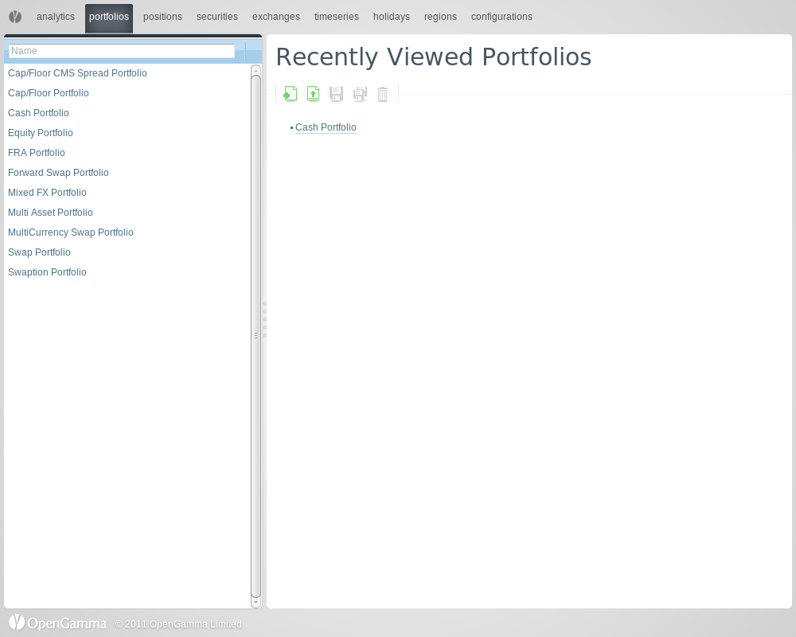

title: Installing R from Source
shortcut: DOC:Installing R from Source
---
These are detailed instructions for setting up the full OpenGamma stack from source on an Ubuntu server, including OG-RStats, and all dependencies needed for generating documentation. These instructions are tested by running the full script on an EC2 instance.

EC2 instances have a relatively small home directory size, and it's easy to run out of disk space when compiling large projects. To start with we move to the attached external drive and create a working directory:

.. code::

    cd /mnt
    sudo mkdir work
    sudo chown -R ubuntu work
    cd work

Next we make sure that the system is up-to-date:

.. code::

    sudo apt-get update
    sudo apt-get -y --force-yes upgrade

We install a JDK:

.. code::

    sudo apt-get install -y --force-yes default-jdk

And we install ant:

.. code::

    sudo apt-get install -y --force-yes ant

Because we are going to build OG-RStats, we also need some C++-related utilities:

.. code::

    sudo apt-get install -y --force-yes libgcj12-dev # GNU compiler for Java
    sudo apt-get install -y --force-yes liblog4cxx10-dev

Hack to make sure we can use Apache Portable Runtime:

.. code::

    sudo cp -r /usr/include/apr-1.0 /usr/include/apr-1

And we also need the C++ tasks for ant:

.. code::

    wget http://hivelocity.dl.sourceforge.net/project/ant-contrib/ant-contrib/cpptasks-1.0-beta5/cpptasks-1.0b5.tar.gz
    tar -xf cpptasks-1.0b5.tar.gz
    cd cpptasks-1.0b5/
    ant jars
    sudo cp target/lib/cpptasks.jar /usr/share/ant/lib/
    cd ..

To build R documentation, we will need LaTeX. We have already installed the latest texlive (it's a very slow install), so we just need to ensure that it is on the PATH:

.. code::

    export PATH=$PATH:/usr/local/texlive/2011/bin/x86_64-linux/

Next we install R and make sure we have the texinfo library:

.. code::

    sudo apt-get install -y --force-yes r-base
    sudo apt-get install -y --force-yes texinfo

We're getting there! We need git so we can install some software from git repositories (including OpenGamma):

.. code::

    sudo apt-get install -y --force-yes git

Now we need to install the Fudge messaging library from source, and because we are installing from source we also need libtool:

.. code::

    sudo apt-get install -y --force-yes libtool
    
    git clone https://github.com/vrai/Fudge-C.git
    cd Fudge-C
    ./reconf
    ./configure 
    make && sudo make install
    cd ..
    
    sudo ldconfig

Now we can install the OpenGamma platform! We set the OG*USER and OG*PASSWORD variables in advance so we can have an unattended install:

.. code::

    export OG_USER=opengamma-public
    export OG_PASSWORD=opengamma
    
    git clone https://github.com/OpenGamma/OG-Platform.git
    cd OG-Platform
    
    ant init
    ant clone-or-pull
    ant build

Now we have compiled all the Java and C++ code, and we can go ahead and start the OpenGamma server:

.. code::

    cd projects/OG-Examples
    ant new-hsqldb
    ant init-database
    ant jetty
    cd ../..

We can verify that the server is running by visiting localhost:8080

.. code::

    casper.start("http://localhost:8080", function() {
        this.capture("dexy--initial.png");
    });

Great! Now we need to finish configuring OG-RStats which needs a little tweaking. We set some parameters and create some directories (these will soon be taken care of by the installer):

.. code::

    mkdir -p ~/etc/OpenGammaLtd
    
    echo "jvmLibrary=/usr/lib/jvm/java-6-openjdk/jre/lib/amd64/server/libjvm.so
    jvmProperty.opengamma.configuration.url=http://localhost:8080/jax/configuration/0/
    " > ~/etc/OpenGammaLtd/LanguageIntegration
    
    echo "serviceExecutable=/mnt/work/OG-Platform/projects/OG-RStats/build/Release/ServiceRunner
    connectorLogConfiguration=/mnt/work/OG-Platform/projects/OG-RStats/config/log4cxx.properties
    "> ~/etc/OpenGammaLtd/OpenGammaR
    
    sudo mkdir -p /var/log/OG-RStats/
    sudo chown -R ubuntu /var/log/OG-RStats/
    
    sudo mkdir -p /var/run/OG-Language/
    sudo chown -R ubuntu /var/run/OG-Language/

We install some R packages (this ensures the R package installer is configured before we install the OpenGamma package):

.. code::

    CRAN_MIRROR=http://cran.case.edu/
    R -e "install.packages(\"rjson\", repos=\"$CRAN_MIRROR\")"
    R -e "install.packages(\"xts\", repos=\"$CRAN_MIRROR\")"

Now we can install the OpenGamma R package:

.. code::

    cd projects/OG-RStats
    ant install

Now R should be ready to go.
