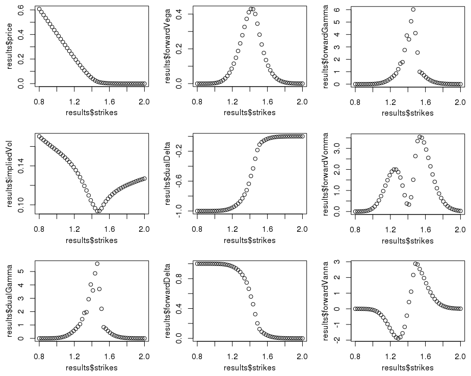
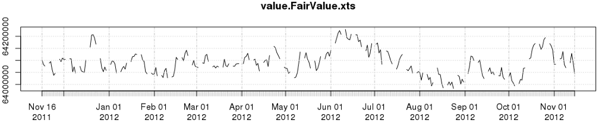
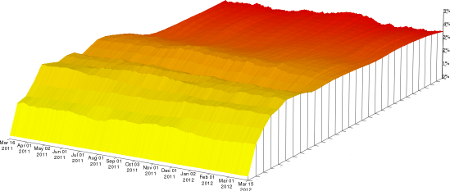

title: OpenGamma Tools for R
shortcut: DOC:OpenGamma Tools for R
---
The OpenGamma Tools for R provide a large number of functions to work with an OpenGamma installation.  We currently support R on Windows only, although other platforms will be forthcoming.

After `Installing R 2.15.0 <http://cran.r-project.org/bin/windows/base/>`_  and the OpenGamma R package, it must be loaded and initialised. The initialisation step will in turn import an automatically generated package called "OG" which contains all of the definitions exported from the main OpenGamma installation. For example:

.. code::

    > library ("OpenGamma")
    > OpenGamma::Init ()
    > demo (SwapExample, package = "OpenGamma")

The following demonstration scripts are provided as part of OpenGamma Tools for R package. They can be accessed using the built-in `demo` function, by browsing into the installed package folder (e.g. `C:\Program Files\R\R\-version\library\OpenGamma` on Windows), or in `OG-Platform\projects\OG-RStats\package\demo` if you have have downloaded the source distribution.

OpenGamma Tools for R now supports R versions 2.13, 2.14 and 2.15

..........................
Analytics.R / Analytics2.R
..........................

A security, portfolio and view are created programmatically and analytics calculated using current market data. A market data snapshot is taken from the current market data. *Analytics.R* recalculates the analytics for various shifts applied to this market data snapshot. *Analytics2.R* keeps the snapshot the same but modifies properties of the security.

........
Curves.R
........

Position attributes allow properties to be injected that override the default system, portfolio, or calculation configuration settings. This example shows how a view can be constructed that calculates values for a security using two different methods. In this case, the name of the curve used in the calculation is varied.

..................
FXPriceAndGreeks.R
..................

A portfolio is created containing positions in securities with slightly different properties. In this case an FX Option is used with slightly different strikes used for each - every other aspect is kept the same. The view definition requests a number of values calculated from this portfolio. A single cycle of the view will then calculate all of these values across all of strikes in parallel. The resulting values are then plotted against the strikes to give the expected graph shapes.

The calculations for this view can be time consuming. If you are running the OpenGamma server on a workstation then selecting a smaller range of strikes (the default is 50 points between 0.8 and 2) will produce a result much faster.

............
Historical.R
............

Shows how to evaluate a view using historical market data held in the time series database. *Fair Value* on the view's portfolio is calculated for each day at which historical data is available. The resulting values are available as an R data structure. This can then be stored within the OpenGamma time series database so that it is available for later use.

The example will run a cycle for each day in the simulation. Those that fall on weekends will not produce values because there are no historical time series data points for those days. The resulting time series from the full simulation therefore does not contain values for these days.

...........
Perturbed.R
...........

Extends the `Historical.R` example by modifying the historical data that is used at each iteration. The results are combined into a data frame such that each column is one of the perturbations and holds the time series of values produced for that parameter.

.............
SwapExample.R
.............

A security, portfolio and view are created programmatically complete with a market data snapshot that allows analytic values to be produced for the security. This script demonstrates the minimum inputs necessary to drive the OpenGamma analytics library - all values required by the engine are provided by the script.

............................
YieldCurve.R / YieldCurve2.R
............................

An early `blog post <http://www.opengamma.com/blog/2011/11/03/first-r-sample-market-data-plotting>`_  about our R module used the `YieldCurve.R` example. Time series from the underlying database are extracted and used to produce a crude visualisation of the yield curve over time. Extending this script shows how the same data can be used in conjunction with the view processor to access the fitted curve from R. `YieldCurve2.R` produces a visualisation of the fitted yield curve over time and serves as an example of how the wide range of tools already developed for R (in this case graph plotting) can be used to work with the values produced by the OpenGamma analytics library. Below is the output from one of the currency curves produced by YieldCurve2.R plotted with `ChartSeries3D <http://www.quantmod.com/examples/chartSeries3d/>`_ :

Note that both of these scripts use the XTS package at the end to supplement the basic R time series structures with additional information to assist in plotting them using various graphics packages. If you do not have XTS installed and/or loaded then you may see warnings or errors when the final part of the script executes.
