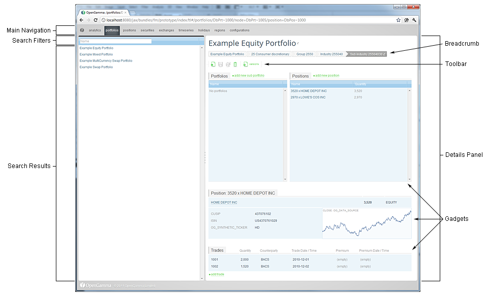
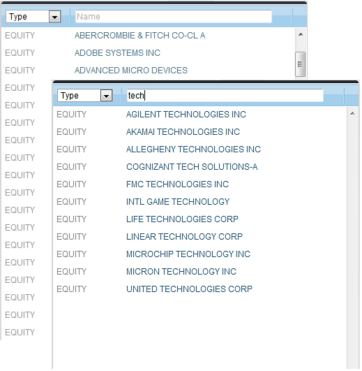
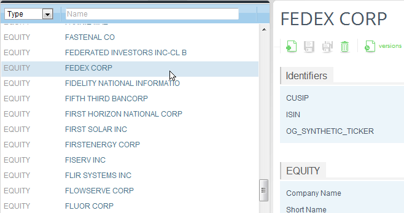
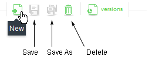
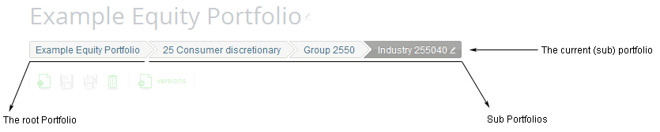
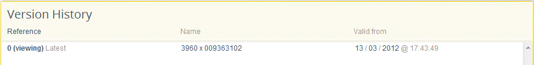
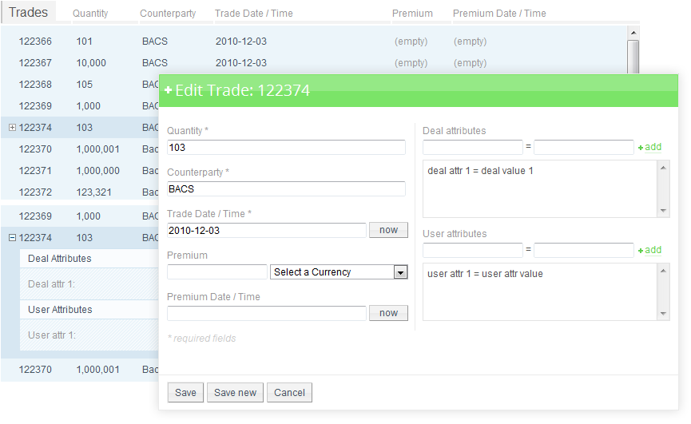
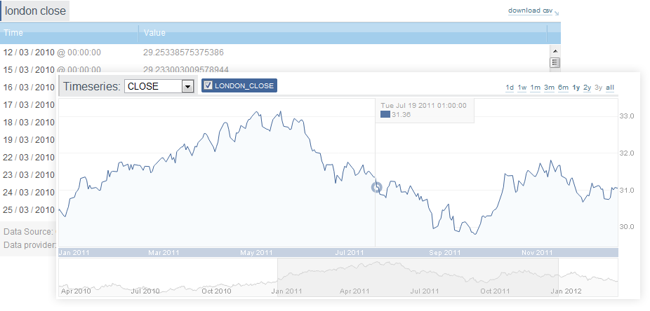
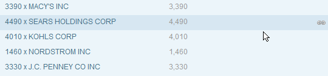
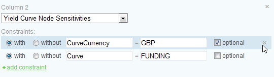

title: Admin & Configuration
shortcut: DOC:Admin & Configuration
---
..................................
Anatomy of the OpenGamma Admin GUI
..................................

*  `Search Filters`_ 

*  `Search Results`_ 

*  `Toolbar`_ 

*  `Breadcrumb`_ 

*  `Versions`_ 

*  `Trades Gadget`_ 

*  `TimeSeries Gadget`_ 

*  `View Definitions`_ 

*  `Conventions`_ 

..............
Search Filters
..............

Most fields in the search results can be filtered by typing in part or all of the string you are looking for. For numeric fields you can also use < (less than), > (more than) or a range (100 - 200) to find what you are looking for. There are also dropdown menus or calendars where appropriate.

..............
Search Results
..............

Any place in the UI that you see a blue highlighted background under your cursor means you can interact with the item. In the Search results this means you can click on the result to open the item in the details panel.

.......
Toolbar
.......

The toolbar persists on every page of the Admin application. If a feature is not available on a particular view, its corresponding icon will be grayed out.

..........
Breadcrumb
..........

The Breadcrumb is only available on the portfolios view. This is a path to your current location within the portfolio.
It allows you to navigate back to a particular point easily and also rename the sub portfolio you are currently in.
NOTE: You should notice that the root Portfolio name on the page doesn't change when you drill deeper into the portfolio.

........
Versions
........

Anywhere that versions are supported will have a link on the toolbar. Clicking this will open the versions panel below the details panel.
This will list all historical versions of that item and allow you to view them.

.............
Trades Gadget
.............

The trades gadget allows you to add, edit and clone trades in a position. Quantity, Counterparty and Trade date are required fields. You can also add premium information, and custom user and deal attributes.

.................
TimeSeries Gadget
.................

The TimeSeries gadget appears in a number of locations in the UI. There are two main components, the plot and the source data view. Both are displayed on the TimeSeries page, other location only display the plot. You can zoom and pan the plot manually or use the presets in the top right-hand corner. You can also overlay different data series on top of each other if they are available.

................
View Definitions
................

The view definition is where you configure your analytics views. You can edit current views, clone or create new ones from scratch.

.. image:: opengamma-viewdefinition.png

...........
Conventions
...........

Typically navigational links are dark blue and action links are green. Dialogs that allow you to create new information are green and destructive dialogs are red. The web GUI makes extensive use of contextual options, this is to keep the interface uncluttered and only present the user with the options they might require when they need them. When the cursor moves over a UI component that has contextual options the background should highlight and new icons will appear in the top right of the component.

