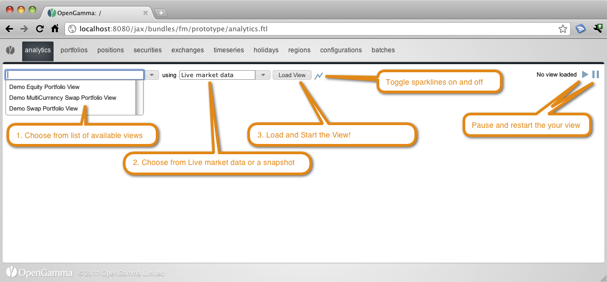
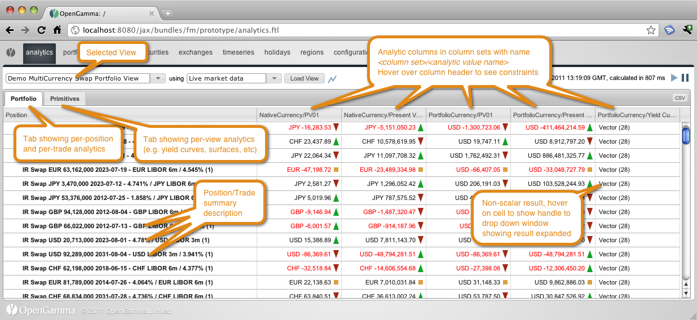
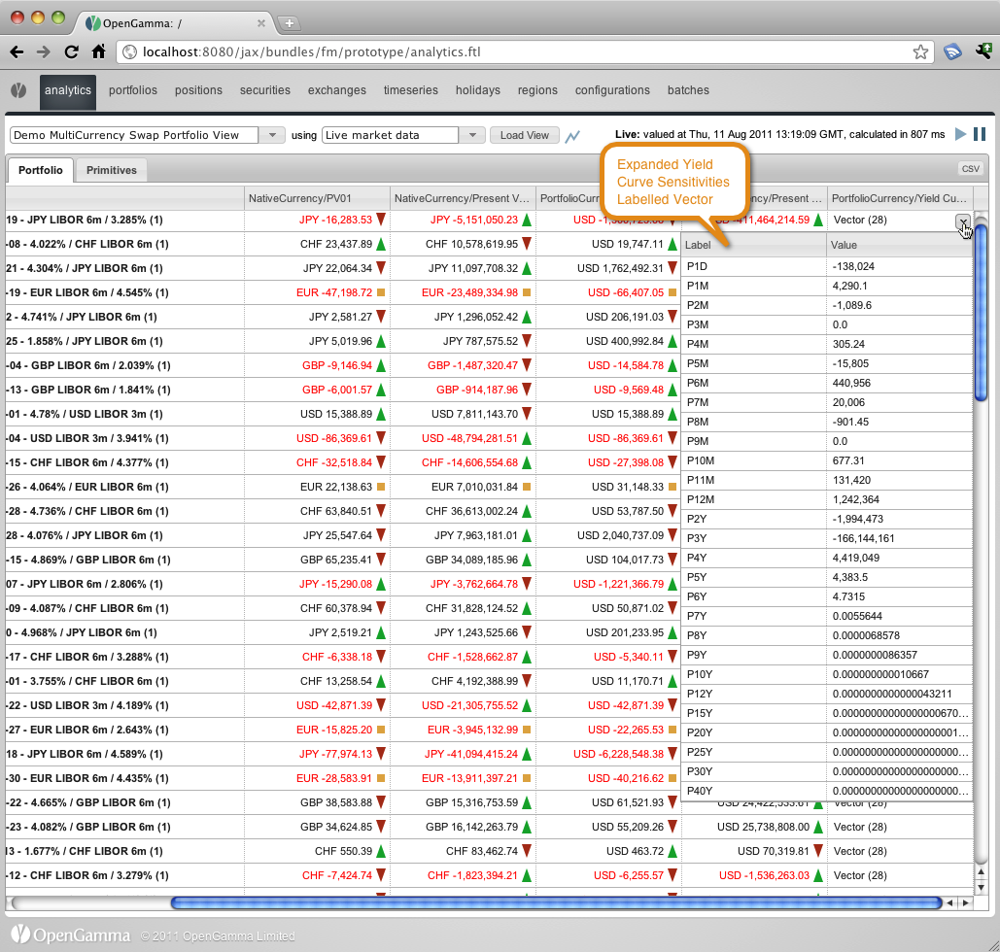
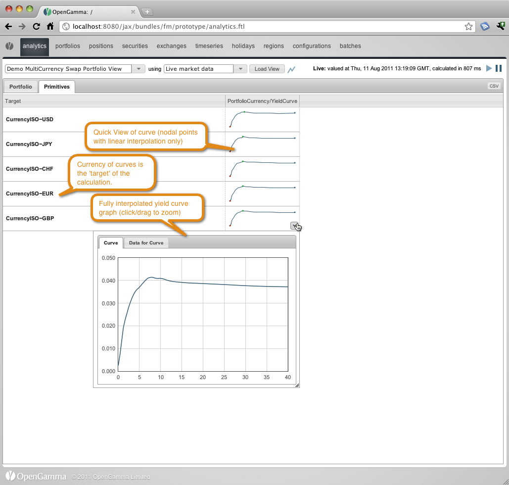
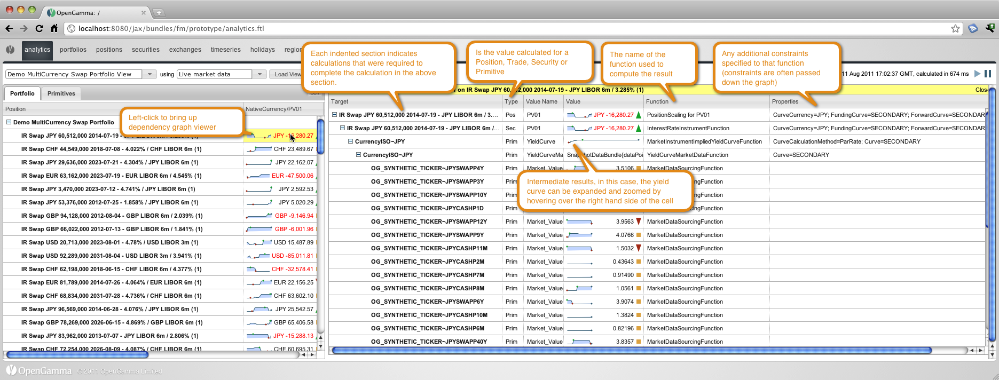
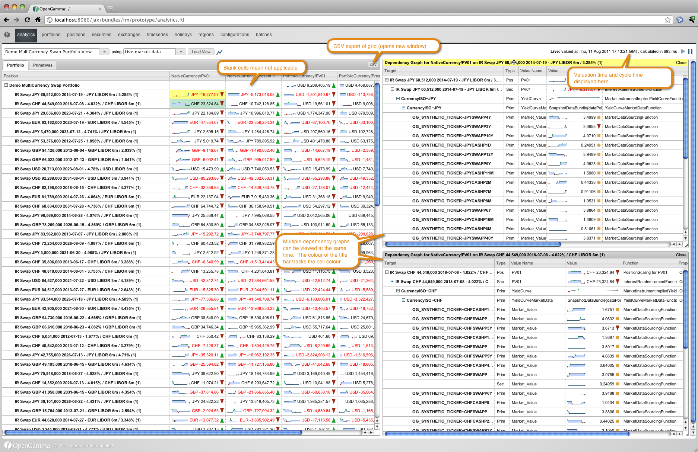

title: The Analytics Viewer
shortcut: DOC:The Analytics Viewer
---

The initial view of the Analytics tab before you've selected a view

A first look at running a view

Looking at a non-scalar value

Looking at the primitives tab and examining a yield curve

Looking at a dependency graph

Looking at multiple dependency graph and highlighting some other features

