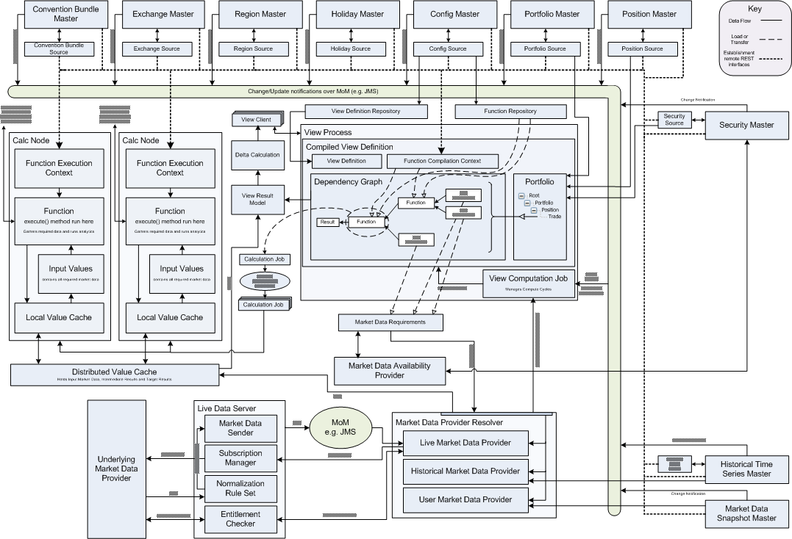

title: System Data Flow Diagram and Explanation
shortcut: DOC:System Data Flow Diagram and Explanation
---

\\  `System Data Flow Diagram and Explanation </confluence/DOC/OpenGamma-Platform-Documentation/Platform-Overview/System-Data-Flow-Diagram-and-Explanation/index.rst>`_ 

The diagram above shows a relatively simple example configuration of the OpenGamma platform showing all the major components.  Across the top and down the right hand side are the various semi-static data sources.  These are repositories of data, typically backed by a relational database that don't change often enough to classify as real time data.  The Master interfaces provide administrative and complex query access to the underlying database, and these are the only interfaces the system uses to query persistent data - there is no direct database access at all.  While it's possible to run these master instances locally to the engine, a typical configuration would use RESTful remote access end-points and host these services on a separate machine.  Most access to these databases occurs via the Source interfaces.  These are simplified interfaces that typically provide read-only access of the queries most commonly required by the engine functions accessing data.  To allow for updating data, there is a MoM (message-oriented middleware) layer to notify any interested systems of updates to data.

.....................
Engine Initialisation
.....................

When the engine (aka `ViewProcessor </javadoc/index.html?com/opengamma/engine/management/ViewProcessor.html>`_) starts up, the following things happen:

*  The Function Repository is populated.  This is currently done using a mixture of code and configuration coming from a `ConfigSource </javadoc/index.html?com/opengamma/core/config /ConfigSource.html>`_

   *  `DemoCurveFunctionConfiguration` \- this class loops over all available `YieldCurveDefinition </javadoc/index.html?com/opengamma/financial/analytics/ircurve/YieldCurveDefinition.html>`_s objects stored in the `ConfigSource </javadoc/index.html?com/opengamma/core/config/ConfigSource.html>`_ and creates instances of the functions necessary to build yield curves.  It then adds these functions to the `FunctionRepository </javadoc/index.html?com/opengamma/engine/function/FunctionRepository.html>`_

   *  DemoStandardFunctionConfiguration - this class adds functions for most of the other analytics available from the platform. &nbsp;Various helper functions allow easy addition of different types of function.

*  The `ViewDefinitionRepository </javadoc/index.html?com/opengamma/engine/view/ViewDefinitionRepository.html>`_ is populated.  This is done by querying all the available `ViewDefinition </javadoc/index.html?com/opengamma/engine/view/ViewDefinition.html>`_s from a `ConfigSource </javadoc/index.html?com/opengamma/core/config/ConfigSource.html>`_ and registering change listeners, allowing changes in `ViewDefinition </javadoc/index.html?com/opengamma/engine/view/ViewDefinition.html>`_s to cause dependency graph rebuilds and GUI updates.

   *  Views are currently identified by name in various places around the system, at some point, this will change to UniqueId and the engine will probably just use the `ConfigSource </javadoc/index.html?com/opengamma/core/config/ConfigSource.html>`_ directly.

When a client actually wants to start a view, they start by creating a `ViewClient </javadoc/index.html?com/opengamma/engine/management/ViewClient.html>`_ and attaching it to a `ViewProcess </javadoc/index.html?com/opengamma/engine/management/ViewProcess.html>`_.  This happens by:

*  Loading the appropriate ViewDefinition from the `ViewDefinitionRepository </javadoc/index.html?com/opengamma/engine/view/ViewDefinitionRepository.html>`_.

*  Loading and resolving the Portfolio referenced by the `ViewDefinition </javadoc/index.html?com/opengamma/engine/view/ViewDefinition.html>`_.

   *  This starts via the `PositionSource </javadoc/index.html?com/opengamma/core/position/PositionSource.html>`_.  Currency, this wraps both the `PortfolioMaster </javadoc/index.html?com/opengamma/master/portfolio/PortfolioMaster.html>`_ and `PositionMaster </javadoc/index.html?com/opengamma/master/position/PositionMaster.html>`_, and loads both the portfolio structure and attaches any positions resolved independently.

   *  The `Security </javadoc/index.html?com/opengamma/core/security/Security.html>`_ objects attached to each position are then loaded from the `SecuritySource </javadoc/index.html?com/opengamma/core/security/SecuritySource.html>`_, yielding a fully resolved portfolio.

*  Now the Engine enumerates all the 'requirements' specified in the `ViewDefinition </javadoc/index.html?com/opengamma/engine/view/ViewDefinition.html>`_.  This consists of two types

   *  Portfolio Requirements, which can be thought of as 'column' requirements, are values that should be requested for each trade, position and portfolio node in a portfolio

      *  Portfolio Requirements are segregated by asset class, so only requirements for the matching asset class are requested.

   *  Specific Requirements - these are 'other requirements', although often they are just intermediate calculations that can be useful that don't relate to any specific security/trade/position/portfolio node. &nbsp;Examples are:

      *  Yield Curves

      *  Volatility Surfaces and Cubes

      *  Market data lookups (e.g. FX rates the user wants to explicitly see).

*  Now the engine goes through each requirement and tries to find a function in the `FunctionRepository </javadoc/index.html?com/opengamma/engine/view/FunctionRepository.html>`_ that can provide the desired result.

   *  It does this by offering the 'target' (position/trade/portfolio node, etc) to the function and asking if it can satisfy the requirements.

   *  If it can, then the function is 'compiled' for that value requirement, which will produce a set of input requirements for this function.

      *  These input requirements are then fed back into the process, looking for functions to satisfy those, until the only requirements that remain are for live market data.

      *  This means, for example, that a function computing fair value, can require a yield curve, and those calculations can be totally separated.

*  Now any duplicates are removed from all the graphs, so, for example, each yield curve is only calculated once for the portfolio.

*  The total set of market data requirements is computed and sent to the Market Data Availability provider, which indicates if data is available, and does any conversions of identifiers necessary.

Execution Phase

*  Now an execution plan is built from the dependency graph.  Nodes are converted into `ViewComputationJob </javadoc/index.html?com/opengamma/engine/view/calc/ViewComputationJob.html>`_s and grouped to minimise data transfer between nodes. 

*  Groups are dispatched to `CalculationNode </javadoc/index.html?com/opengamma/engine/view/calcnode/CalculationNode.html>`_s.

at the same time

*  One of:

   *  Market data subscriptions are made and the resulting snapshot is copied into the distributed value cache

   *  A market data snapshot is loaded from the database and inputs are copied into the distributed value cache

   *  Historical data points are loaded from the historical time series database and copied into the distributed value cache

and on the ComputeNodes

*  The `FunctionExecutionContext </javadoc/index.html?com/opengamma/engine/function/FunctionExecutionContext.html>`_ is initialised with remote implementations of the various Source interfaces available to executing functions.

*  Functions are executed according to the execution plan

   *  These are provided with their target, any inputs are read and prepared from the local value cache.

   *  Results are stored in the local value cache, and possibly sent up to the distributed value cache if they are not local intermediate results.

   *  The engine is notified on completion, and if a job takes too long, it may be reissued, assuming the calculation node has gone down.

      *  There are plans to make fail-over more resilient to pathological computations that crash multiple compute nodes by black-listing, but this isn't currently implemented.

      *  If the view is running in batch mode, then results are written directly into the batch database from the compute node.

On completion

*  Results are collected into a `ViewResultModel </javadoc/index.html?com/opengamma/engine/view/ViewResultModel.html>`_, which maps from requirements requested into results

*  Any deltas between this and the previous results are calculated

*  The `ViewClient </javadoc/index.html?com/opengamma/engine/view/management/ViewClient.html>`_ is notified of the new results

